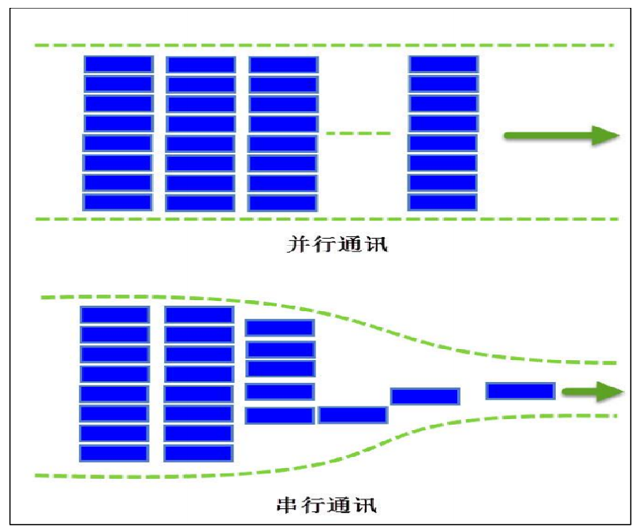
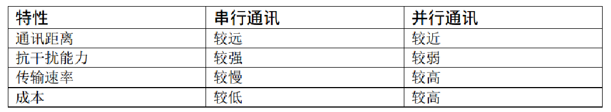
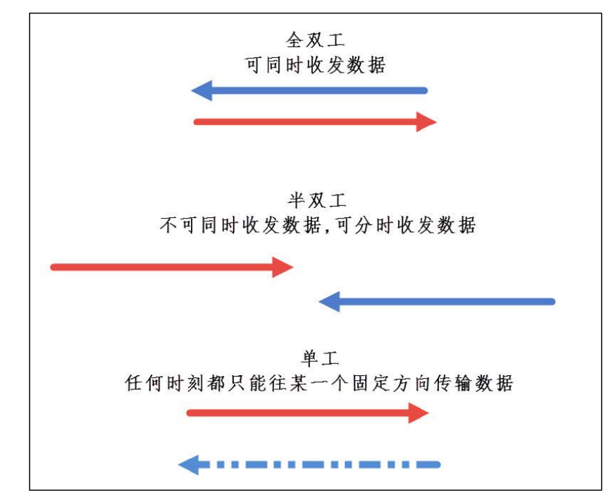
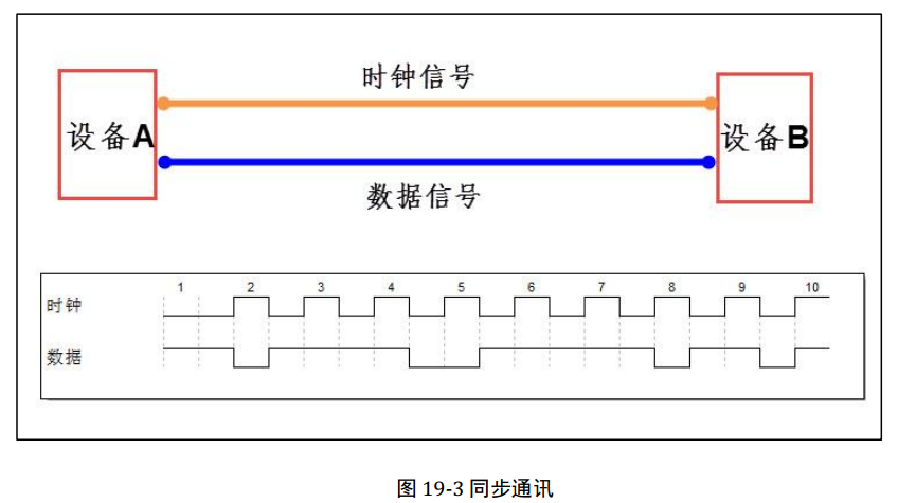
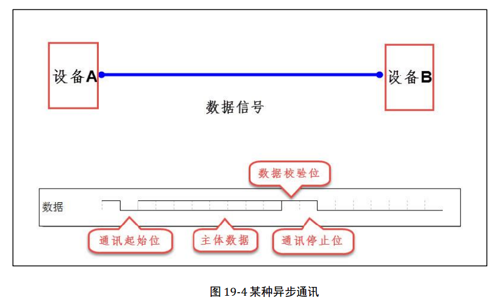

* 线制：串行、并行





* 方向：单工、半双工、全双工



* 时钟：同步、异步

在同步通讯中，数据信号所传输的内容绝大部分就是有效数据，而异步通讯中会包含有帧的各种标识符，所以同步通讯的效率更高，但是同步通讯双方的时钟允许误差较小，而异步通讯双方的时钟允许误差较大。





* 速率

Bitrate，比特率：每秒钟传输的二进制位数，单位为比特每秒 (bit/s)

Baudrate，波特率：表示每秒钟传输的码元个数

```
一个二进制位表示一个码元
0V    ——    0 
3.3V  ——    1
两个二进制位表示一个码元
0V    ——    00 
2V    ——    01
4V    ——    10
6V    ——    11
```

