# ADC

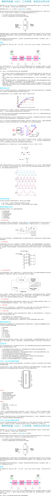

ADC：Analog-to-Digital Converter 模数转换器，可将连续变量的`模拟信号`转换为离散的`数字信号`。

#### 分辨率

`8位ADC`，用 8bit 进行数字存储，即最大值 11111111（8个1） =  255。

在 0 - 3.3v 的转换电压范围下，电压被分为 256 份 （0~255），每份大小为 3.3v / 256。

`12位ADC`，用 12bit 进行数字存储，即最大值 111111111111（12个1） =  4095。

在 0 - 3.3v 的转换电压范围下，电压被分为 4096 份 （0~4095），每份大小为 3.3v / 4096。

#### 对齐方式

因12位的数据是储存在16位的寄存器中，所以储存结果可分为左对齐和右对齐的方式。

#### 转换模式

* 单次：转换完单个通道后停止转换（单通道）
* 连续：转换完单个通道后继续转换该通道（单通道）
* 扫描：对 ADCx 中所有选中的通道进行转换（多通道）
* 间断：对选中通道进行分组，然后对每组的通道进行转换（多通道）

##### 规则组和注入组

对一组指定的通道，按照指定的顺序，逐个转换这组通道，转换结束后，再从头循环；这指定的通道组就称为`规则组`。但是实际应用中，有可能需要临时中断规则组的转换，对某些通道进行转换，这些需要中断规则组而进行转换的通道组，就称为`注入组`。

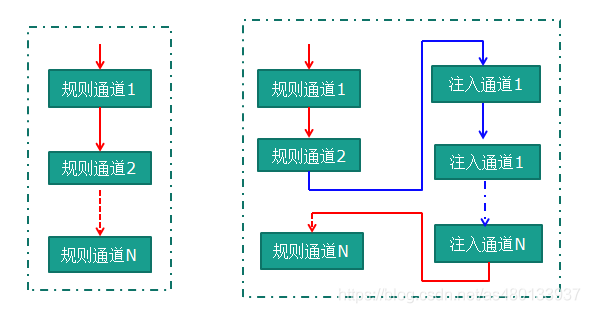

#### 采用周期

越长采样越准确（再长也是微秒级的）。

#### 相关函数

ADC 校准：

```c
HAL_ADCEx_Calibration_Start(&hadc1);
```

### 配置流程

##### 查询阻塞模式

读取（转换结束标志位 `HAL_ADC_STATE_REG_EOC`）：

```c
uint16_t read_adc() {
    HAL_ADC_Start(&hadc1);
    HAL_ADC_PollForConversion(&hadc1, 50); // timeout = 50ms
    while (HAL_IS_BIT_CLR(HAL_ADC_GetState(&hadc1), HAL_ADC_STATE_REG_EOC)) {} 
    return HAL_ADC_GetValue(&hadc1);
}
```

* `单通道`，`单次模式`：1 single_channel_with_blocking_mode

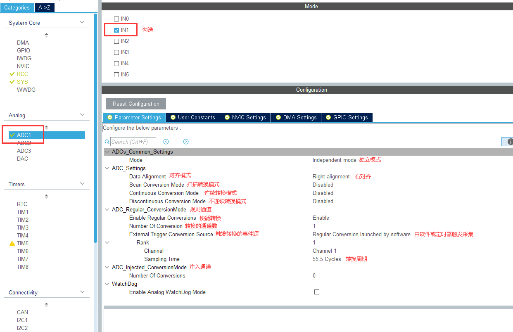


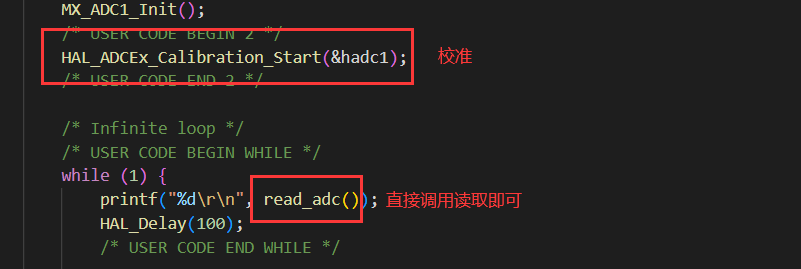

* `多通道`，`扫描模式`，`不连续采集`：2 multi_channel_with_blocking_mode

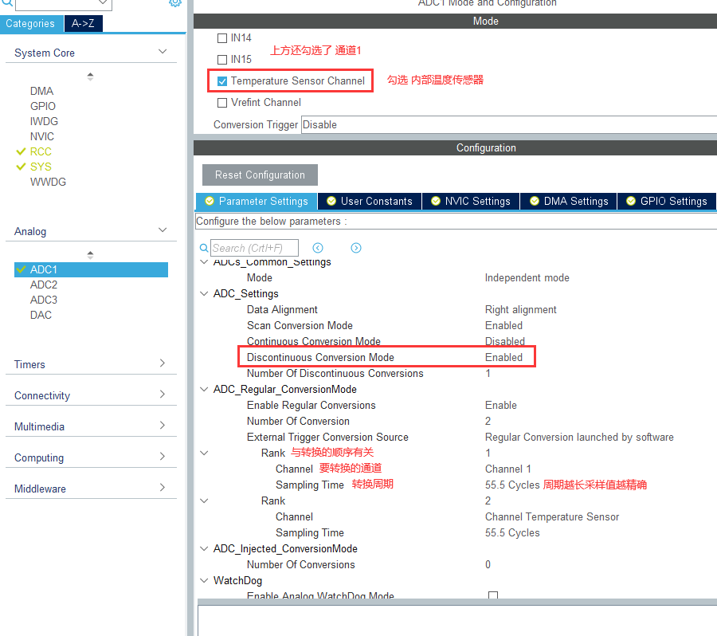

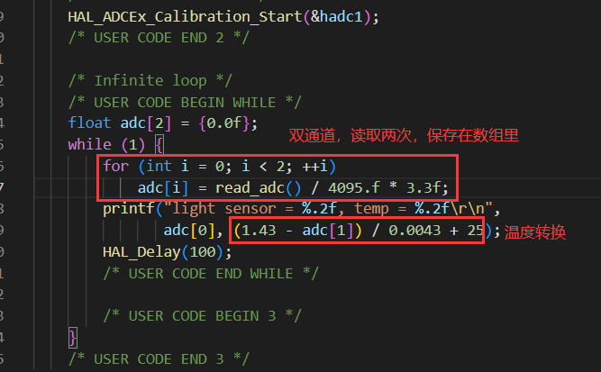

```c
float adc[2] = {0.0f};
for (int i = 0; i < 2; ++i)
    adc[i] = read_adc() / 4095.f * 3.3f;
printf("light sensor = %.2f, temp = %.2f\r\n",
       adc[0], (1.43 - adc[1]) / 0.0043 + 25);
```

##### 定时器中断模式

* `单通道`，`单次模式`，`定时器中断`，`ADC中断`：3 single_channel_with_interrupt_mode

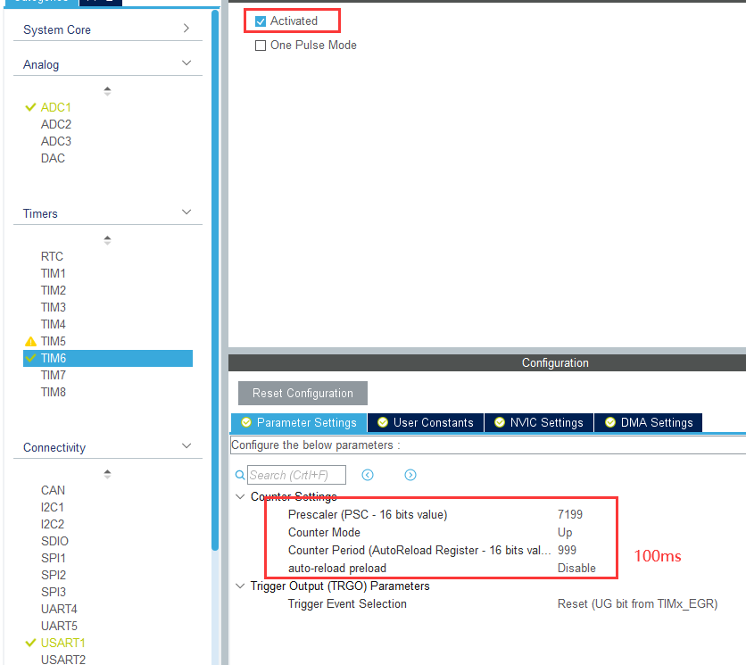

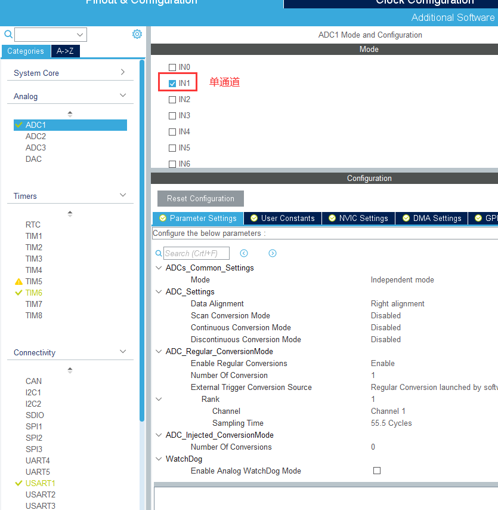

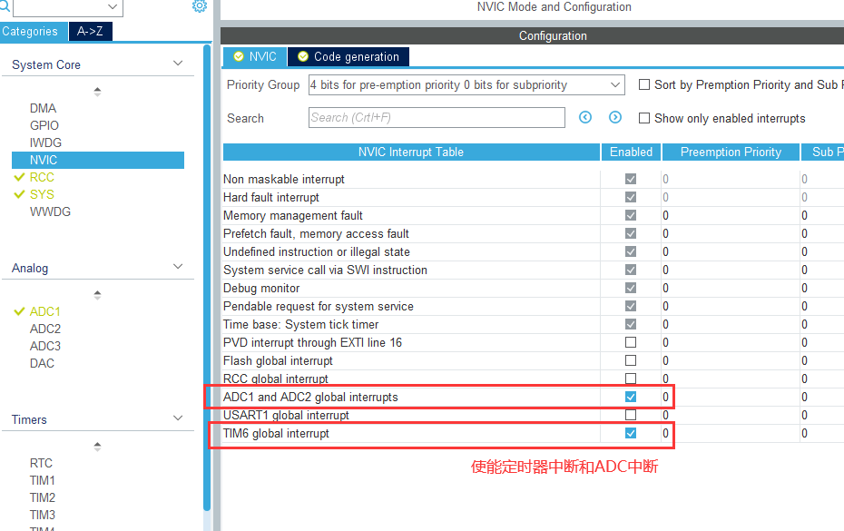

```c
void HAL_TIM_PeriodElapsedCallback(TIM_HandleTypeDef* htim) {  // TIM
    if (htim->Instance == TIM6) HAL_ADC_Start_IT(&hadc1);
}

void HAL_ADC_ConvCpltCallback(ADC_HandleTypeDef* hadc) {  // ADC
    HAL_ADC_Stop_IT(&hadc1);
    HAL_TIM_Base_Stop_IT(&htim6);
    printf("%.2f\r\n", HAL_ADC_GetValue(&hadc1) / 4096.f * 3.3f);
    HAL_TIM_Base_Start_IT(&htim6);
}
```

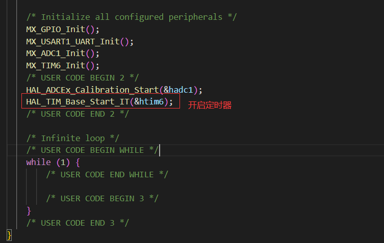

```c
HAL_TIM_Base_Start_IT(&htim6);
```

##### DMA模式

* `单通道`，`DMA传输`：4 single_channel_with_dma_mode

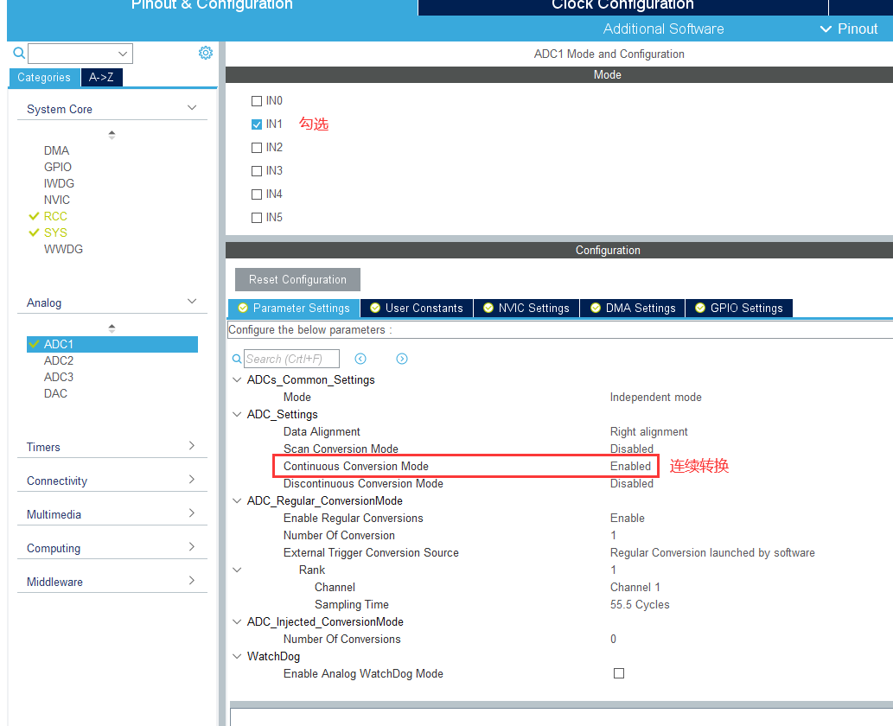

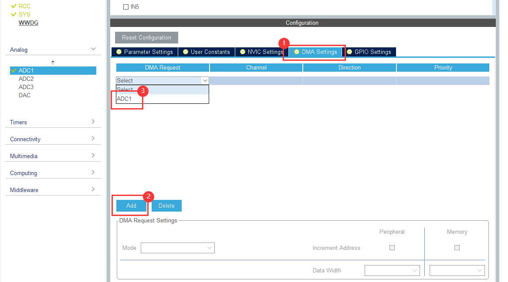

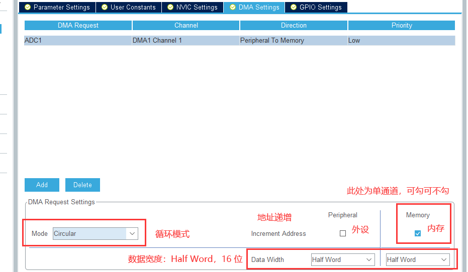

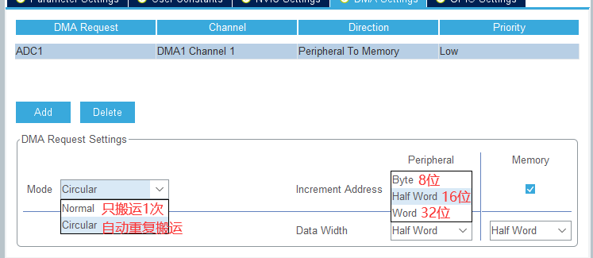

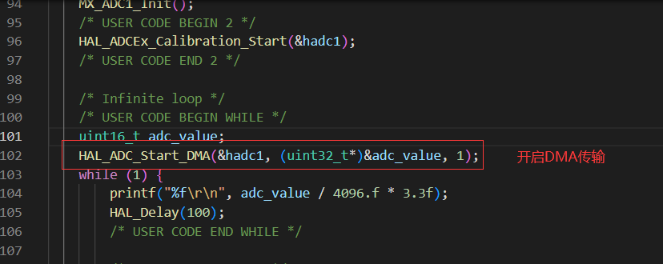

```c
uint16_t adc_value;
HAL_ADC_Start_DMA(&hadc1, (uint32_t*)&adc_value, 1);
```

DMA - Normal Mode 普通模式：每次使用采样值前都需要调用 1 次 `HAL_ADC_Start_DMA`。

DMA - Circular Mode 循环模式：只需调用 1 次 `HAL_ADC_Start_DMA`，在此之后可直接使用采样值。

* `多通道`，`DMA传输`：5 multi_channel_with_dma_mode

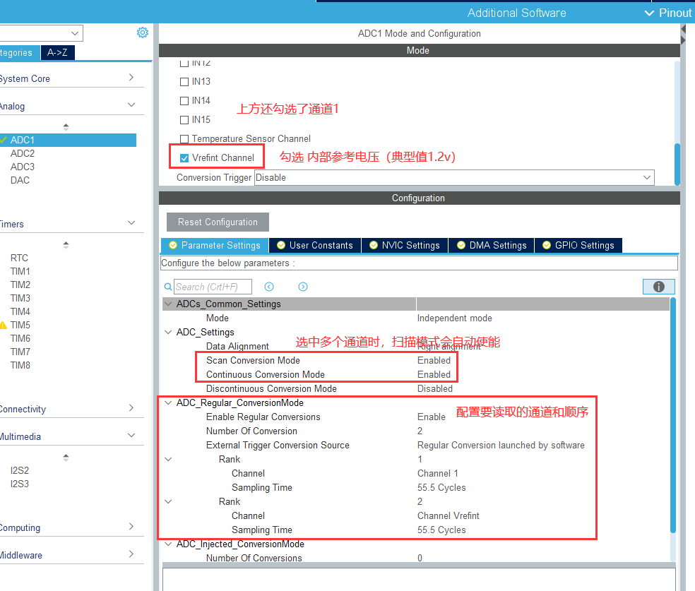

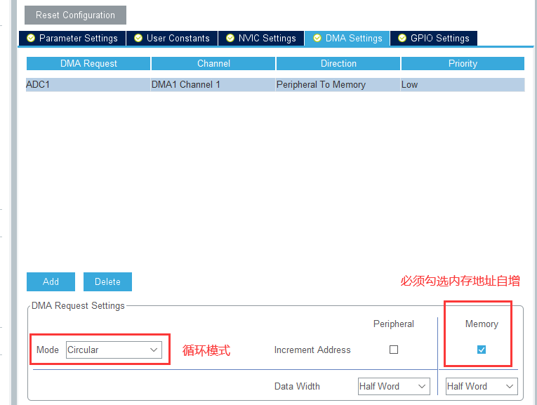

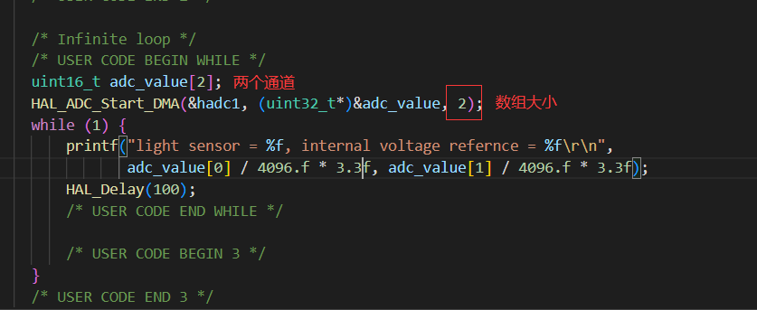

内存地址自增，对应着每个采样值在数组的成员下标递增。即第1个采样值保存在第1个数组成员中，第2个采样值保存在第2个数组成员中...

`内部基准电压`：典型值是1.20V，最小值是1.16V，最大值是1.24V。

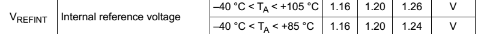

VREF+ / VREF-： VREF+ 是 ADC 和 DAC 的输入参考电压。100脚以上的型号，Vref+ 引到了片外；64脚和小于64脚的型号，Vref+ 在芯片内部与VCC信号线相连，没有引到片外，这样AD的参考电压就是VCC上的电压。

