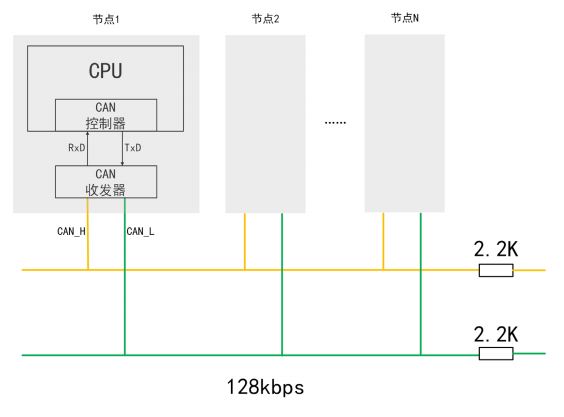
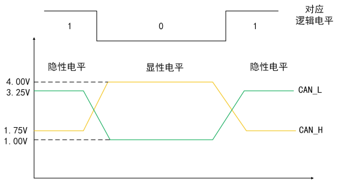
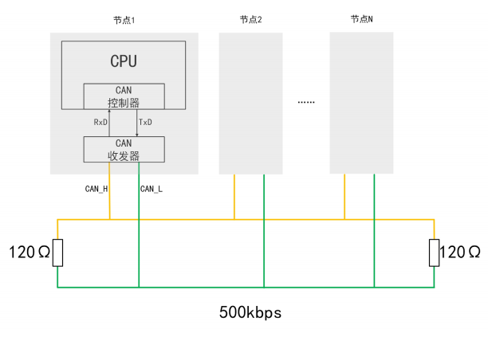
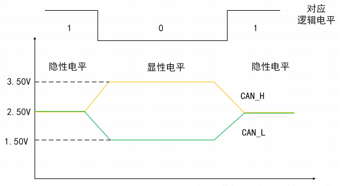
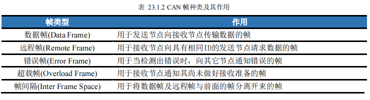
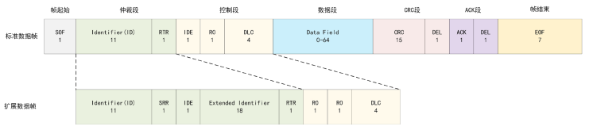
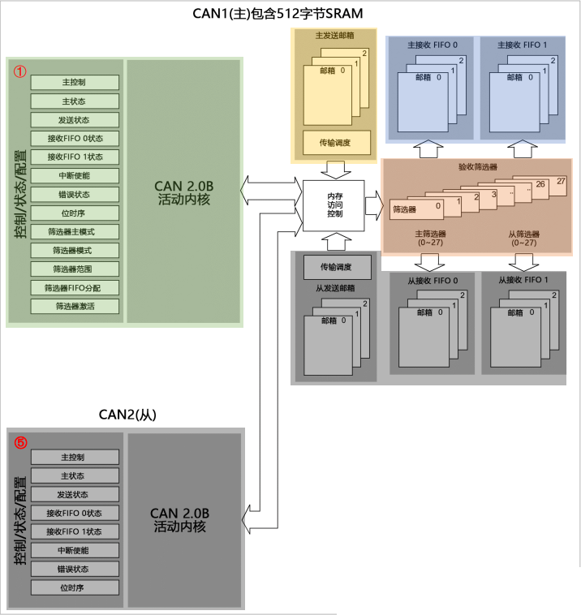
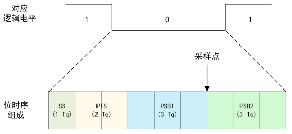

CAN，Controller Area Network，控制器局域网

* 节点设备：CAN 控制器 + CAN 收发器

### 协议

#### 标准

**ISO11519**：低速 CAN，10 ~ 125Kbps，开环总线

* 最大连接数：20

* 最大长度：40Kbps -> 1km

* 拓扑结构

每根线串联 2.2K 电阻（Min 2.09KΩ）

* 电平标准

**ISO11898**：高速 CAN，125Kbps ~ 1Mbps，闭环总线（）

* 最大连接数：30

* 最大长度：1Mbps -> 40m

* 拓扑结构

总线两端各串联 1个 120Ω 电阻用于阻抗匹配，以减少回波反射。（Min 85Ω，MAX 130Ω）

* 电平标准

以差分信号传输数据，传输线的电位差表示数据电平。

#### 消息机制：广播

同时刻网络上所有节点监测到的数据都是相同的，各节点根据报文ID来甄别是否是发给自己的报文。

##### 帧 Frame

* 数据帧：标准帧（CAN2.0A）、扩展帧（CAN2.0B）

某个CAN设备发出数据帧，网络上所有设备（无过滤时）都获取该数据帧中仲裁段中的ID，如果是自己关注ID的数据，则获取数据段的内容。

**帧起始**（Start Of Frame，SOF）：1bit，显性信号，表示数据帧（或远程帧）的开始。

**仲裁段**（Arbitration Field）：标识符位（Identifier field-ID）+ 远程发送请求位（Remote Transfer Request，RTR）

标准帧的ID位是11位，即范围是0x000~0x7FF，而扩展帧的ID是11+18=29位；

在CAN协议中，ID 决定报文的优先级高低，也决定这拓扑结构的节点是否接收此ID的帧数据。

远程发送请求位，用于区分该帧是数据帧还是远程帧，显性信号（0）代表数据帧（Data Frame），隐性信号（1）代表远程帧（Remote Frame）

**控制段**（Control Field）：标准帧中由扩展标识符位（Identifier Extension bit-IDE，1 bit）、保留位0（Reseved bit0-r0，1 bit）、数据长度编码位（Data Length Code-DLC，4 bits）组成；扩展帧用由两个保留位（Reseved bit，2 bit）、数据长度编码位（Data Length Code-DLC，4 bits）组成;

**数据段**（Data Field）：发送数据的内容，最多8个字节（64bit）

数据的实际长度会写到前面的数据长度编码位DLC里。

**循环校验段**（CRC Field）：循环校验序列（CRC Sequence）+ 界定符（Delimiter，DEL）

循环校验序列用于校验传输是否正确；界定符用于表示循环校验序列是否结束。

**确认段**（ACK Field）：括确认位（ACK SLOT）+ 界定符（Delimiter，DEL）

确认位在节点收到正确的CRC序列时，发送端的ACK位被置位；界定符表示确认是否正常接收。

**帧结束**（End of Frame，EOF）：7位长度，隐性信号，表示帧的结束。

### 控制器

CAN 控制器，Basic Extended CAN，bxCAN。

* CAN 2.0A Active 只能处理标准数据帧，扩展帧的内容会识别为错误。

* CAN 2.0B Active 可以处理标准数据帧和扩展数据帧。

* CAN 2.0B Passive 只能处理标准数据帧，扩展帧的内容会忽略。

F103 只有 1个 CAN 控制器，F105/F107 有两。

①CAN1内核：包含各种控制、状态、配置寄存器。

主控制寄存器（CAN_MCR）控制 CAN 的工作模式，在后面设置CAN协议初始化时，实现对该寄存器的修改。

位时序寄存器（CAN_BTR）控制 CAN 的工作速率。CAN是异步信号，需收发双方提前统一通信速率，并采用“位同步”机制，实现对电平的正确采样。

传输中的每位数据由四段组成：同步段（Synchronization Segment，SS）、传播时间段（Propagation TimeSegment，PTS）、相位缓冲段1（Phase Buffer Segment 1，PBS1）和相位缓冲段2（Phase Buffer Segment 2， PBS2）。每段又由多个位时序（Time Quantum，Tq）组成。

假设CAN对应逻辑电平持续的时间为9Tq，即一位数据持续的时间为9Tq。其中SS段长度为1Tq（只能为1Tq），PTS段长度为2Tq（范围为18Tq），PSB1段长度为3Tq（范围为18Tq），PSB2段长度为3Tq（范围为2\~8Tq）。采样点在PSB1和PSB2之间，调整各段的长度，即可对采样点位置进行调整，实现补偿准确采样。
