# DAC


### 相关函数

* 设置输出值

```c
HAL_StatusTypeDef HAL_DAC_SetValue(DAC_HandleTypeDef* hdac, uint32_t Channel, uint32_t Alignment, uint32_t Data); 
```

Alignment 对齐模式：`DAC_ALIGN_8B_R` 8位右对齐，`DAC_ALIGN_12B_L` 12位左对齐，`DAC_ALIGN_12B_R` 12位右对齐（常用）。

* 获取输出值

```c
uint32_t HAL_DAC_GetValue(DAC_HandleTypeDef* hdac, uint32_t Channel);  
```

* 开启输出

```
HAL_StatusTypeDef HAL_DAC_Start(DAC_HandleTypeDef* hdac, uint32_t Channel);   
```

* 关闭输出

```
HAL_StatusTypeDef HAL_DAC_Stop(DAC_HandleTypeDef* hdac, uint32_t Channel);  
```

* 开启DMA输出

```c
HAL_StatusTypeDef HAL_DAC_Start_DMA(DAC_HandleTypeDef* hdac, uint32_t Channel, uint32_t* pData, uint32_t Length, uint32_t Alignment); 
```

* 关闭DMA输出

```c
HAL_StatusTypeDef HAL_DAC_Stop_DMA(DAC_HandleTypeDef* hdac, uint32_t Channel);
```


### 配置

#### 基本使用

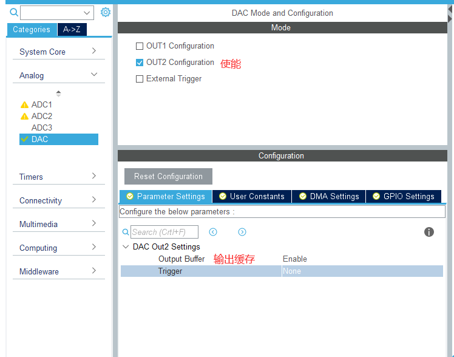

输出缓冲：减少输出阻抗，无需外部运放即可直接驱动外部负载。

使能输出缓冲时，DAC 的电压范围：0.2 ~ VREF~+~-0.2。（看手册）

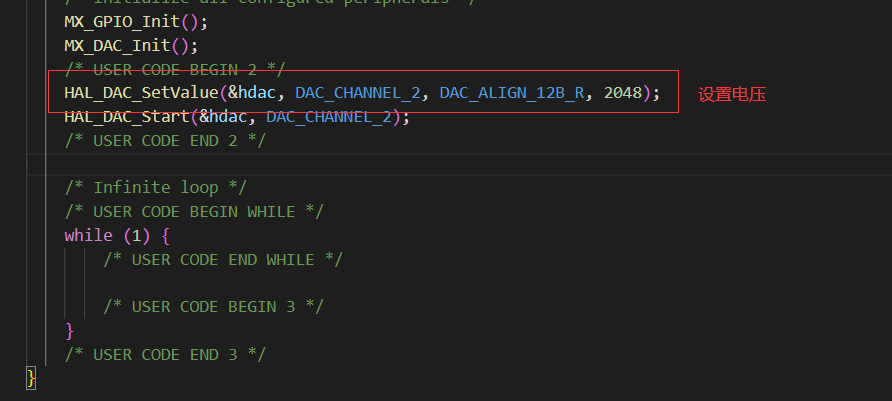

DAC~out~ = VREF x ( value / 4095 )。由于 STM32F103RCT6 的 VREF 引脚没有引出，而是在内部直连芯片 VDD，所以 VREF = VDD。此处使用 3.3V 电源对芯片进行供电，所以当 value 为 2048 时，DAC~out~ = 1.65V（使用万用表测量即可）。

```c
HAL_DAC_SetValue(&hdac, DAC_CHANNEL_2, DAC_ALIGN_12B_R, 2048);
HAL_DAC_Start(&hdac, DAC_CHANNEL_2);
```

#### 三角波/噪声生成

**DAC**：

TIM 配置：

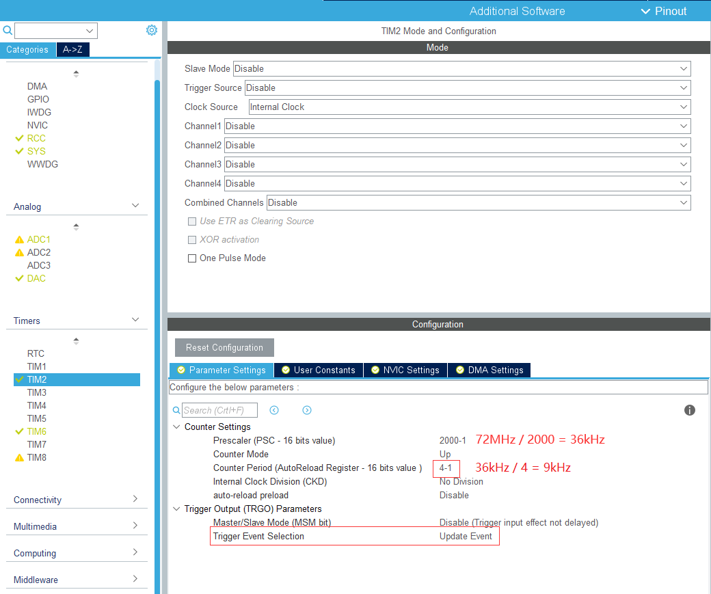

DAC 配置：

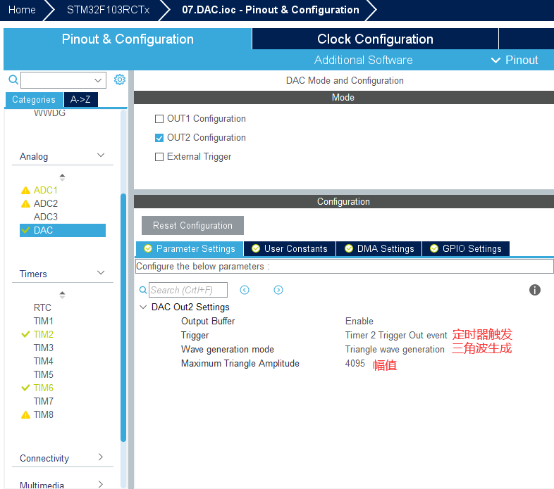

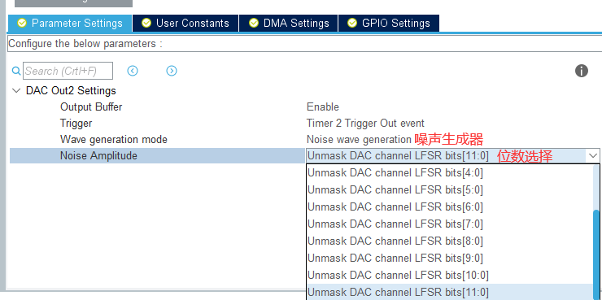

设置 DAC 最大幅值，每次定时器发生溢出事件时，内部的三角波计数器从 0 递增到 最大幅值，再递减到 0（步长为 1，单周期内点数 = 最大幅值 * 2）。

三角波频率：（系统时钟频率 $f_{systick}$，定时器分频系数 TIM_Prescaler，TIM_Period 定时器重装值，单周期内点数 N）

DAC 输出的电压值 DAC~out~ = VREF~+~ * 三角波计数器当前值 / 4095

**ADC**：使用定时器采集 DAC （使用杜邦线连接 PA5(DAC) 和 PB0(ADC) ）

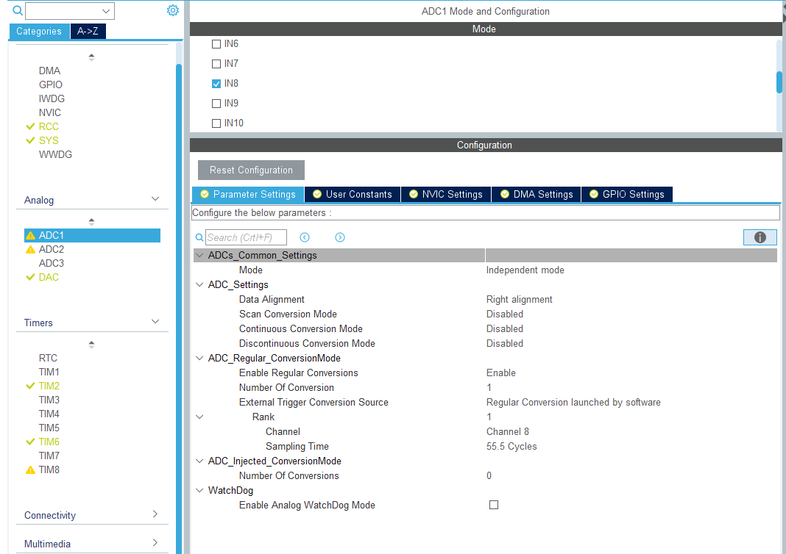

采样时钟配置：

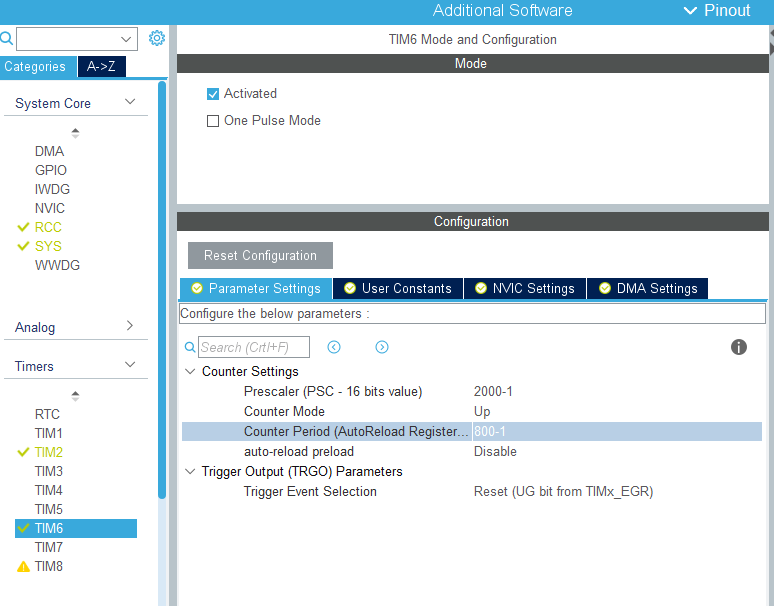

采样定理：采样时钟的频率需大于等于2倍的信号频率。

中断配置：

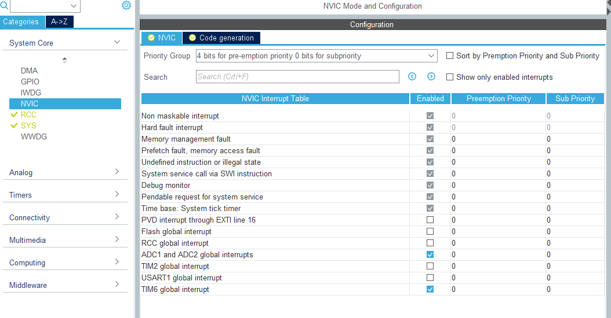

```c
void HAL_TIM_PeriodElapsedCallback(TIM_HandleTypeDef* htim) {  // TIM
    if (htim->Instance == TIM6) HAL_ADC_Start_IT(&hadc1);
}
void HAL_ADC_ConvCpltCallback(ADC_HandleTypeDef* hadc) {  // ADC
    HAL_ADC_Stop_IT(&hadc1);
    HAL_TIM_Base_Stop_IT(&htim6);
    printf("%.2f\r\n", HAL_ADC_GetValue(&hadc1) / 4096.f * 3.3f);
    HAL_TIM_Base_Start_IT(&htim6);
}
```

代码：（此处略去了重定向 printf 的代码）

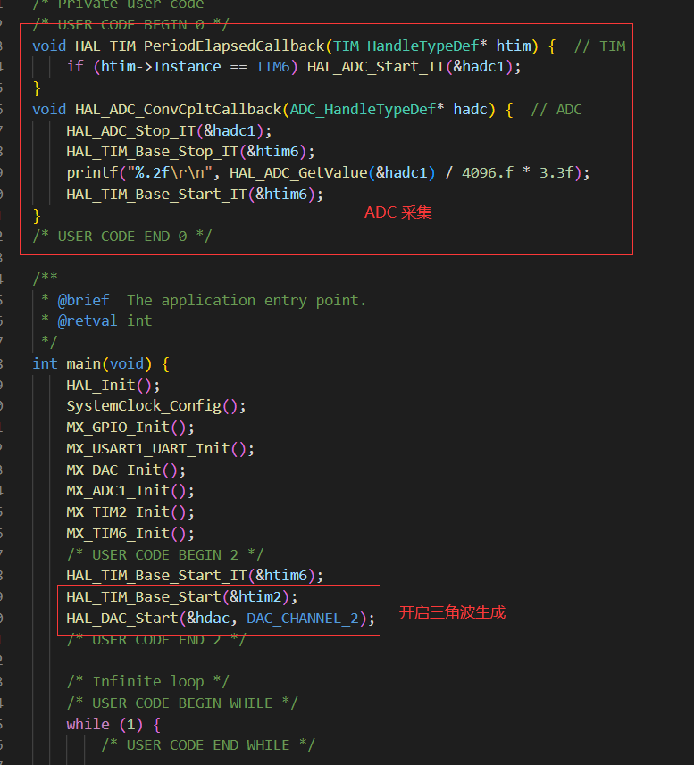

```c
HAL_TIM_Base_Start_IT(&htim6);
HAL_TIM_Base_Start(&htim2);
HAL_DAC_Start(&hdac, DAC_CHANNEL_2);
```

采集效果（使用的上位机为 [vofa+][https://www.vofa.plus/]）：

* 最大幅值位4095的三角波

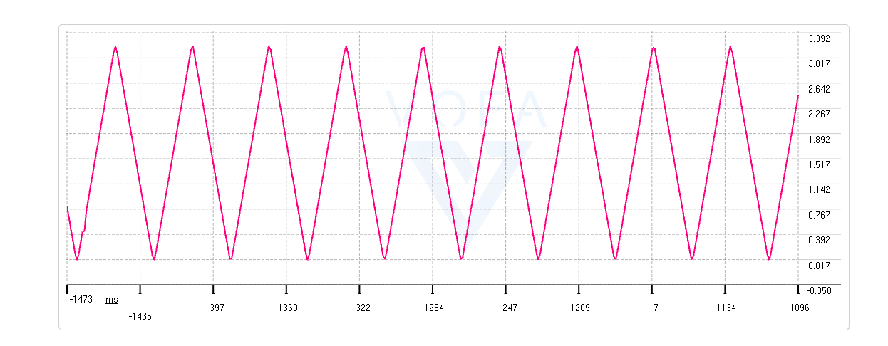

* 12bits 噪声：

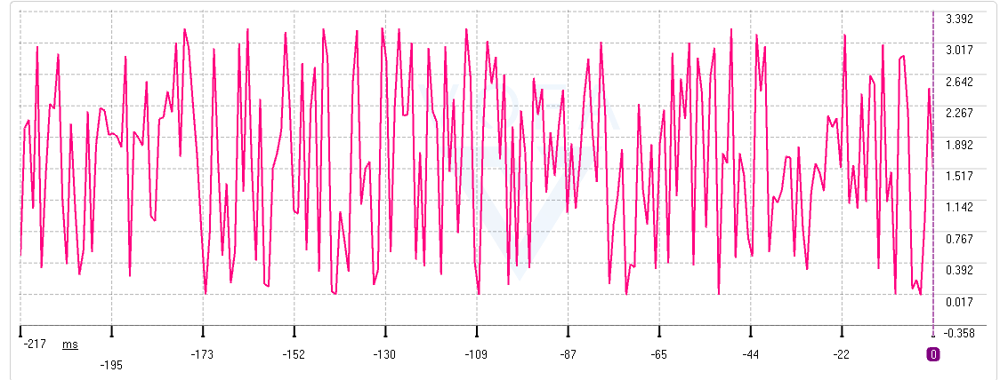

#### 正弦波生成

**DAC**：

TIM 配置：

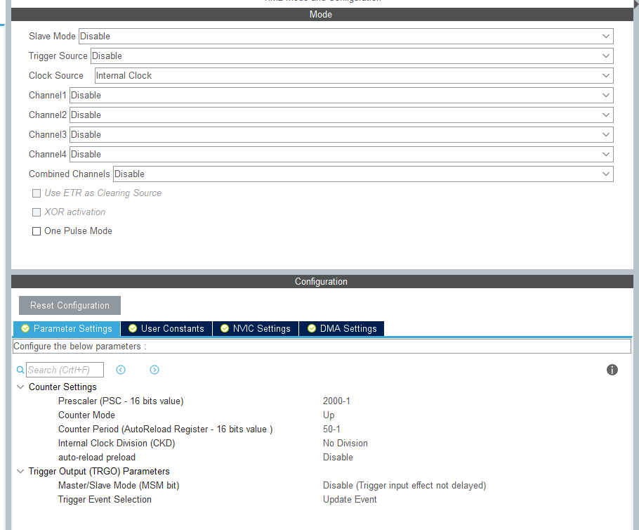

DAC 配置：

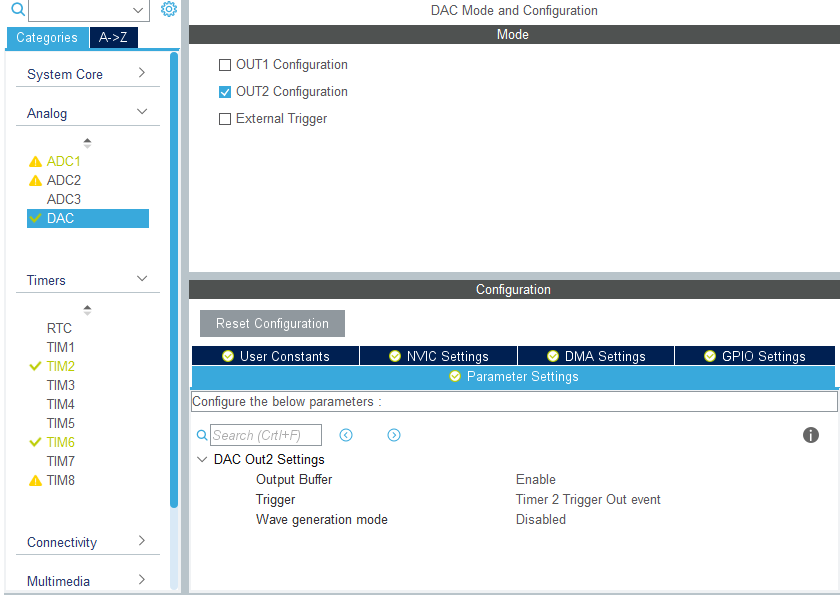

DMA 配置：

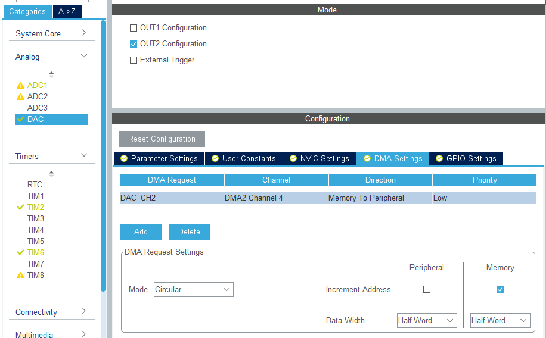

每次 TIM2 的溢出都会触发一次 DMA 传递一个值，此处使用的时 256 个值，所以需要 TIM2 溢出 256 次，才输出 1 个周期的正弦波。

**ADC**：配置和上方输出三角波的相同

正弦波生成：

```python
import numpy as np
import math
POINT_NUM = 256  # 点数
AMPLITUDE = 2048 # 幅值
n = np.linspace(0, 2*math.pi, POINT_NUM)
vals = map(math.sin, n)  # [-1,1]
wave = []
for i in vals:
    v = round((i+1) * AMPLITUDE)  # [0,2] * amplitude
    if v > 4095:
        v = 4095
    wave.append(v)
print(list(map(int, wave)))
```

代码：


```c
uint16_t Sine12bit[256] = {2048, 2098, 2149, 2199, 2250, 2300, 2350, 2399, 2449, 2498, 2548, 2596, 2645, 2693, 2741, 2788, 2835, 2881, 2927, 2972, 3017, 3061, 3105, 3148, 3190, 3231, 3272, 3312, 3351, 3390, 3428, 3465, 3501, 3536, 3570, 3603, 3636, 3667, 3697, 3727, 3755, 3783, 3809, 3834, 3858, 3881, 3903, 3924, 3944, 3962, 3980, 3996, 4011, 4025, 4037, 4049, 4059, 4068, 4075, 4082, 4087, 4091, 4094, 4095, 4095, 4095, 4093, 4089, 4085, 4079, 4072, 4063, 4054, 4043, 4031, 4018, 4003, 3988, 3971, 3953, 3934, 3914, 3892, 3870, 3846, 3822, 3796, 3769, 3741, 3712, 3682, 3651, 3620, 3587, 3553, 3518, 3483, 3446, 3409, 3371, 3332, 3292, 3252, 3211, 3169, 3126, 3083, 3039, 2995, 2950, 2904, 2858, 2811, 2764, 2717, 2669, 2621, 2572, 2523, 2474, 2424, 2375, 2325, 2275, 2224, 2174, 2124, 2073, 2023, 1972, 1922, 1872, 1821, 1771, 1721, 1672, 1622, 1573, 1524, 1475, 1427, 1379, 1332, 1285, 1238, 1192, 1146, 1101, 1057, 1013, 970, 927, 885, 844, 804, 764, 725, 687, 650, 613, 578, 543, 509, 476, 445, 414, 384, 355, 327, 300, 274, 250, 226, 204, 182, 162, 143, 125, 108, 93, 78, 65, 53, 42, 33, 24, 17, 11, 7, 3, 1, 0, 0, 2, 5, 9, 14, 21, 28, 37, 47, 59, 71, 85, 100, 116, 134, 152, 172, 193, 215, 238, 262, 287, 313, 341, 369, 399, 429, 460, 493, 526, 560, 595, 631, 668, 706, 745, 784, 824, 865, 906, 948, 991, 1035, 1079, 1124, 1169, 1215, 1261, 1308, 1355, 1403, 1451, 1500, 1548, 1598, 1647, 1697, 1746, 1796, 1846, 1897, 1947, 1998, 2048};
HAL_DAC_Start_DMA(&hdac, DAC_CHANNEL_2, (uint32_t*)Sine12bit, 256, DAC_ALIGN_12B_R);
```

采集效果：

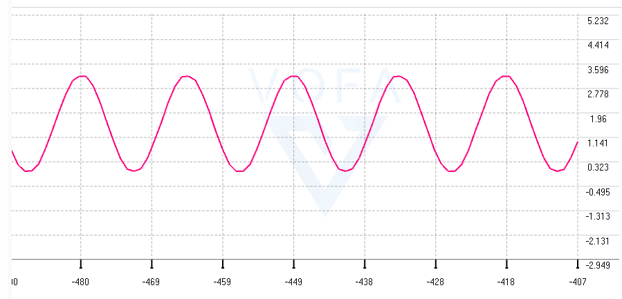

