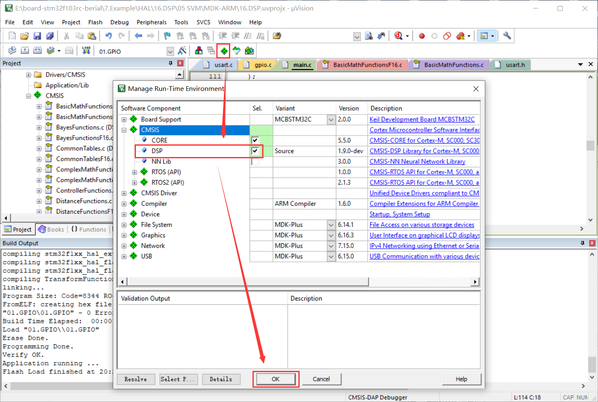
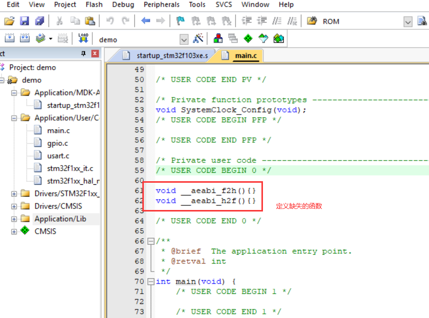
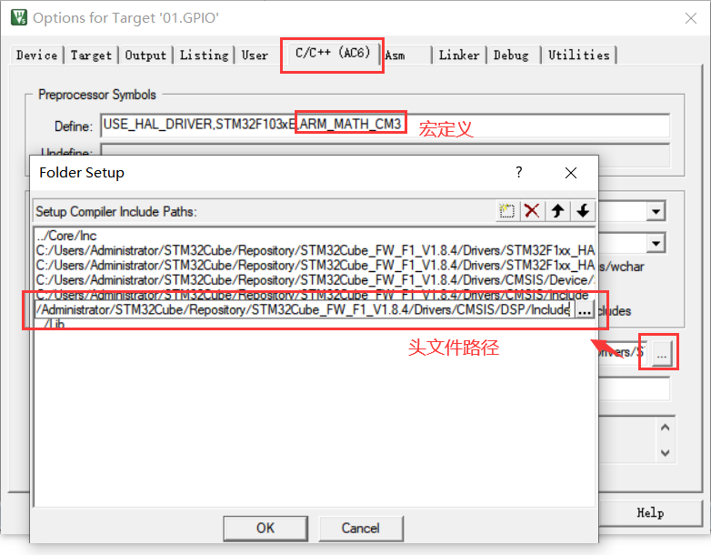
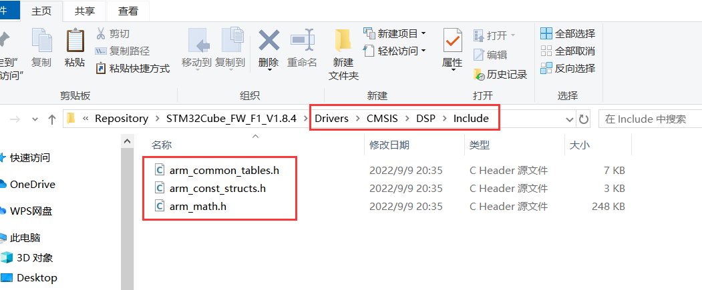
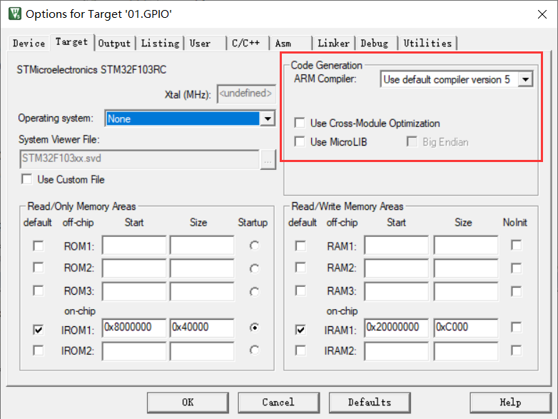
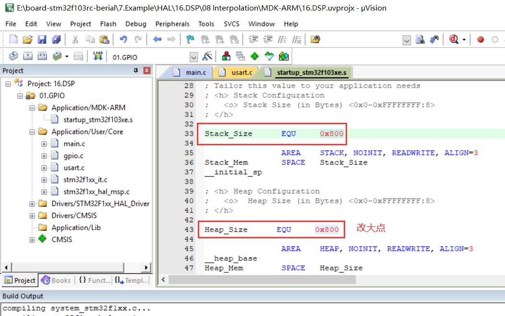
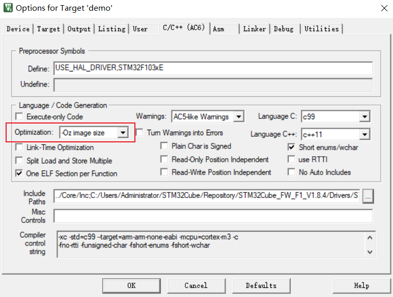
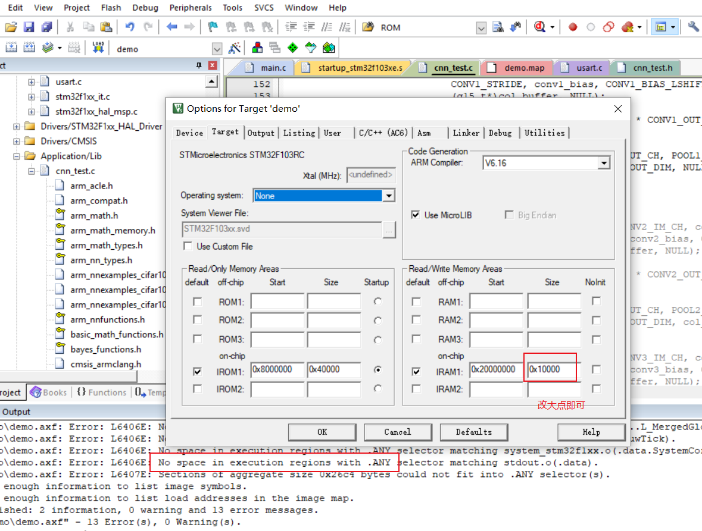

## DSP & NN

**拓展部分：ARM 数学库 及 神经网络**

----

### ARM Comiler V6

优点：编译快，配置简便

缺点：使用微库导致部分函数缺失






```c
void __aeabi_f2h(){}
void __aeabi_h2f(){}
```

### ARM Comiler V6

优点：编译快

缺点：库不是最新的，缺少支持向量机，高斯朴素贝叶斯分类等库


宏定义（F103为CM3内核）：

```
ARM_MATH_CM3
```



头文件：

```
Drivers/CMSIS/DSP/Include
```



库：

```
arm_cortexM3l_math.lib
```


### ARM Comiler V5

有点：函数全，配置简便

缺点：编译慢，不能使用微库



库勾选：


直接勾选确认即可，不需配置头文件路径等。

### 报错：空间不足

 Error: L6406E: No space in execution regions with .ANY selector matching xxx.o(.constdata).



开启代码优化：



或者这里改大点：

