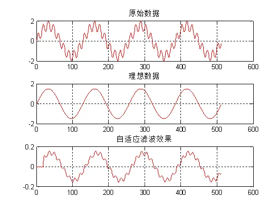
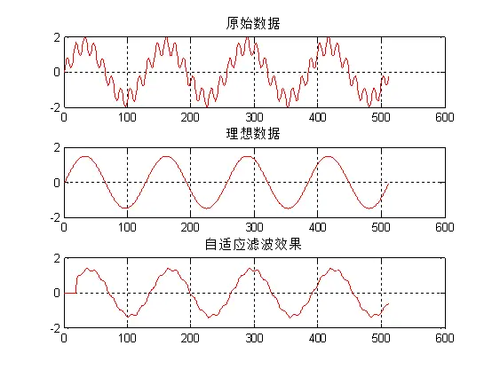
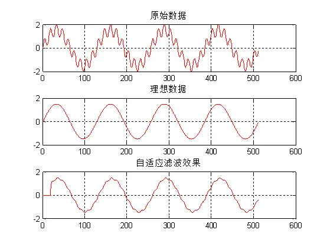
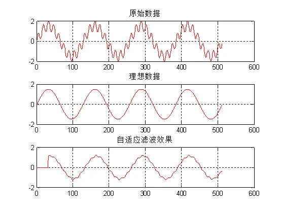
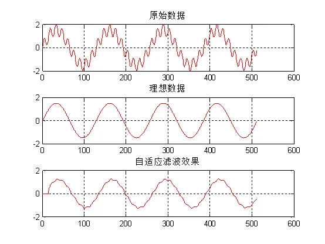
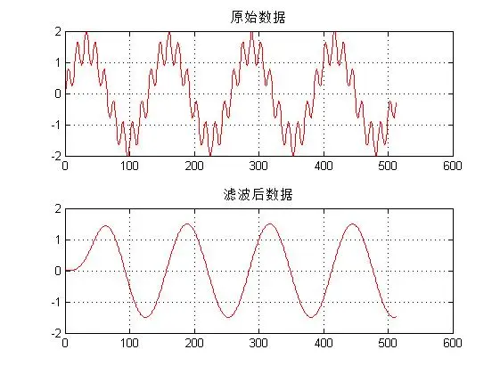
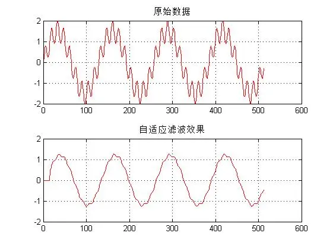

[https://www.bilibili.com/read/cv20101814]

阶数

20阶，迭代次数22次

20阶，迭代次数100次

20阶，迭代次数300次

10阶，迭代次数100次

32阶，迭代次数100次

16阶，迭代次数128次

IIR滤波测试

IIR滤波结果

IIR滤波[https://www.bilibili.com/read/cv19597688]

自适应滤波（16阶，128次迭代）

结论：

可以看到IIR滤波后比较平滑，但IIR有明显的相位延迟，另外自适应滤波阶数前序列为0，且运行时间较长；自适应滤波随着迭代次数增加效果变好，随着阶数增加效果变好，运行时间也变长。
