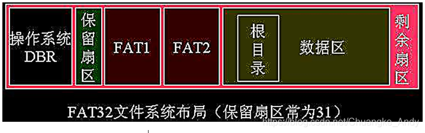
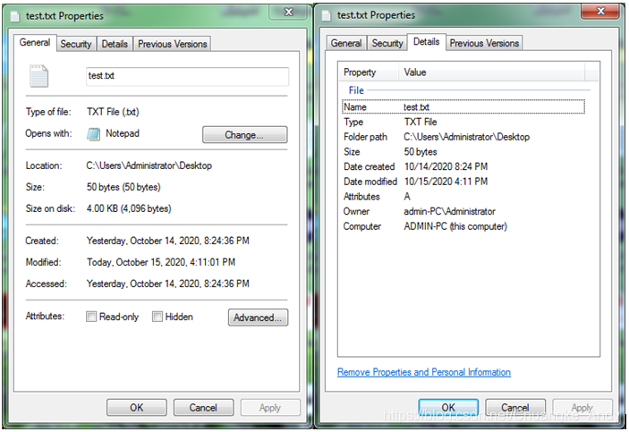
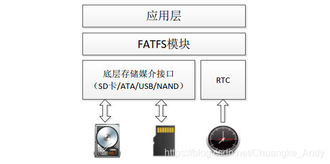
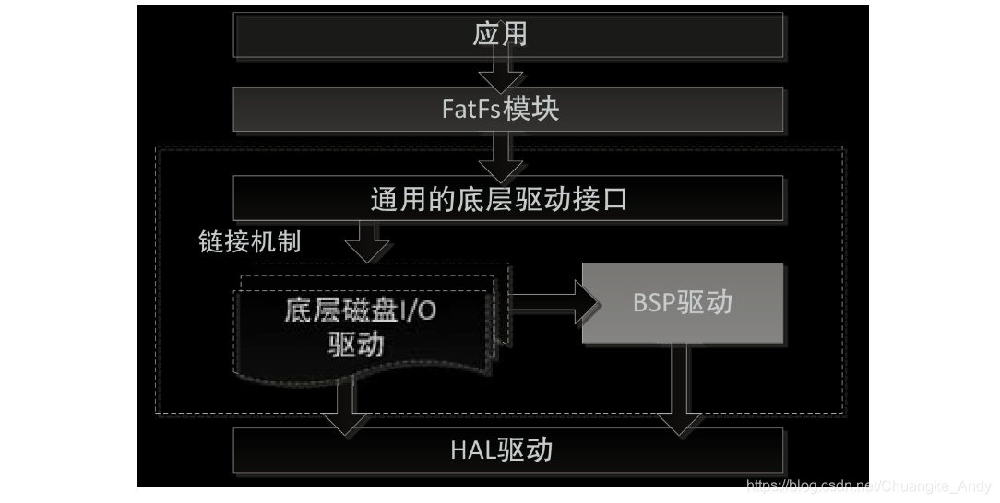
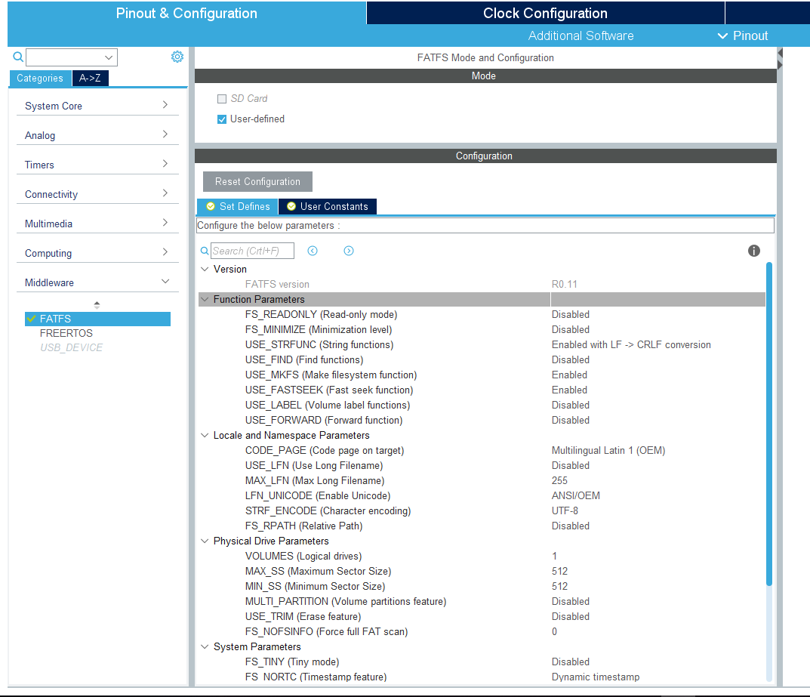
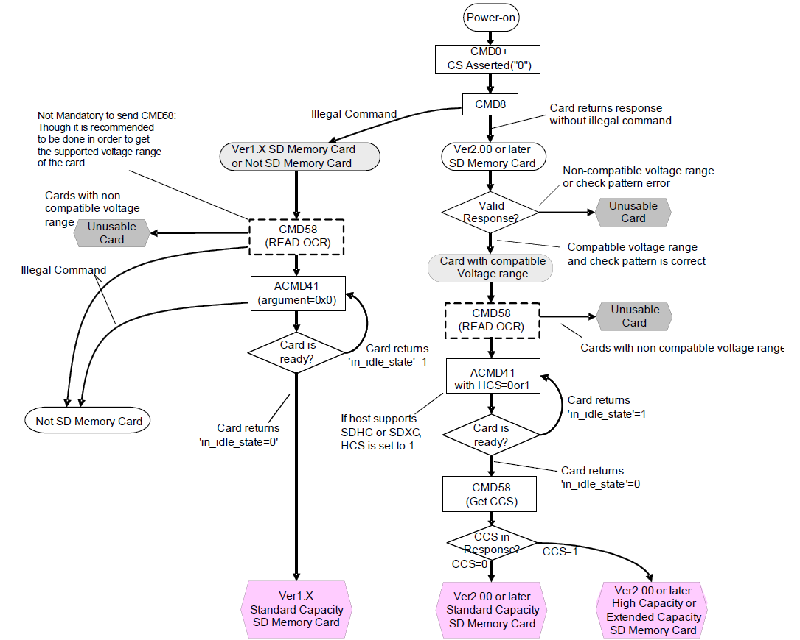
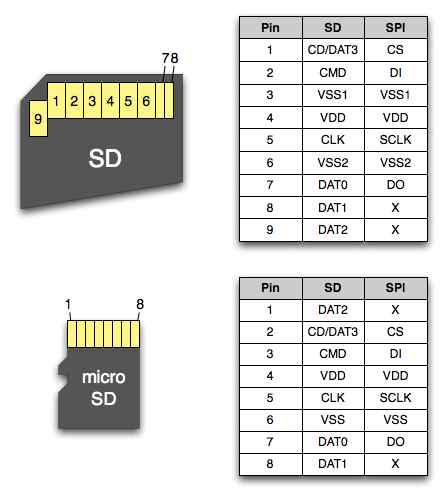
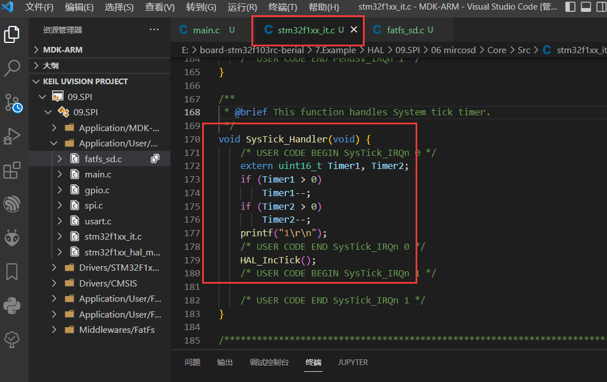
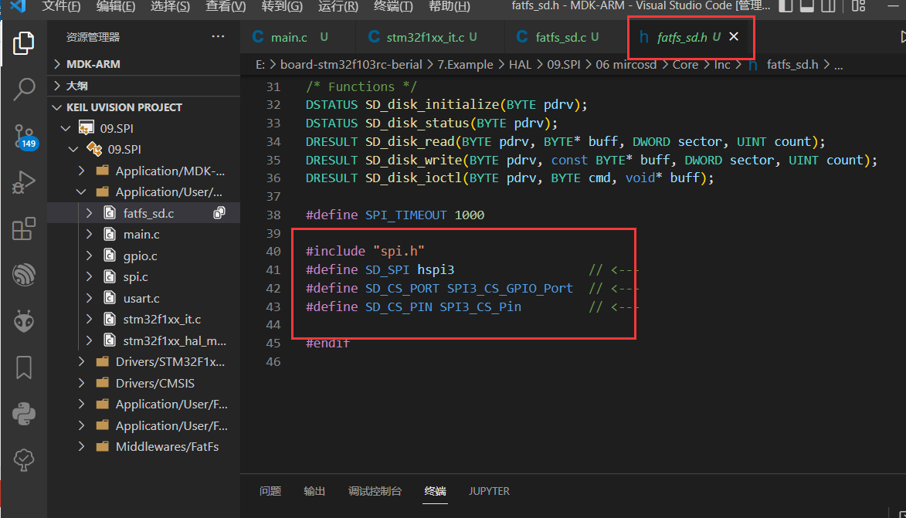

https://blog.csdn.net/weixin_42359585/article/details/108743762

https://gitee.com/KANG-H/stm32_hal_sd_sdio_fatfs?_from=gitee_search

https://www.cnblogs.com/milton/p/15367647.html

https://blog.csdn.net/qq_54496810/article/details/122073446


usb:http://www.mcublog.cn/stm32/2020_04/stm32-fatfs-spi-sd/


注：不带文件系统的SD卡仅能实现简单的读写扇区操作，要真正应用SD卡必须要使用文件系统。

## FATFS 文件系统

FAT：File Allocation Table，文件分配表

#### 存储原理

以FAT32为例，下图为FAT32文件系统布局：



簇是文件存储的最小单元，FAT32分区大小与对应簇空间大小关系如下表示：

|  分区空间大小  | 簇空间大小 | 每个簇包含的扇区数 |
| :------------: | :--------: | :----------------: |
|     < 8GB      |    4KB     |         8          |
| [ 8GB, 16GB )  |    8KB     |         16         |
| [ 16GB, 32GB ) |    16KB    |         32         |
|    >= 32GB     |    32KB    |         64         |

例如：创建一个50字节的test.txt文件，文件大小是50字节，但是占用磁盘空间为4096字节（一个簇）



#### 层次结构

FATFS模块的层次结构如下图示：



* 应用层：提供应用接口函数。http://elm-chan.org/fsw/ff/00index_e.html



* FATFS模块：文件读写协议。
* 底层接口：包括存储媒介读写接口和供给文件创建修改时间的实时时钟。

#### 源码文件

| 与平台无关 |                                   |
| ---------- | --------------------------------- |
| ffconf.h   | FATFS模块配置文件                 |
| ff.h       | FATFS和应用模块公用的包含文件     |
| ff.c       | FATFS模块                         |
| diskio.h   | FATFS和disk I/O模块公用的包含文件 |
| interger.h | 数据类型定义                      |
| option     | 可选的外部功能（比如支持中文）    |

| 与平台相关 |                               |
| ---------- | ----------------------------- |
| diskio.c   | FATFS和disk I/O模块接口层文件 |

## CUBEMX



参数详看：FatFs - Configuration Options.pdf

#### 生成文件

- 在`..\Middlewares\Third_Party\FatFs`中提供了FATFS文件系统相关的中间件原码
- 在`..\FATFS\Target\bsp_driver_sd.c/.h`中实现SD卡的相关初始化、读写等操作
- 在`..\FATFS\Target\sd_diskio.c/.h`中实现SD卡的底层磁盘IO相关初始化、读写等操作
- 在`..\FATFS\App\fatfs.c/.h`中实现通过fatfs文件系统挂载SD卡

#### 需要实现的函数

- disk_initialize - Initialize disk drive 初始化磁盘驱动器
- disk_status - Get disk status 获取磁盘状态
- disk_read - Read sector(s) 读扇区
- disk_write - Write sector(s) 写扇区
- disk_ioctl - Control device dependent features 设备相关的控制特性
- get_fattime - Get current time 获取当前时间

#### TF卡初始化流程



1. 上电, 将CS片选信号拉低, 开启CLK给SD卡发送至少74个时钟周期, 让SD卡完成自身检查和初始化, 进入IDLE状态. 之后对SD卡发送`CMD0`, 进入SPI模式. SD卡从D_OUT线上的返回值如果是0x01, 说明CMD0操作是成功的, 此时SD卡处在IDLE状态.
2. 发送`CMD8`. `CMD8`是检测SD卡版本的命令, 如果SD卡对此命令不识别, 说明SD卡为老版本, 如果SD卡有正确返回值(00 01 AA), 说明SD卡是2.0+版本的, 支持大容量储存, 也就是SDHC卡.
3. 发送`ACMD41`, 让卡从IDLE状态进入读写就绪的状态. 这里要注意, SD卡命令有两种, CMD和ACMD, 直接发送命令默认为CMD, 如果要发送ACMD, 需要先发送`CMD55`, 接收到正常的返回值0X01, 接着发送`ACMD41`, 完成卡从IDLE状态到读写状态的初始化进程. SD卡退出IDLE状态的正确返回值为0X00. `ACMD41`的值有多种, 常用的为`0x40000000`.
4. 发送`CMD58`, 读取OCR寄存器, OCR寄存器记录了SD卡可识别的电压范围; 是否支持大容量存储(即SDHC); 上电状态. 发送了`CMD58`后, SD卡的返回值为R1返回值+OCR寄存器的内容. 根据datasheet可以得到很多信息. 手册上推荐发送这个命令, 主要功能是知道V2.0SD卡是标准版本还是大容量的版本, 是否支持按块(512BYTE)寻址, 从而读写的方法也不同. 判断正常的方法, CMD58的返回值类型为R3, 即R1类型+OCR寄存器内容, 如果一切就绪, OCR的最高四位为1100. 这时候初始化就完成了, SD卡进入读写状态.

实测CMD58返回的结果

- 2GB TF卡: `80 FF 80 00`
- 8GB TF卡: `C0 FF 80 00`
- 16GB TF卡: `C0 FF 80 00`

读写数据

- 无论读写数据还是接收发送CMD, 都会用到两个最基本的函数, 一个是read_byte(), 即从SD卡的DATA_OUT引脚上读取8bit(1byte)的数据; 另一个是write_byte(), 向SD卡的DATA_IN引脚写一个字节的数据.
- 命令, 数据和返回值都是由多字节组合成的, 在一个操作中会多次调用这两个基本的函数. 如从指定的地址中读取512字节的数据, 在发送了读的命令后相应的要调用512次read_byte().
- 读写函数的时序: 向SD卡写数据时, 时钟上升沿时数据有效; 从SD卡读数据时, 时钟在高电平时, MCU读到的数据有效.

#### 接线说明



#### 代码修改

* 在系统时间中断中添加倒计时：

Timer1 和 Timer2 用于 fatfs_sd.c 中的超时判断。



* 修改引脚为 TFCRAD 引脚

注：fatfs_sd.h 和 fatfs_sd.c 不是 cubemx 生成的，而是外部实现的用于 fatfs 的底层接口



* 将底层接口对接 fatfs 的 IO

在 user_diskio.h 中引入头文件 fatfs_sd.h，并在 user_diskio.c 补上对应函数。


* 给写入的文件添加时间属性

##### 如果系统没有时间信息

在 ffconf.h 中, 将`#define _FS_NORTC 0`改为`#define _FS_NORTC 1`, 这时候会使用底下的几个固定时间戳作为所有的文件创建时间, 具体可以这些变量后面的注释。

```c
#define _NORTC_MON  6
#define _NORTC_MDAY 4
#define _NORTC_YEAR 2015
```

##### 如果有时间信息

前往fatfs.c, 实现这个函数, 这里返回的时间在创建文件时会成为文件的创建时间

```c
DWORD get_fattime(void){
  return 0;
}
```

