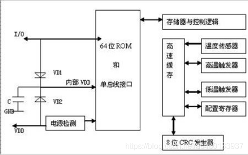
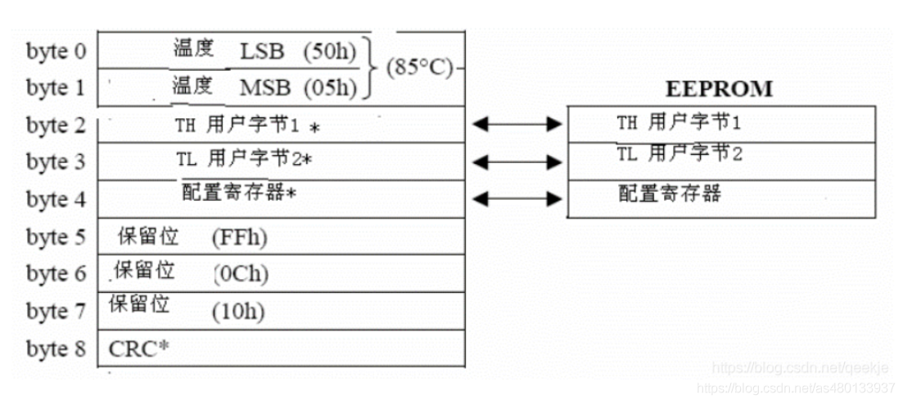
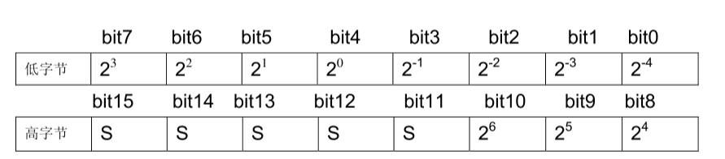
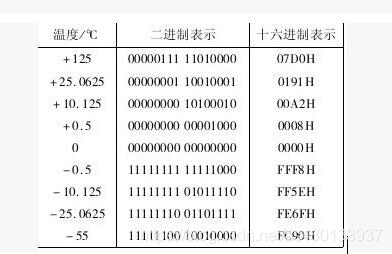
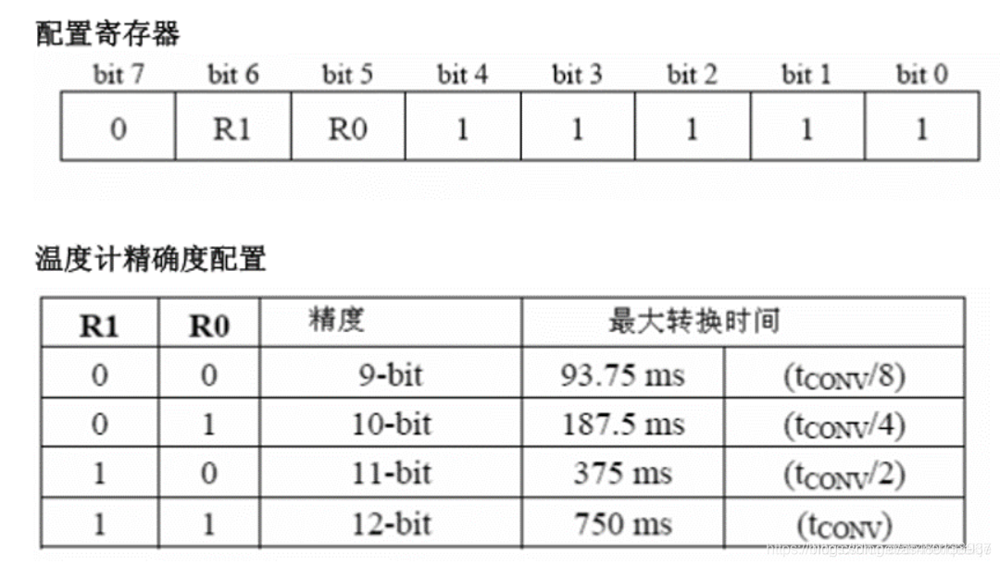

#### 内部构成

* 64位ROM：储存64位序列号，实现单根总线上挂载多个DS18B20
* 高速暂存器：温度传感器、低温触发器&高温触发器、配置寄存器（配置温度分辨率）
* 存储器：由1个高速的RAM和1个可擦除的EEPROM组成，EEPROM存储低温TL和高温TH报警值以及温度分辨率

温度的分辨率 0.5°C（9位），0.25°C（10位），0.125°C（11位），0.0625°C（12位，默认）

#### 高速缓存器（9字节）

* 字节0~1 是温度存储器，用于存储转换好的温度。
  * 第0个字节存储温度低8位
  * 第1个字节存储温度高8位

* 字节2~3 是用户用来设置最高报警和最低报警值(TH和TL)。

* 字节4 是配置寄存器，用来配置转换精度，可以设置为9~12 位。

* 字节5~7 保留位。芯片内部使用。

* 字节8 CRC校验位。是64位ROM中的前56位编码的校验码。由CRC发生器产生。

#### DS18B20温度读取与计算

DS18B20采用16位补码的形式来存储温度数据，温度是摄氏度。当温度转换命令发布后，经转换所得的温度值以二字节补码形式存放在高速暂存存储器的第0和第1个字节。

高字节的五个S为符号位，温度为正值时S=1，温度为负值时S=0，剩下的11位为温度数据位。

- 对于12位分辨率，所有位全部有效。
- 对于11位分辨率，位0(bit0)无定义。
- 对于10位分辨率，位0和位1无定义。
- 对于9位分辨率，位0，位1，和位2无定义。

对应的温度计算：

* 当五个符号位S=0时，温度为正值，直接将后面的11位二进制转换为十进制，再乘以0.0625(12位分辨率)，就可以得到温度值；

* 当五个符号位S=1时，温度为负值，先将后面的11位二进制补码变为原码(符号位不变，数值位取反后加1)，再计算十进制值。再乘以0.0625(12位分辨率)，就可以得到温度值；

例如：

+125℃的数字输出07D0(00000111 11010000)

转换成10进制是2000，对应摄氏度：0.0625x2000=125°C

-55℃的数字输出为 FC90。

首先取反，然后+1，转换成原码为：11111011 01101111

数值位转换成10进制是870，对应摄氏度：-0.0625x870=-55°C

#### 配置寄存器

在配置寄存器中，我们可以通过R0和R1设置DS18B20的转换分辨率，DS18B20在上电后默认R0=1和R1=1(12分辨率)，寄存器中的第7位和第0位到4位保留给设备内部使用。

