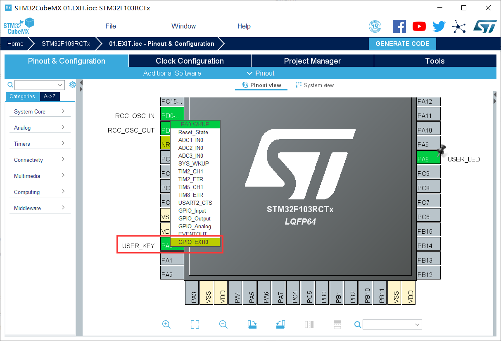
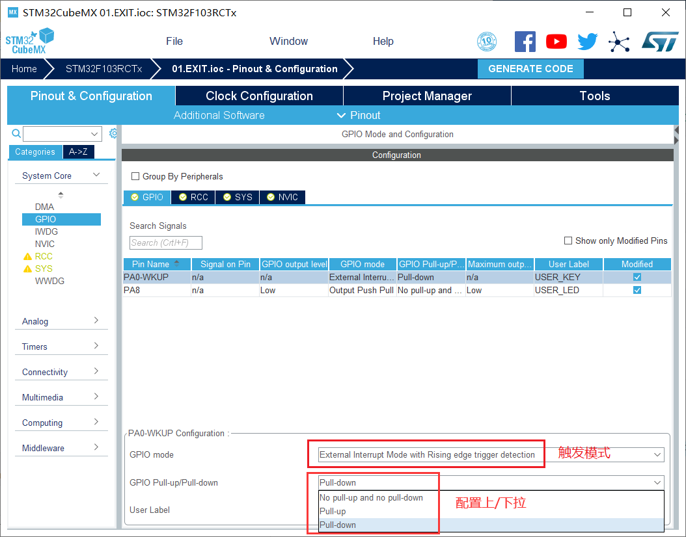
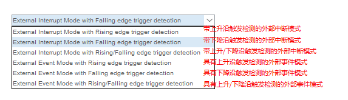
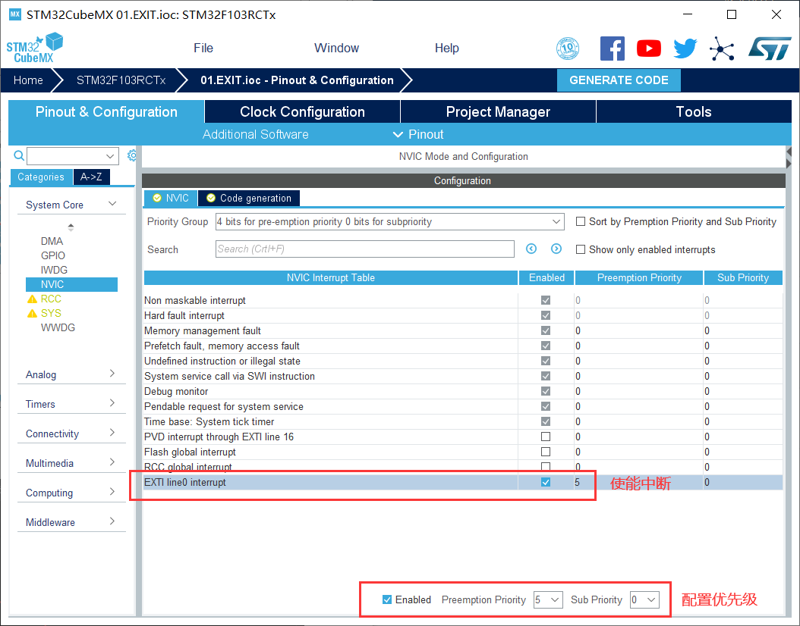
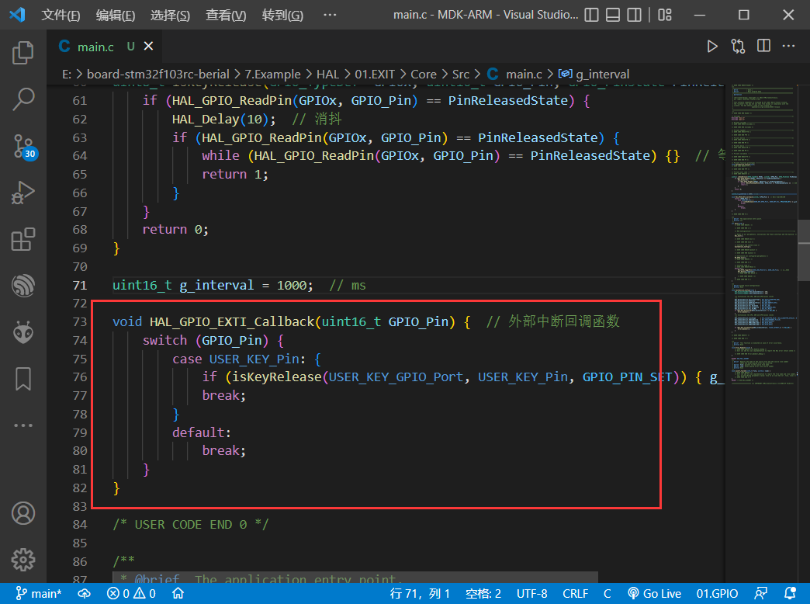

功能：每次按下 `WK_UP`， `LED` 会闪烁得更快。

## GPIO

GPIO：General-purpose input/output，通用的输入输出口

`详细剖析`：https://blog.csdn.net/as480133937/article/details/98063549

### 引脚配置

* 输入模式

|Mode||Desc||
| --------------------- | ---- | ---- | ---- |
| GPIO_Mode_IN_FLOATING | analog in | 浮空输入 | floating input |
| GPIO_Mode_IPU         | input floating | 上拉输入 | input pull-up |
| GPIO_Mode_IPD         | input pulled down | 下拉输入 | input pull-dowm |
| GPIO_Mode_AIN         | input pulled up | 模拟输入 | analog Input |

* 输出模式（带上拉/下拉）
|Mode||Desc||
| --------------------- | ---- | ---- | ---- |
|GPIO_Mode_Out_OD |output open drain |开漏输出|open-drain output|
|GPIO_Mode_Out_PP |output push-pull |推挽输出|push-pull output|
|GPIO_Mode_AF_OD |alternate function open drain |复用开漏输出| multiplexed open-drain output |
|GPIO_Mode_AF_PP|alternate function push pull| 复用推挽输出 | multiplexed push-pull output |

* 最大输出速度
|Speed|Desc|
| --------------------- | ---- |
| 2MHz |低速|
| 25MHz |中速|
| 50MHz|快速|
|100MHz |高速|

### 相关函数

在 `stm32f1xx_hal_gpio.h` 中，有以下函数（部分）：

* 读取引脚电平

```c
GPIO_PinState HAL_GPIO_ReadPin(GPIO_TypeDef* GPIOx, uint16_t GPIO_Pin); 
```

* 设置引脚电平

```c
void HAL_GPIO_WritePin(GPIO_TypeDef* GPIOx, uint16_t GPIO_Pin, GPIO_PinState PinState);
```

* 翻转引脚电平

```c
void HAL_GPIO_TogglePin(GPIO_TypeDef* GPIOx, uint16_t GPIO_Pin);
```

* 锁住引脚电平

```c
HAL_StatusTypeDef HAL_GPIO_LockPin(GPIO_TypeDef* GPIOx, uint16_t GPIO_Pin);
```

* 中断回调函数

```c
void HAL_GPIO_EXTI_Callback(uint16_t GPIO_Pin);
```

## EXIT

EXIT：external interrupts，外部中断

NVIC：nested vectored interrupt controller，嵌套向量中断控制器

### 配置流程

配置引脚为 EXIT 模式：



配置引脚初始参数：





使能外部中断和配置中断优先级（值越小优先级越高）：



代码编写：当中断触发时，会调用函数 `HAL_GPIO_EXTI_Callback`。



```c
void HAL_GPIO_EXTI_Callback(uint16_t GPIO_Pin) { 
    switch (GPIO_Pin) {
        case KEY1_Pin: {
            // do something
            break;
        }
        case KEY2_Pin: {
            // do something
            break;
        }
        default:
            break;
    }
}
```

