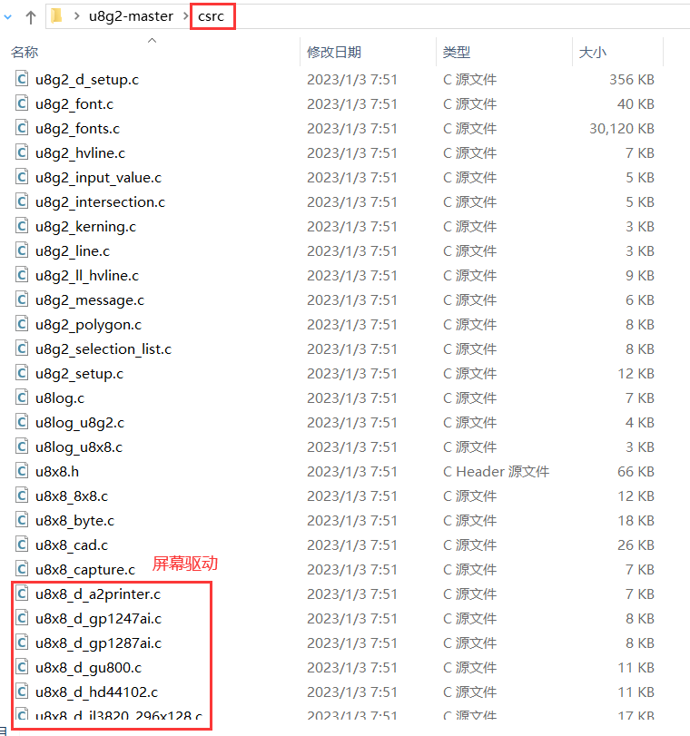
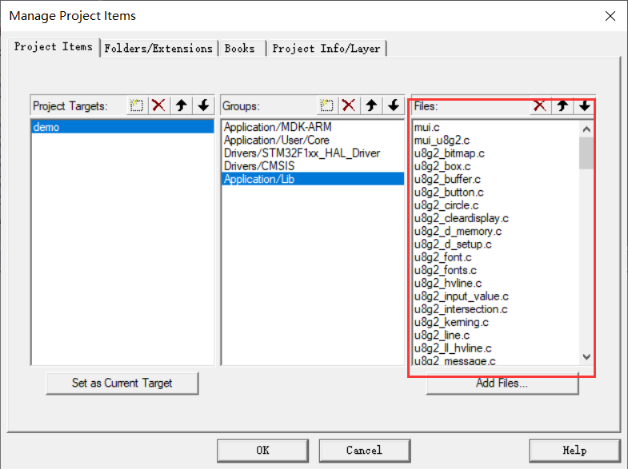
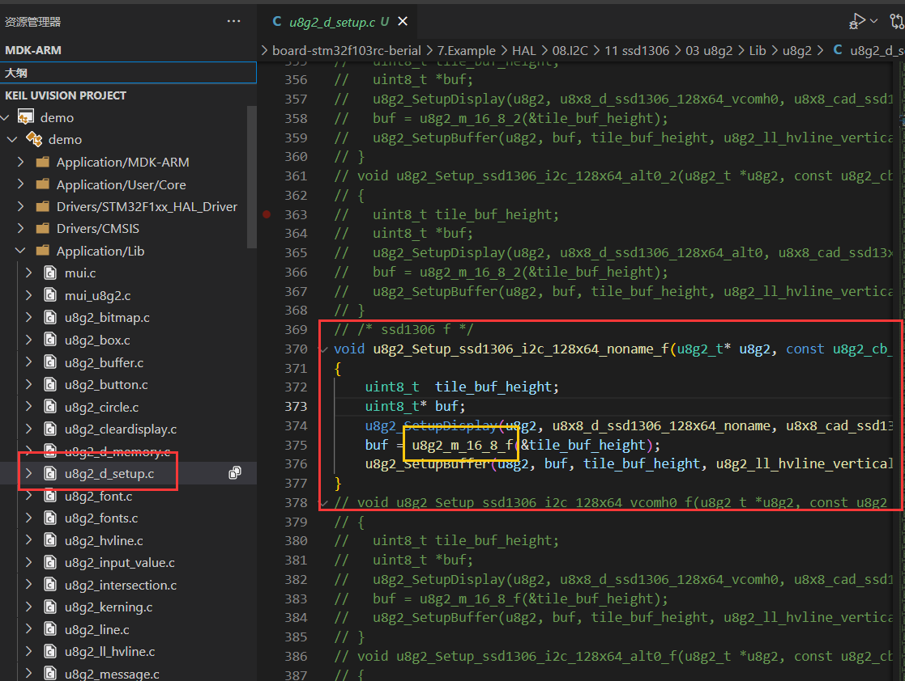
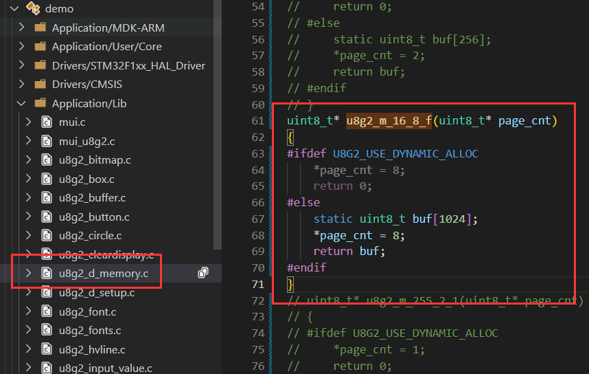
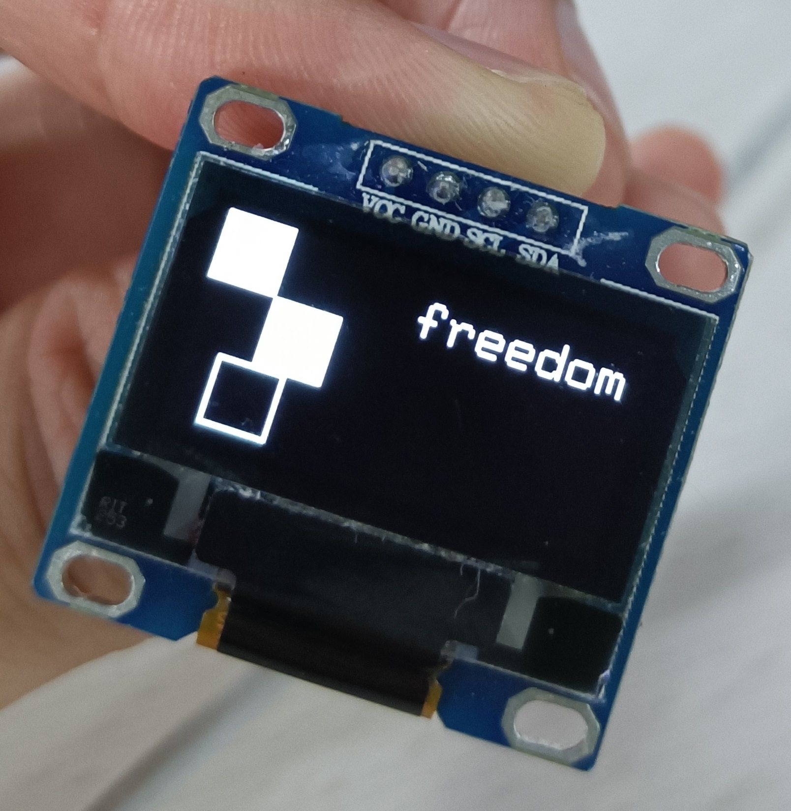

#### 下载

https://github.com/olikraus/u8g2

#### 移植（硬件I2C）

①

将 `csrc` 文件夹里的文件添加到工程中：






屏幕驱动：我用的屏幕是 SSD1306_128x64，对应 `u8x8_d_ssd1306_128x64_noname.c`

当用 AC5 编译器时，最好删除不需要的屏幕驱动，否则内存不够。用 AC6 编译器时，有内存优化，可以不删。

② 

找到 `u8g2_d_setup.c`，把 `u8g2_Setup_ssd1306_i2c_128x64_noname_f` 以外的函数全部屏蔽掉。



找到 `u8g2_d_memory.c`，把 `u8g2_m_16_8_f` 以外的函数全部屏蔽掉。



③

写接口（直接写在 `main.c` 中也行）：

`oled.h`

```c
#ifndef __OLED_U8G2_H_
#define __OLED_U8G2_H_

#include "i2c.h"
#include "u8g2/u8g2.h"

#define SSD1306_ADDRESS 0x78

uint8_t u8x8_byte_hw_i2c(u8x8_t* u8x8, uint8_t msg, uint8_t arg_int, void* arg_ptr);
uint8_t u8x8_gpio_and_delay(u8x8_t* u8x8, uint8_t msg, uint8_t arg_int, void* arg_ptr);
void    u8g2Init(u8g2_t* u8g2);

#endif
```

`oled.c`

```c
#include "oled.h"

void* memcpy_byte(void* dst, const void* src, int n)
{
    if (dst == NULL || src == NULL || n <= 0)
        return NULL;

    char* pdst = (char*)dst;
    char* psrc = (char*)src;

    if (pdst > psrc && pdst < psrc + n) {
        pdst = pdst + n - 1;
        psrc = psrc + n - 1;
        while (n--)
            *pdst-- = *psrc--;
    } else {
        while (n--)
            *pdst++ = *psrc++;
    }
    return dst;
}

uint8_t u8x8_byte_hw_i2c(u8x8_t* u8x8, uint8_t msg, uint8_t arg_int, void* arg_ptr)
{
    /* u8g2/u8x8 will never send more than 32 bytes
     * between START_TRANSFER and END_TRANSFER */

    static uint8_t buffer[128];
    static uint8_t length;

    switch (msg) {
        case U8X8_MSG_BYTE_INIT: {
            // i2c init
            break;
        }
        case U8X8_MSG_BYTE_START_TRANSFER: {
            length = 0;
            break;
        }
        case U8X8_MSG_BYTE_SEND: {
            memcpy_byte(buffer + length, arg_ptr, arg_int);
            length += arg_int;
            break;
        }
        case U8X8_MSG_BYTE_END_TRANSFER: {
            if (HAL_I2C_Master_Transmit(&hi2c2, SSD1306_ADDRESS, buffer, length, 0xFF) != HAL_OK) return 0;
            break;
        }
        case U8X8_MSG_BYTE_SET_DC: {
            break;
        }
        default:
            return 0;
    }
    return 1;
}

void delay_us(uint32_t time)
{
    uint32_t i = 8 * time;
    while (i--)
        ;
}

uint8_t u8x8_gpio_and_delay(u8x8_t* u8x8, uint8_t msg, uint8_t arg_int, void* arg_ptr)
{
    switch (msg) {
        case U8X8_MSG_DELAY_100NANO:  // delay arg_int * 100 nano seconds
            __NOP();
            break;
        case U8X8_MSG_DELAY_10MICRO:  // delay arg_int * 10 micro seconds
            for (uint16_t n = 0; n < 320; n++) {
                __NOP();
            }
            break;
        case U8X8_MSG_DELAY_MILLI:  // delay arg_int * 1 milli second
            HAL_Delay(1);
            break;
        case U8X8_MSG_DELAY_I2C:  // arg_int is the I2C speed in 100KHz, e.g. 4 = 400 KHz
            delay_us(5);
            break;                     // arg_int=1: delay by 5us, arg_int = 4: delay by 1.25us
        case U8X8_MSG_GPIO_I2C_CLOCK:  // arg_int=0: Output low at I2C clock pin
            break;                     // arg_int=1: Input dir with pullup high for I2C clock pin
        case U8X8_MSG_GPIO_I2C_DATA:   // arg_int=0: Output low at I2C data pin
            break;                     // arg_int=1: Input dir with pullup high for I2C data pin
        case U8X8_MSG_GPIO_MENU_SELECT:
            u8x8_SetGPIOResult(u8x8, /* get menu select pin state */ 0);
            break;
        case U8X8_MSG_GPIO_MENU_NEXT:
            u8x8_SetGPIOResult(u8x8, /* get menu next pin state */ 0);
            break;
        case U8X8_MSG_GPIO_MENU_PREV:
            u8x8_SetGPIOResult(u8x8, /* get menu prev pin state */ 0);
            break;
        case U8X8_MSG_GPIO_MENU_HOME:
            u8x8_SetGPIOResult(u8x8, /* get menu home pin state */ 0);
            break;
        default:
            u8x8_SetGPIOResult(u8x8, 1);  // default return value
            break;
    }
    return 1;
}

void u8g2Init(u8g2_t* u8g2)
{
    u8g2_Setup_ssd1306_i2c_128x64_noname_f(u8g2, U8G2_R0, u8x8_byte_hw_i2c, u8x8_gpio_and_delay);
    u8g2_InitDisplay(u8g2);
    u8g2_SetPowerSave(u8g2, 0);  // 使能
    u8g2_ClearBuffer(u8g2);
}
```

④

调用

`main.c`

```c
#include "oled/oled.h"

int main(void){

    u8g2_t u8g2; 
    u8g2Init(&u8g2);
    
    while (1) {
        u8g2_SendBuffer(&u8g2);
        u8g2_DrawBox(&u8g2, 0, 0, 20, 20);
        u8g2_DrawBox(&u8g2, 20, 20, 20, 20);
        u8g2_SendBuffer(&u8g2);
        u8g2_DrawFrame(&u8g2, 10, 40, 20, 20);
        u8g2_SendBuffer(&u8g2);
        u8g2_SetFont(&u8g2, u8g2_font_DigitalDiscoThin_tf);
        u8g2_DrawStr(&u8g2, 30, 10, "free");
        u8g2_SendBuffer(&u8g2);
        HAL_Delay(1000);
    }
    
}
```



#### 上手

https://blog.csdn.net/dpjcn1990/article/details/92831760