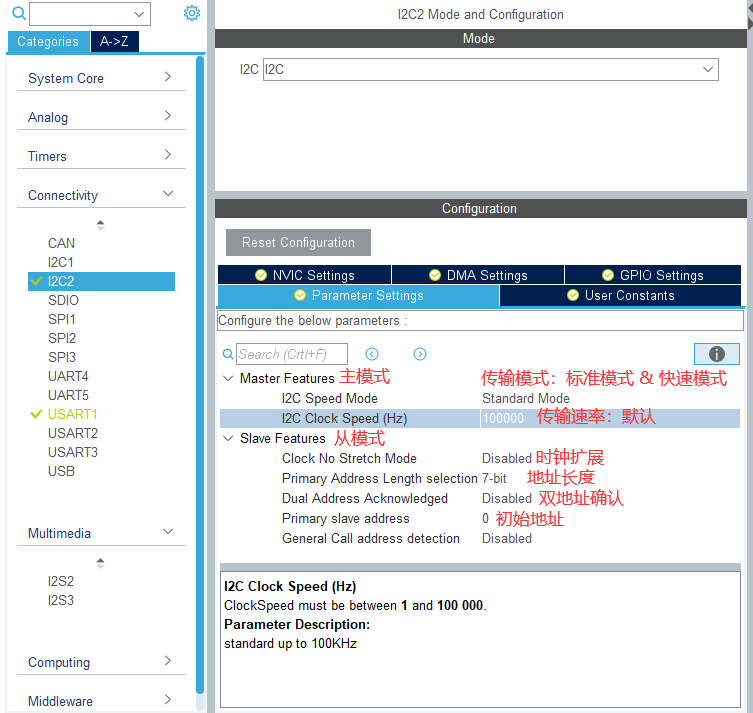
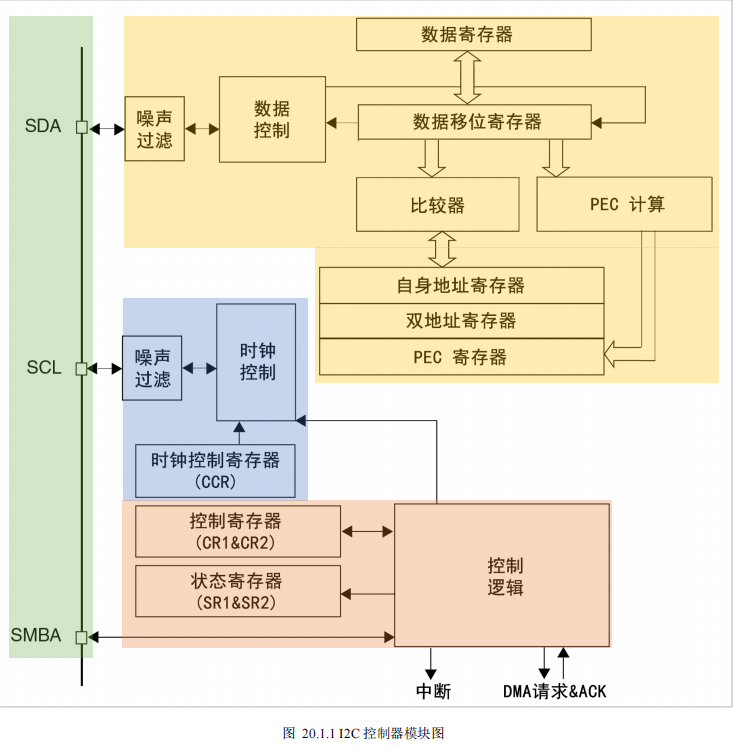

# I2C

#### 相关函数

```c
HAL_StatusTypeDef HAL_I2C_Mem_Read(I2C_HandleTypeDef *hi2c, uint16_t DevAddress, uint16_t MemAddress, uint16_t MemAddSize, uint8_t *pData, uint16_t Size, uint32_t Timeout); // 读
HAL_StatusTypeDef HAL_I2C_Mem_Write(I2C_HandleTypeDef *hi2c, uint16_t DevAddress, uint16_t MemAddress, uint16_t MemAddSize, uint8_t *pData, uint16_t Size, uint32_t Timeout); // 写
```

* DevAddress：8bits 器件地址
* MemAddress：寄存器地址
* MemAddSize：寄存器地址大小（eg:I2C_MEMADD_SIZE_8BIT）
* pData：数据缓冲区指针
* Size：数据缓冲区大小
* Timeout：超时时间

### 配置

主模式：



标准模式（Standard mode，最高速度100kHz）

快速模式（Fast mode，最高速度400kHz）

SMBus2.0（System Management Bus，系统管理总线）

PMBus （Power Management Bus，电源管理总线）

---

