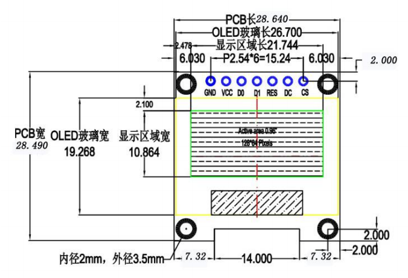
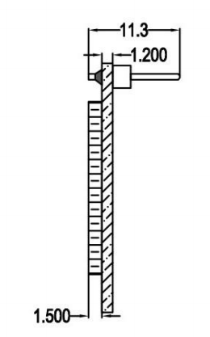
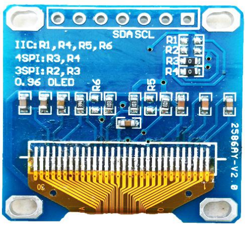

#### 介绍

OLED，即有机发光二极管（Organic Light-Emitting Diode）/ 有机电激光显示（Organic Electroluminesence Display, OELD），具备轻薄、省电等特性。

#### 尺寸

| 正面               | 侧面               |
| ------------------ | ------------------ |
|  |  |

#### 接线




兼容 3.3V 和 5V 控制芯片的 I/O 电平（无需任何设置，直接兼容）

* IIC 模式：需要短接 R1、R4、R5、R6，去掉 R2、R3 电阻

```c
GND： 电源地
VCC： 2.2V~5.5V
SCL： CLK 时钟 （高电平 2.2V~5.5V）
SDA： MOSI 数据 （高电平 2.2V~5.5V）
```

* 4 线 SPI：需要短接 R3、R4 电阻，去掉 R1、R2、R5、R6 电阻

```
GND：电源地
VCC：2.2V~5.5V
SCL（D0）：CLK 时钟 （高电平 2.2V~5.5V）
SDA(D1)：MOSI 数据（高电平 2.2V~5.5V）
RST：复位（高电平 2.2V~5.5V）
D/C：数据/命令（高电平 2.2V~5.5V）
CS：接地
```

* 3 线 SPI 模式：不建议，不常用

#### 上电

OLED 显示屏不同于 LCD，OLED 上电是没有反应的，需要程序驱动才会有显示！