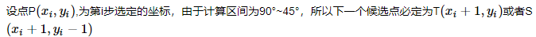
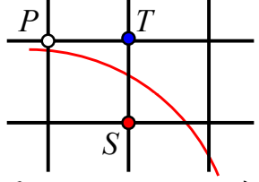
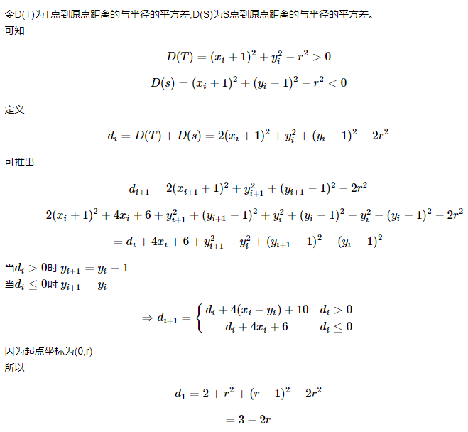

#### Bresenham Cricle

该算法适合于生成整圆，它使用8路对称法，只需计算出90°~45°内的点，沿着右下方向（+x，-y）逐点扫描。

**原理**：

---

$$
D(T)=(x_{i}+1)^{2}+y_{i}^{2}-r^{2}>0
$$

$$
D(s)=(x_{i}+1)^{2}+(y_{i}-1)^{2}-r^{2}<0
$$

定义

$$
d_{i}=D(T)+D(s)=2(x_{i}+1)^{2}+y_{i}^{2}+(y_{i}-1)^{2}-2r^{2} 
$$

可推出

$$
\begin{align}
d_{i+1}&=2(x_{i+1}+1)^{2}+y_{i+1}^{2}+(y_{i+1}-1)^{2}-2r^{2} \\
&=2(x_{i}+1)^{2}+4x_{i}+6+y_{i+1}^{2}+(y_{i+1}-1)^{2}+y_{i}^{2}+(y_{i}-1)^{2}-y_{i}^{2}-(y_{i}-1)^{2}-2r^{2} \\
&=d_{i}+4x_{i}+6+y_{i+1}^{2}-y_{i}^{2}+(y_{i+1}-1)^{2}-(y_{i}-1)^{2} 
\end{align}
$$
当 $d_{i}>0$ 时 $y_{i+1}=y_{i}-1$

当 $d_{i}\leq 0$ 时 $y_{i+1}=y_{i}$

$$
\Rightarrow
d_{i+1}= 
\left\{\begin{matrix}
d_{i}+4(x_{i}-y_{i})+10 & d_{i}>0 \\  
d_{i}+4x_{i}+6 & d_{i}\leq 0 
\end{matrix}
\right.
$$
因为起点坐标为 $(0,r)$

所以

$$
\begin{align}
d_{1}&=2+r^{2}+(r-1)^{2}-2r^{2}\\
&=3-2r
\end{align}
$$

