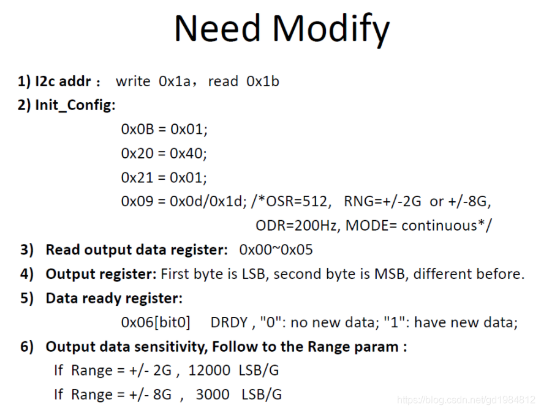
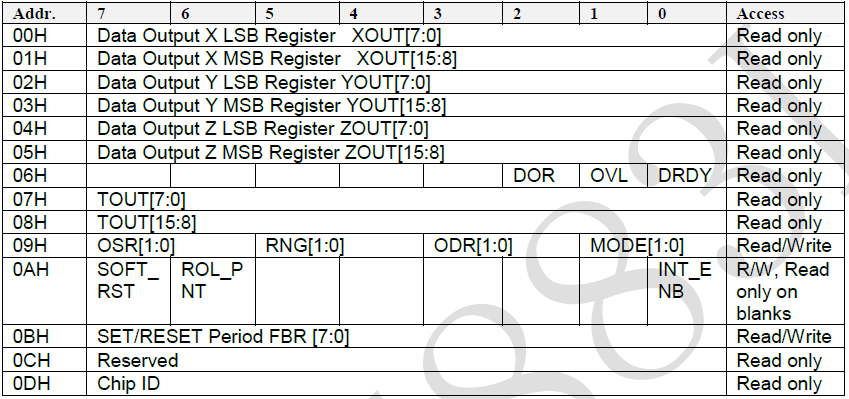

|      | 国产     | 进口     |
| ---- | -------- | -------- |
|      | QMC5883L | HMC5883L |
| 丝印 | D5883    | L883     |

QMC5883L上电后默认为待命模式。此状态下，寄存器值将会通过一个超低功耗的LDO保持，对任意寄存器的读写操作都将会唤醒I2C总线接口。内部时钟被停止，同时也不会进行磁场测量。

00H\~05H是数据寄存器，分别存放的是三轴传感器的X、Y和Z轴的值，每两个寄存器构成一个轴的高低字节，表示范围：-32768\~32768。

06H是状态寄存器，当传感器数据已测量完毕并准备好DRDY位被置“1”，数据寄存器一旦被读取，DRDY位将被置“0”。OVL是溢出位，当有任意一个轴的测量值超过范围，OVL将被置“1”，当下一次测量不超测量范围时，OVL将会被置“0”。当处于连续模式下测量数据被跳过时DOR被置“1”，而当数据寄存器被读写后置“0”。

07H~08H存放的是QMC5883L内置的温度传感器的输出数据。这里需要注意的是温度传感器的增益出厂前校正过，但偏移没有得到补偿，所以，温度传感器测得的相对值是准确的。温度系数100 LSB/℃。

09H~0AH是QMC5883L的控制寄存器。09H设置工作模式(MODE)、数据输出更新频率(ODR)、传感器测量范围(RNG)以及过采样率(OSR)。0AH设置中断使能(INT_ENB)、点翻转使能(POL_PNT)以及软复位(SOFT_RST)。09H寄存器的设置如下图所示：

09H寄存器，INT_ENB被置“0”时，中断引脚(即DRDY)将被使能，置“1”时中断被禁止。

0AH寄存器：ROL_PNT被置“0”时，I2C总线接口将不会自动在00H~06H间翻转，置“1”时自动翻转。SOFT_RST被置“1”时对QMC5883L进行软复位，软复位可以发生于任何模式下的任何时段，软复位发生后所有寄存器将会被置默认值。

0BH控制QMC5883L的设置/复位时间，推荐值是设定为0x01。

0DH是器件标识寄存器，其值为0xFF。
