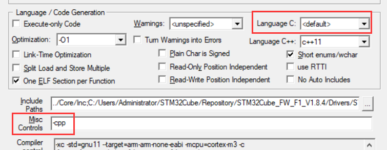
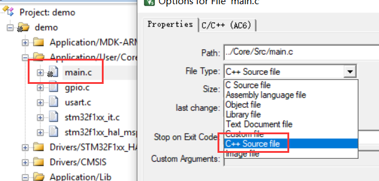

REFER：https://blog.csdn.net/DP29syM41zyGndVF/article/details/115300868

#### 配置

①去掉 MircoLIB 的勾选，因为该精简库不支持C++。

②使用 AC5 时，去掉 C99 Mode 的勾选 。使用 AC6 时，把 Language C 改为 default。

③在 Misc Controls 栏目下添加 --cpp（AC5）/ -cpp（AC6）。



#### 编译

文件后缀为 C，使用 C 编译器进行编译。

文件后缀为 CPP ，使用 C++ 编译器进行编译。

文件后缀为 C ，但被配置为 CPP 类型，使用 C++ 编译器进行编译。



（推荐将 mian.c 的 FileType 改为 C++ Source File，而不是将其名字改为 main.cpp，这样 CubeMX 再次生成代码时，就不会重新生成对应的 C 文件，并且能在 main.c 中使用 C++ 的语法）

头文件中被编译宏 `extern "C"` / `extern "C" { }` 修饰的部分，使用 C 编译器进行编译。

（只修饰要进行 C 编译的部分即可，如中断函数...；class，template... 这些不需要修饰，有些修饰了可能会编译不通过）

#### 串口重定向

用不了 iostream，也就是用不了 std::cin、std::cout，即无法通过重载运算符 <<、>> 以进行数据打印。

```c
// #pragma import(__use_no_semihosting)

void _sys_exit(int x) {
    x = x;
}

struct __FILE {
    int handle;
};

FILE __stdout;

int fputc(int ch, FILE* f) {
    HAL_UART_Transmit(&huart1, (uint8_t*)&ch, 1, 0xFF);
    HAL_UART_Transmit(&huart2, (uint8_t*)&ch, 1, 0xFF);
    return ch;
}

// printf("helloworld\r\n")
```


