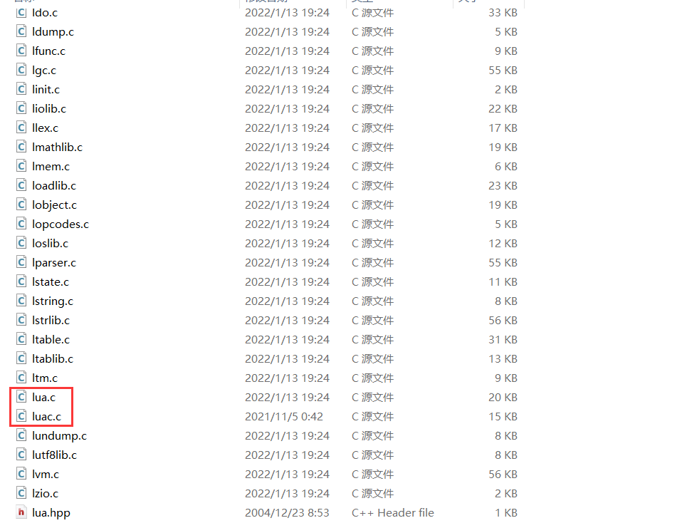
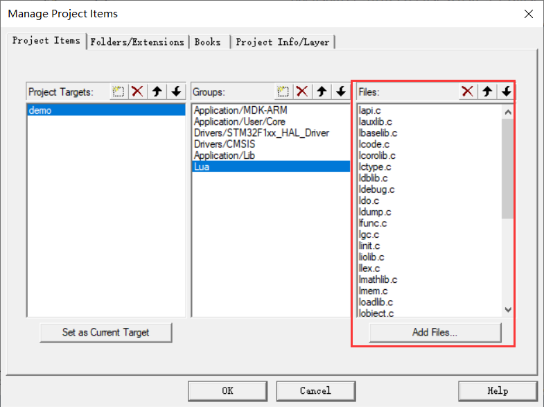
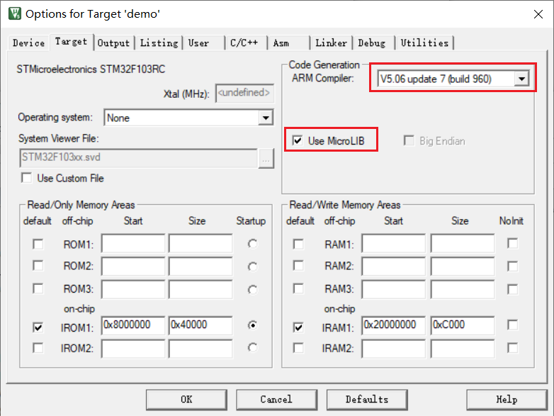
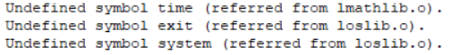
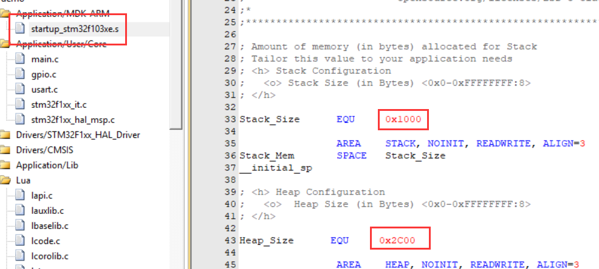
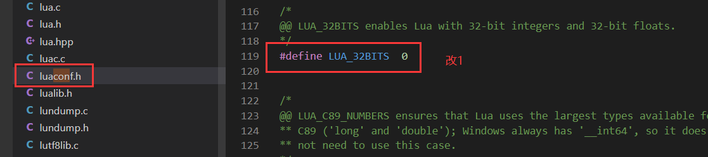

## Reference

基本移植：https://www.cnblogs.com/yangfengwu/p/9315841.html

支持文件输入输出的移植（未测试）：https://blog.csdn.net/zlm_space/article/details/50379980

## Import

LUA 下载：http://www.lua.org/download.html

本例程所用库于 20230105 下载，版本为 5.4.4

把除了 lua.c 和 luac.c 以外的 .c 文件添加到工程里：





添加头文件所在路径：


## Setting

①

AC5 + MircoLIB



直接编译会提示函数缺失，定义为空函数即可：



```c
#include "time.h"
time_t time(time_t* time){return 0;}
int system(const char* string){return 0;}
void exit(int status){}
```

②

调整堆栈大小



Lua 硬件要求：RAM>= 7.5Kb，建议16KB以上；ROM >= 65kb，建议128kb以上。

改动堆栈大小：堆最小为5.5kb，栈最小是1.5kb. lua的空间分配在堆空间。16kb的内存建议分配是堆11Kb（02c00），栈4Kb（0x01），留1Kb给全局变量。

③

串口重定向

```c
int fputc(int ch, FILE* f)
{
    // HAL_UART_Transmit(&huart1, (uint8_t*)&ch, 1, HAL_MAX_DELAY);
    HAL_UART_Transmit(&huart2, (uint8_t*)&ch, 1, HAL_MAX_DELAY);
    return ch;
}
```

## Demo

闪灯测试：

```c
#include "lua.h"
#include "lualib.h"
#include "lauxlib.h"

static int lua_led_on(lua_State* L)
{
    HAL_GPIO_WritePin(LED_GPIO_Port, LED_Pin, GPIO_PIN_SET);
    return 1;
}
static int lua_led_off(lua_State* L)
{
    HAL_GPIO_WritePin(LED_GPIO_Port, LED_Pin, GPIO_PIN_RESET);
    return 1;
}

static int lua_delay(lua_State* L)
{
    HAL_Delay(lua_tointeger(L, 1));
    return 1;
}

static luaL_Reg mylib[] = {
    {"delay", lua_delay},
    {"led_on", lua_led_on},
    {"led_off", lua_led_off},
    {NULL, NULL}};

const char lua_test[] = {
    "off = 500\n"
    "on = 500\n"
    "while 1 do\n"
    " led_on()\n"
		" delay(on)\n"
    " led_off()\n"
    " delay(off)\n"
    "end"};

void lua_run(void)
{
    lua_State* L;
    L = luaL_newstate();
    if (L == NULL) {
        printf("ERR");
        while (1) {};
    }
    luaopen_base(L);
    luaL_setfuncs(L, mylib, 0);
    luaL_dostring(L, lua_test);
    lua_close(L);
}
```

---

函数形式：

```c
static int func_name(lua_State* L)
{
    return 1; // return 0;
}
```

函数注册

```c
luaL_setfuncs(); // 批量注册
```

函数执行

```c
luaL_dofile(); // 从文件中执行（暂不支持使用，因为重定向相关函数）
luaL_dostring(); // 从字符串中执行
```

## Config

开启32位整数和32位浮点数

