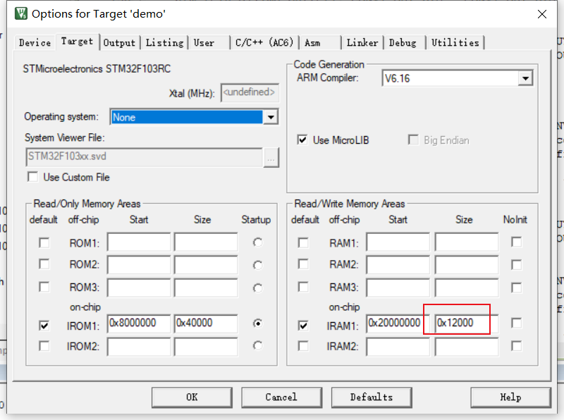
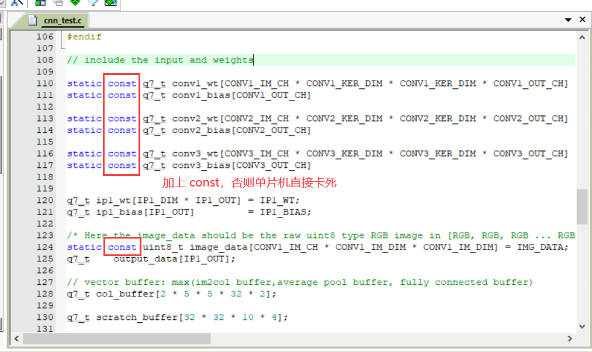

### 卷积神经网络

https://www.bilibili.com/video/BV11G411T7dT/


1. 调大 RAM（否则报空间不够的错误）：



2. 加上 const（ static 不是必加 ）

不加 const 只能跑 第1层卷积和池化 和 最后的全连接层。

加上 const 后可以跑全部层。




#### output：

```
0: 0
1: 0
2: 0
3: 0
4: 0
5: 0
6: 0
7: 0
8: 127
9: 0
```

