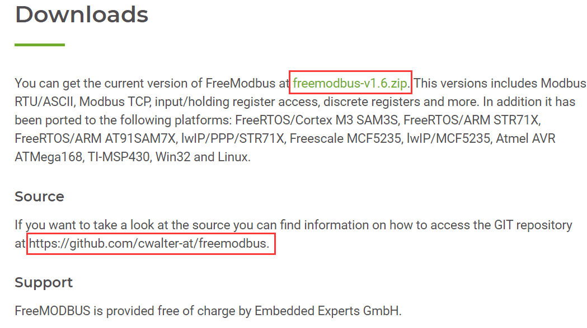
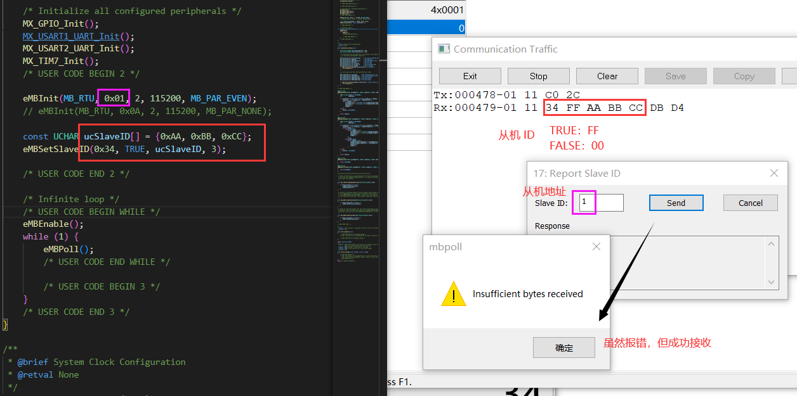
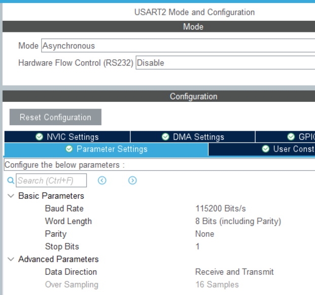
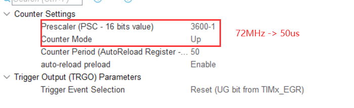
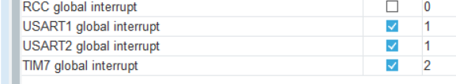
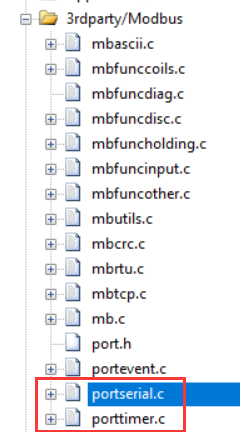
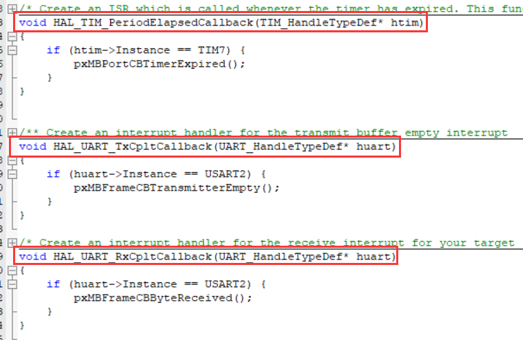
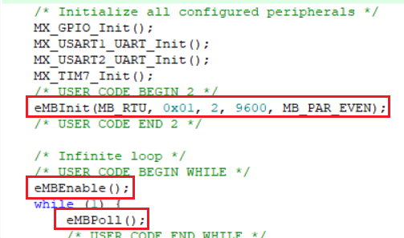
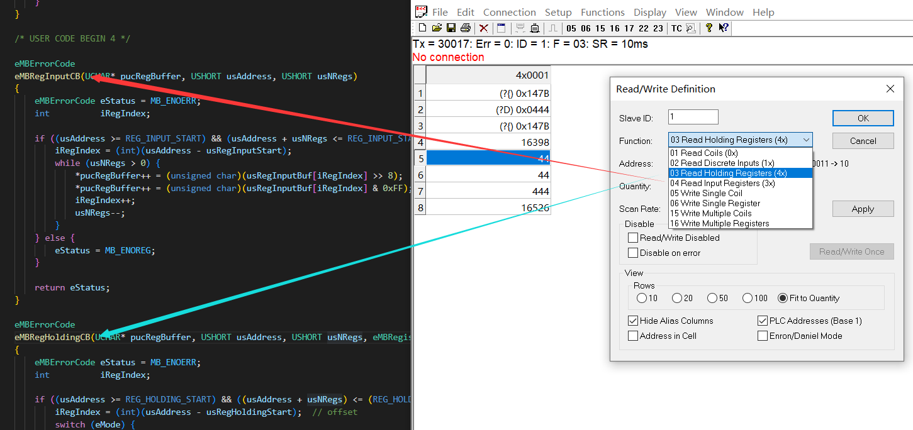

**Lib**：

（注：从机免费，主机收费）

https://www.embedded-experts.at/en/freemodbus-downloads/

https://github.com/cwalter-at/freemodbus



**Tools**：

Modbus Poll 激活码：5A5742575C5D10

① ID 地址读取



# Modbus

一主多机，主问从答

RTU 帧结构 = 地址 + 功能码 + 数据 + CRC校验

ASCII 帧结构 = 起始符 + 地址 + 功能码 + 数据 + CRC校验 \+ 结束符

从机地址：0x01-0xF7 / 1 ~ 247

---

1、Modbus-RTU

2、Modbus-ASCII

3、Modbus-TCP

https://zhuanlan.zhihu.com/p/342917561

4、Modbus-PLUS

---

RTU，ASCII：Serial（单设备：RS232，RS422，TLL；多设备：RS485）/ CAN（多设备）

TCP：Ethernet

#### 帧间隔/超时时间

两帧之间需大于一定的时间，作为一帧结束的判断依据。

* =19200：固定 1750us

定时器设置：Tout = ((arr+1)*(psc+1))/Tclk

arr= n-1,psc-3600-1,Tclk=72MHz -> Tout=n*50us

* <19200：传输 3.5 个字节时间

波特率 9600bps => 每字节占时 1/(9600/10) = 1.04ms => 帧间隔 3.5*1.04 ≈ 4ms

#### 实现方式

```c
// 计时标志
uint8_t ms;

// 串口中断（清零）
void HAL_UART_RxCpltCallback(UART_HandleTypeDef* huart) { ms = 0; }

// 定时器中断（递增）
void HAL_TIM_PeriodElapsedCallback(TIM_HandleTypeDef* htim) { ++ms; }

void main(void)
{
    // 主循环
    while (1) {
        if (ms >= 4) {
            // 帧处理
        }
    }
}
```

#### 数据模型

|| 区块       | 访问长度   | 访问方式 |
|---| ---------- | ---------- | -------- |
|coils| 线圈状态   | 位（bit）  | 可读可写 |
|discrete| 离散量输入 | 位（bit）  | 只读     |
|input| 输入寄存器 | 字（word） | 只读     |
|holding| 保持寄存器 | 字（word） | 可读可写 |

* 每中数据最多支持65536个元素

#### 移植过程

串口配置：



定时器配置：



中断配置：定时器优先级高于串口的。



对接驱动：串口收发，定时器控制。



中断配置：



使能 Modbus：



不同的功能码对应不同的处理函数：



