https://www.rt-thread.org/document/site/#/rt-thread-version/rt-thread-nano/an0038-nano-introduction

## RT-Thread Nano

### Pack Install

```
 https://www.rt-thread.org/download/cube/RealThread.RT-Thread.pdsc
```

获取包描述文件：

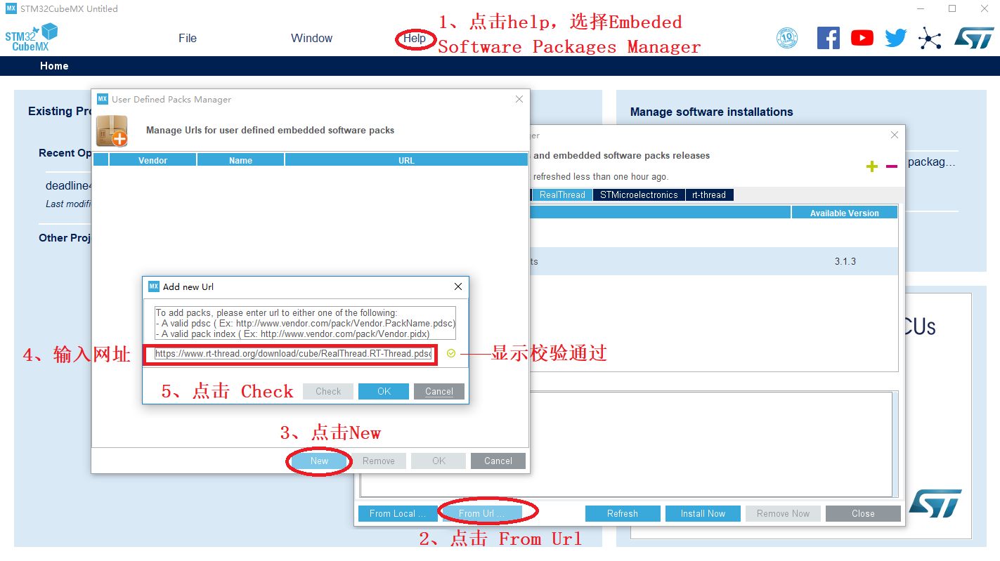

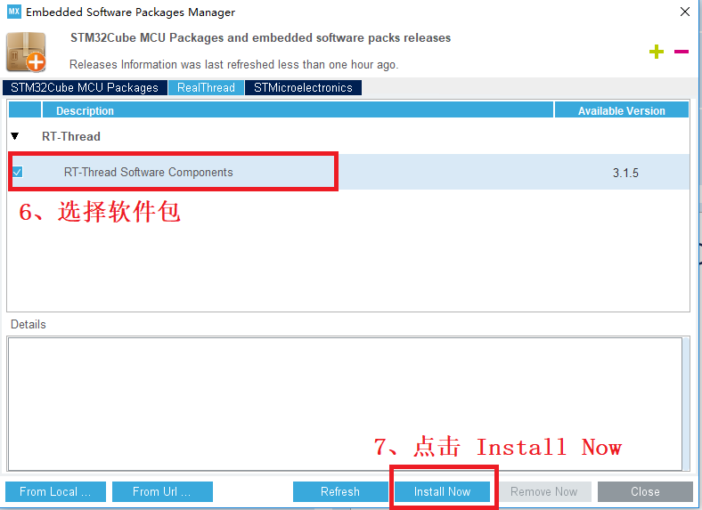

安装软件包：

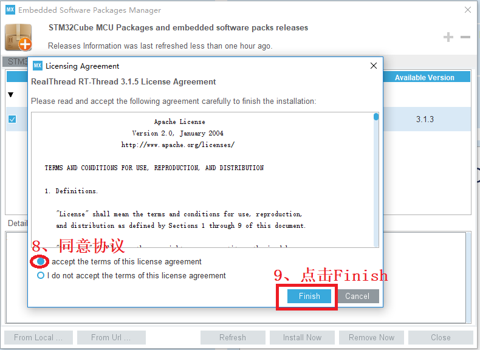

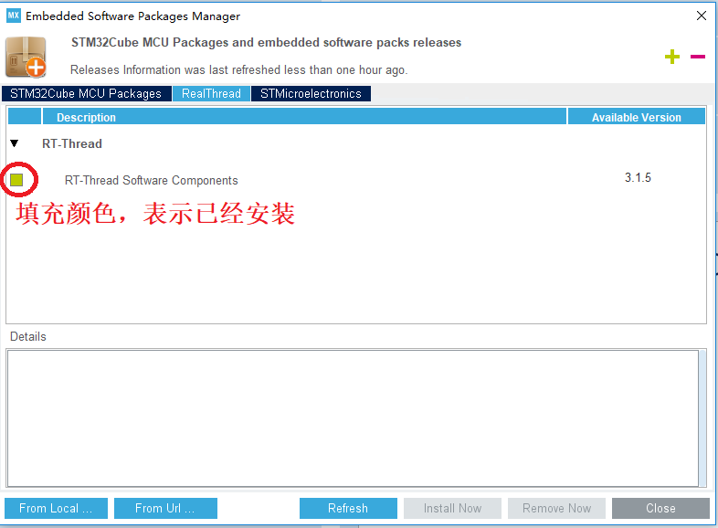

### Add To Project

勾选软件包：

* kernel：RT-Thread 内核
* shell：FinSH Shell 组件，用于控制台交互
* device：device 框架，可基于此框架编写外设驱动并注册，统一接口操作外设

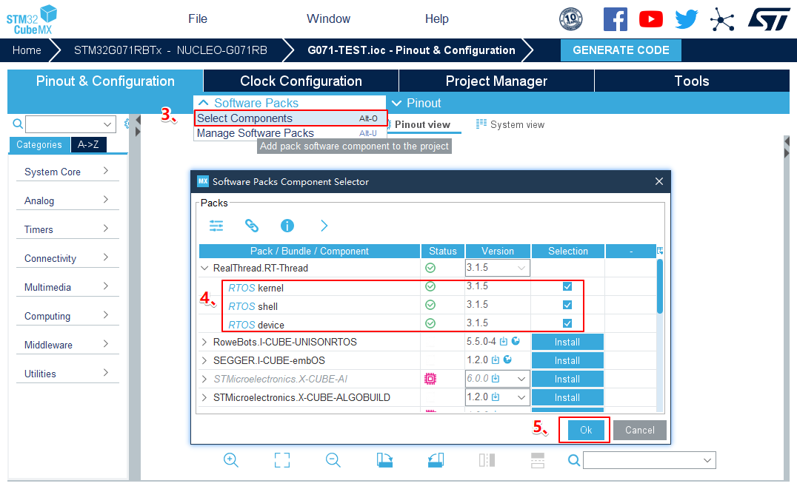

参数配置：


取消中断（因 Nano 中已重定义以下3个中断）：

* Hard fault interrupt
* Pendable request
* Time base: System tick timer

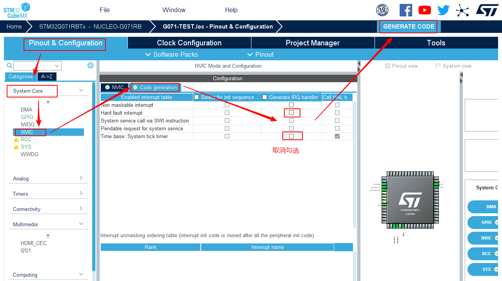

生成工程。

### Coding

**在 `main.c` 中：**

* 导入头文件

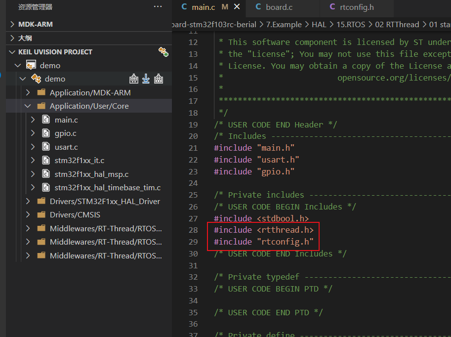

```c
#include <rtthread.h>
#include "rtconfig.h"
```

* 系统初始化

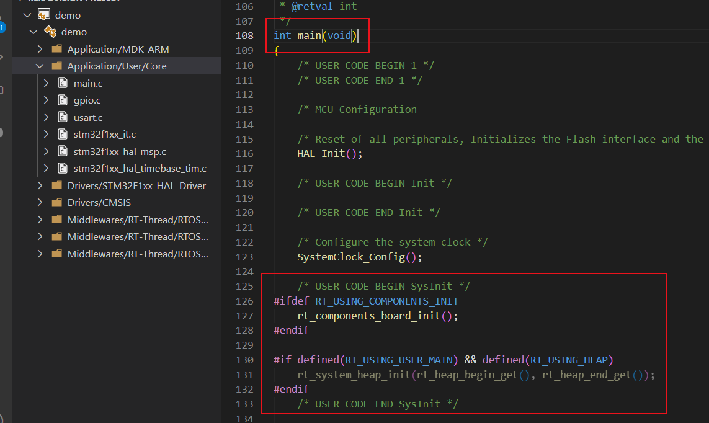

```c
#ifdef RT_USING_COMPONENTS_INIT
    rt_components_board_init();
#endif

#if defined(RT_USING_USER_MAIN) && defined(RT_USING_HEAP)
    rt_system_heap_init(rt_heap_begin_get(), rt_heap_end_get());
#endif
```

在 `main()` 中的 `while()` 循环中调用 `rt_thread_delay()` 等，有让出 CPU 控制权的动作，以处理其他任务。

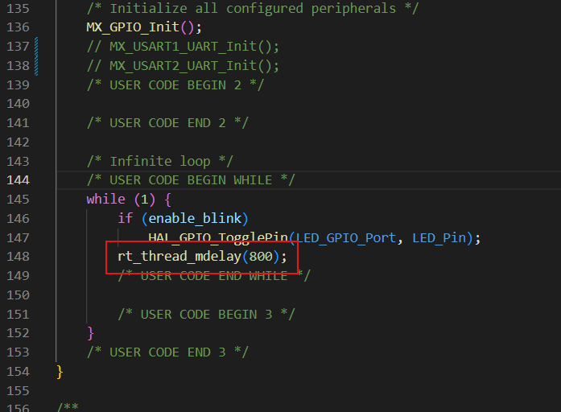

**在 `rtconfig.h` 中：**

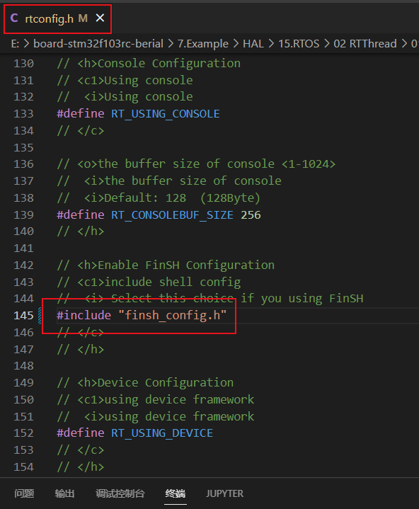

```c
#include "finsh_config.h"
```

**在 `board.c` 中：**

* 串口初始化

在 `main()` 函数中调用 `uart_init()` 或者使用 `INIT_BOARD_EXPORT(uart_init)` 初始化（不需要在 cubemx 中配置）。使用 `rt_kprintf` 可进行内容格式化及打印。

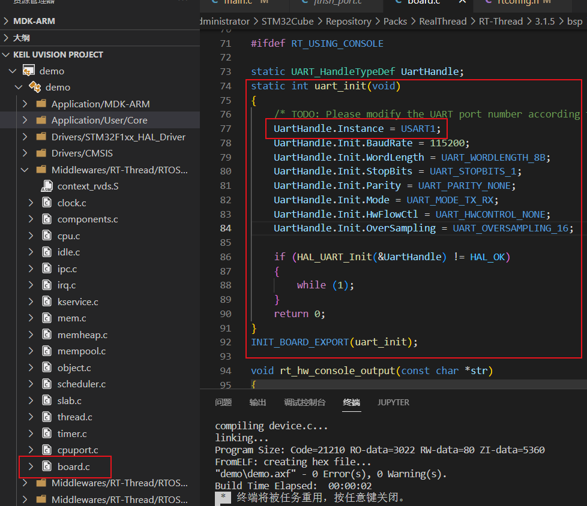

### MSH CMD

---

函数导出：`MSH_CMD_EXPORT(func,desc)`。函数名 func，函数描述 desc。

---

以下 `MobaXterm` 进行调试：

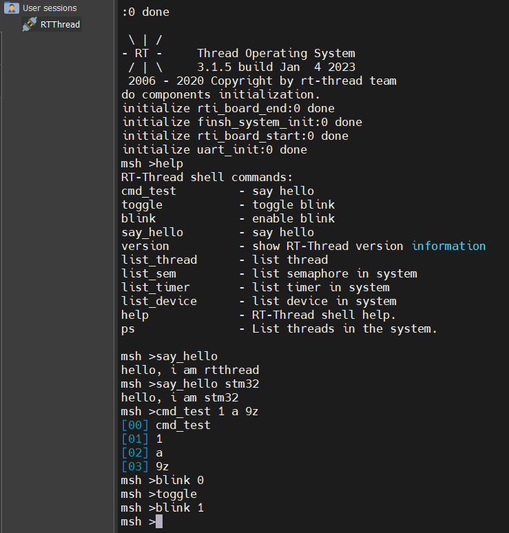

* 参数枚举

argc：参数个数，argv：参数内容

注：argc >= 1，argv[0] 为指令名，argv[1] / argv[2] / argv[3]... 为参数内容

```c
// enum param

void cmd_test(int argc, char** argv)
{
    for (uint8_t i = 0; i < argc; ++i)
        rt_kprintf("[%02d] %s\r\n", i, argv[i]);
}

MSH_CMD_EXPORT(cmd_test, say hello)
```

* LED 控制

toggle：电平反转

blink：灯闪烁

```c
// led ctrl

bool enable_blink = true;

void toggle(void)
{
    HAL_GPIO_TogglePin(LED_GPIO_Port, LED_Pin);
}
MSH_CMD_EXPORT(toggle, toggle blink)

void blink(int argc, char** argv)
{
    switch (argc) {
        case 1: enable_blink = true; break;
        case 2: enable_blink = rt_strcmp(argv[1], "0"); break;
    }
}
MSH_CMD_EXPORT(blink, enable blink)
```

注：`rt_strcmp`，字符串完全相同时返回值为 0。

* 打印测试

输入 `say_hello` 时，输出 `hello, i am rtthread`

输入 `say_hello stm32` 时，输出 `hello, i am stm32`

```c
// print test

void say_hello(int argc, char** argv)
{
    switch (argc) {
        case 1: rt_kprintf("hello, i am rtthread\r\n"); break;
        case 2: rt_kprintf("hello, i am %s\r\n", argv[1]); break;
    }
}
MSH_CMD_EXPORT(say_hello, say hello)
```

