#### 手动移植

①

下载（ [Github](https://github.com/OpenAtomFoundation/TencentOS-tiny) [Gitee](https://gitee.com/Tencent/TencentOS-tiny?_from=gitee_search) ）并解压。

②

新建文件夹 `TenecntOS`

③

把 `arch`、`kernel`、`osal` 共三个文件夹（核心部分）复制出来：

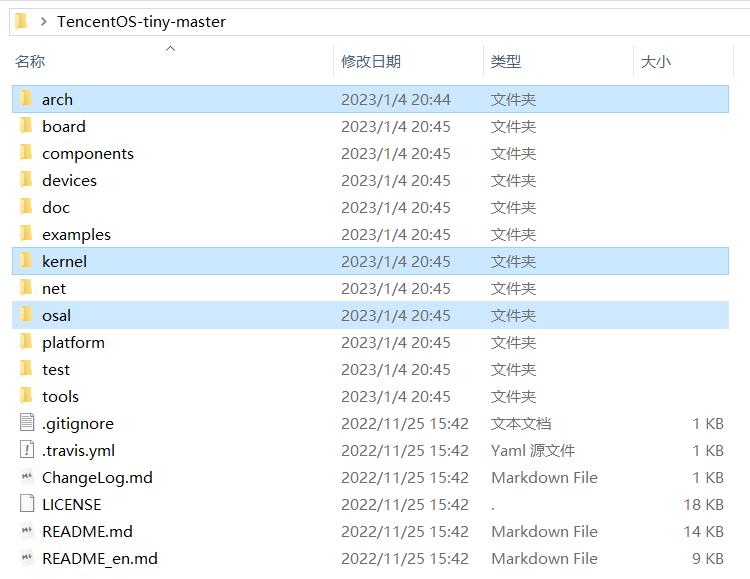

```
* board：适配了特定的开发板
* components：loRaWAN、MQTT、文件系统 fs、安全协议 mbedtls、JSON、LVGL... 的实现源码及适配层
* devices：外设驱动 esp8266、air724...
* net：at 框架、lora、lwip...
* examples / test：使用例程 & 测试例程
* tools：小工具啥的
```

把 `board` 中的 `tos_config.h` 复制出来：


最终 `TencentOS` 目录内容如下：

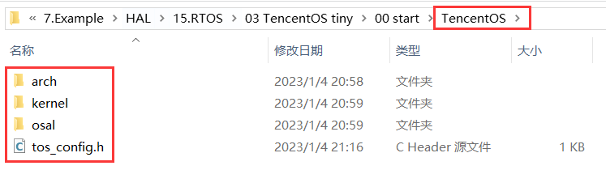

④

打开文件夹 `arch`，因 F103（M3）对应的 `arch` 在 `\arm\arm-v7m` 中，所以把该目录其他文件夹全删掉。

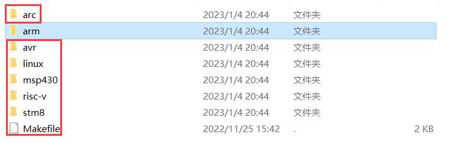

⑤

CubeMX 生成默认工程。

⑥

添加文件：

**arch**

```
TencentOS\arch\arm\arm-v7m\cortex-m3\armcc
```

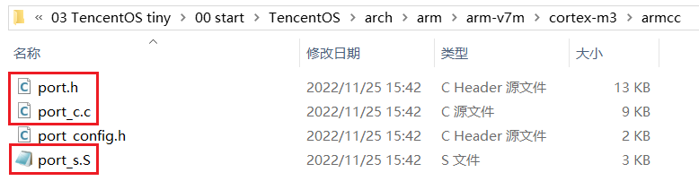

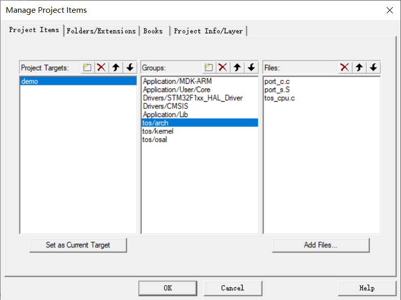

**kernel**

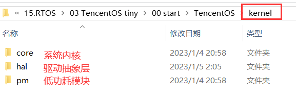

`core` 是必须添加的，其他按需添加。

```
TencentOS\kernel\core
```


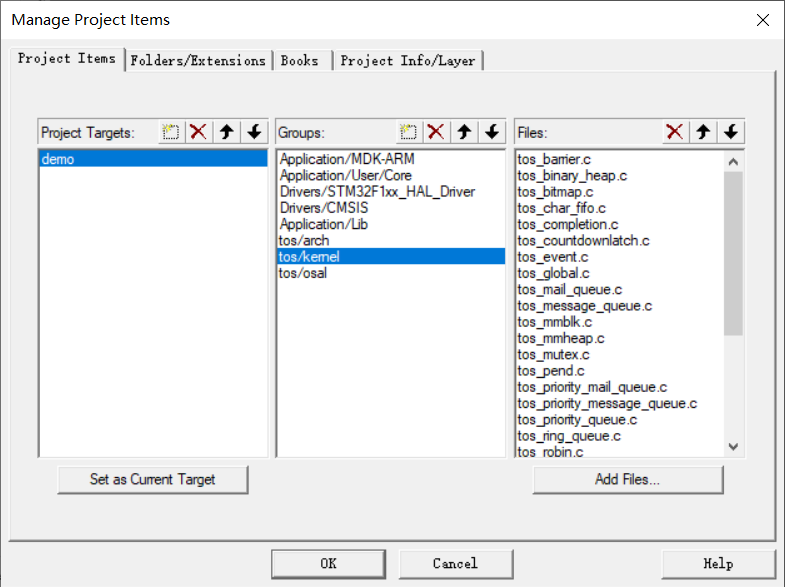

**osal**

```
TencentOS\osal\cmsis_os
```

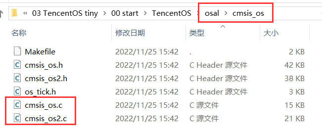

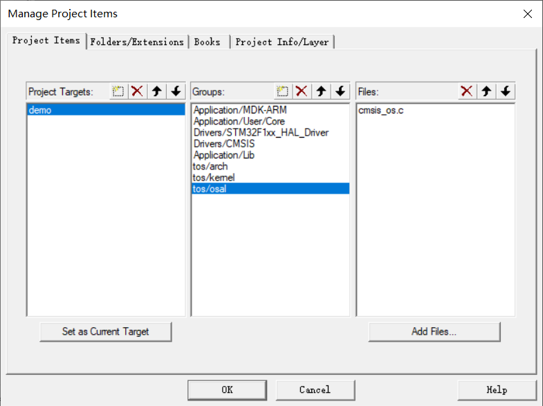

**cfg**

该头文件主要用于功能裁剪。

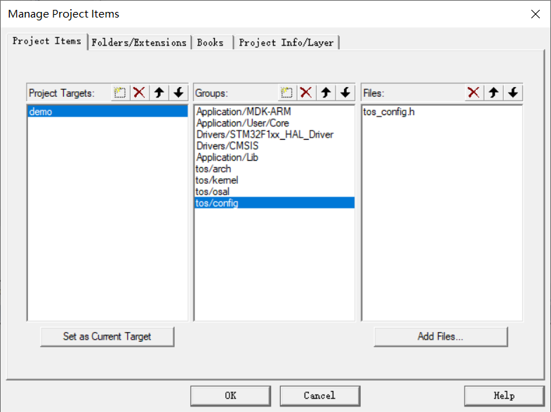

⑦

添加头文件路径：

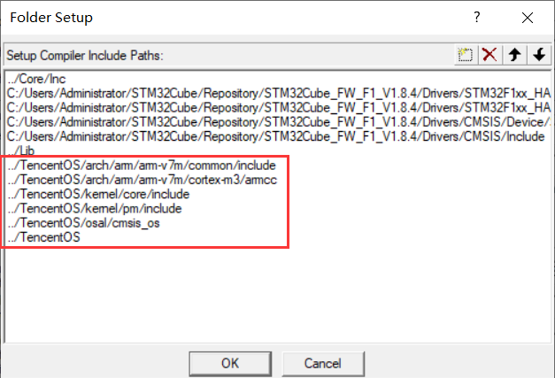

```
../TencentOS
../TencentOS/arch/arm/arm-v7m/common/include
../TencentOS/arch/arm/arm-v7m/cortex-m3/armcc
../TencentOS/kernel/core/include
../TencentOS/kernel/pm/include
../TencentOS/kernel/hal/include
../TencentOS/osal/cmsis_os
```


`tos_config.h`

```c
#include "main.h"
```

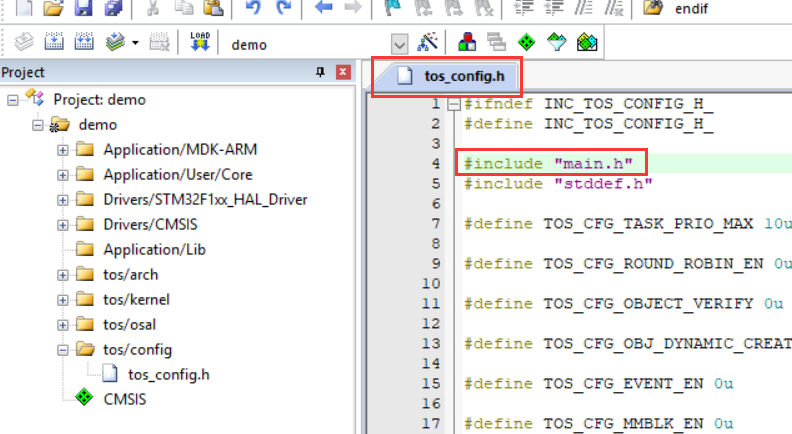

`stm32f1xx_it.h`

```c
#include "tos_k.h"
```

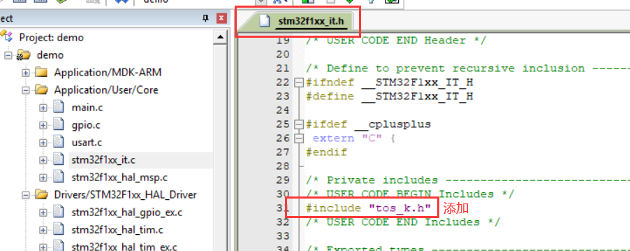

`stm32f1xx_it.c`

```c
if (tos_knl_is_running()) {
    tos_knl_irq_enter();
    tos_tick_handler();
    tos_knl_irq_leave();
}
```

注：重新生成工程后，PendSV_Handler 需要重新注释掉。

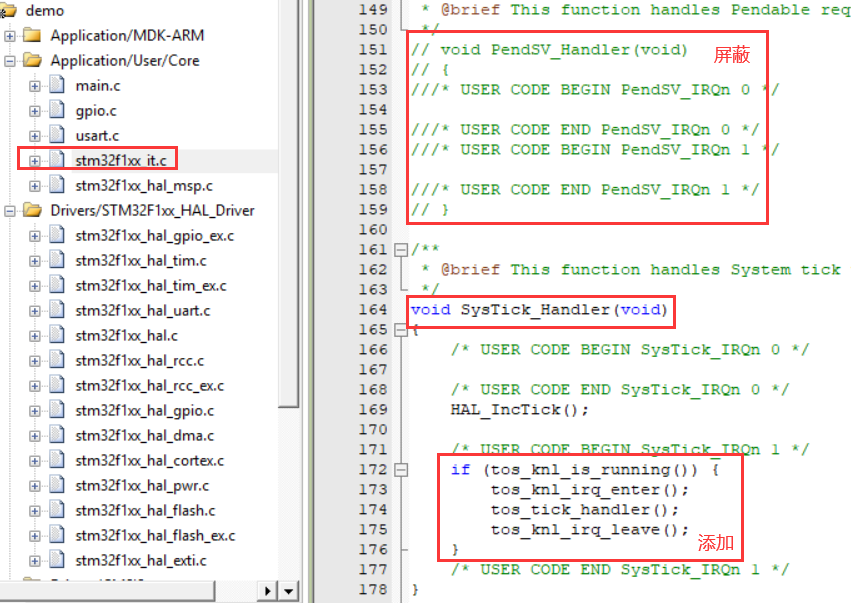

`main.c` (测试)

```c
#include "cmsis_os.h"
```

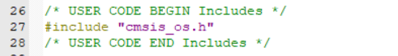

```c
#include "cmsis_os.h"

// task1
#define TASK1_STK_SIZE 256
void task1(void* pdata);
osThreadDef(task1, osPriorityNormal, 1, TASK1_STK_SIZE);

// task2
#define TASK2_STK_SIZE 256
void task2(void* pdata);
osThreadDef(task2, osPriorityNormal, 1, TASK2_STK_SIZE);

void task1(void* pdata)
{
    int count = 1;
    while (1) {
        printf("\r\nHello world!\r\n###This is task1 ,count is %d \r\n", count++);
        HAL_GPIO_TogglePin(LED_GPIO_Port, LED_Pin);
        osDelay(2000);
    }
}
void task2(void* pdata)
{
    int count = 1;
    while (1) {
        printf("\r\nHello TencentOS !\r\n***This is task2 ,count is %d \r\n", count++);
        osDelay(1000);
    }
}
```

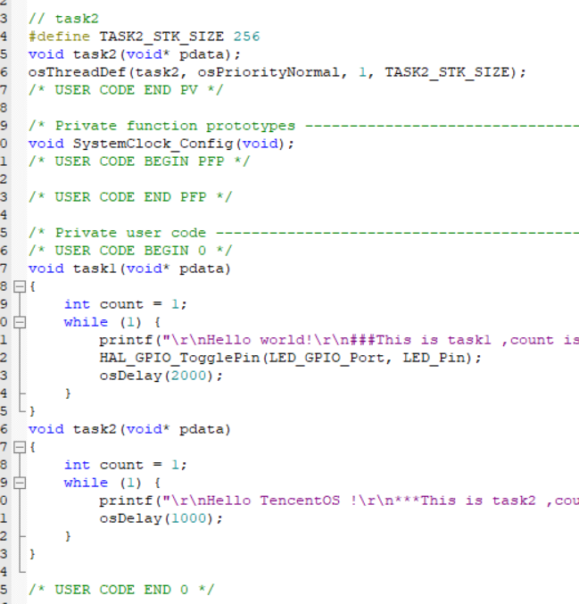

```
osKernelInitialize();                   // TOS Tiny kernel initialize
osThreadCreate(osThread(task1), NULL);  // Create task1
osThreadCreate(osThread(task2), NULL);  // Create task2
osKernelStart();                        // Start TOS Tiny
```

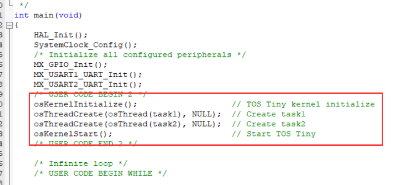


