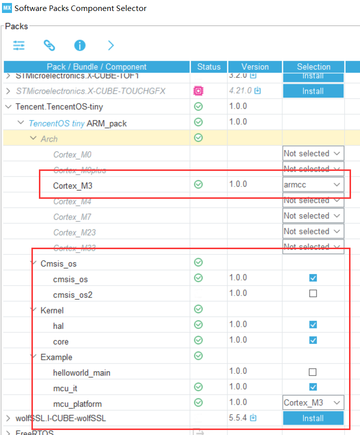
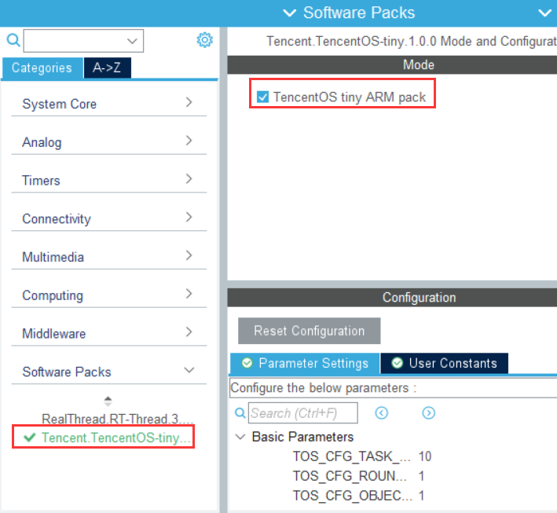
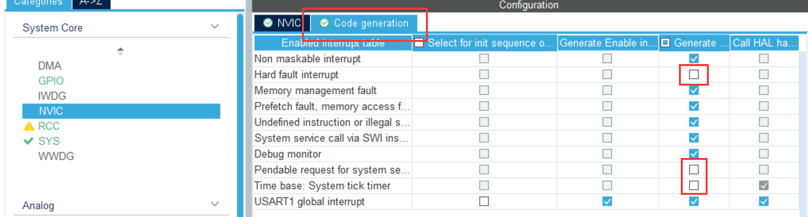
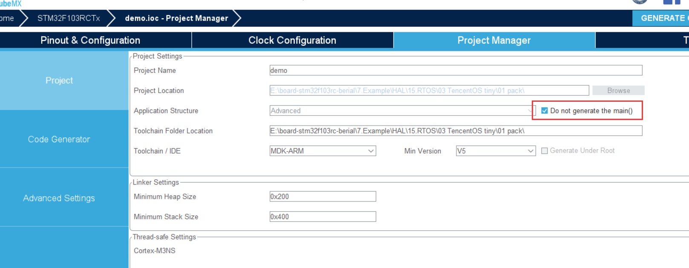
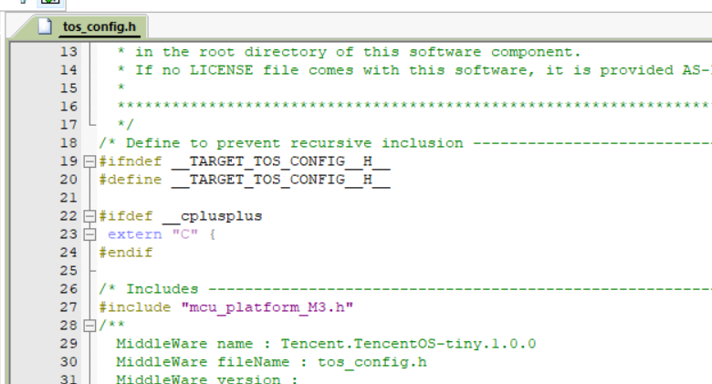
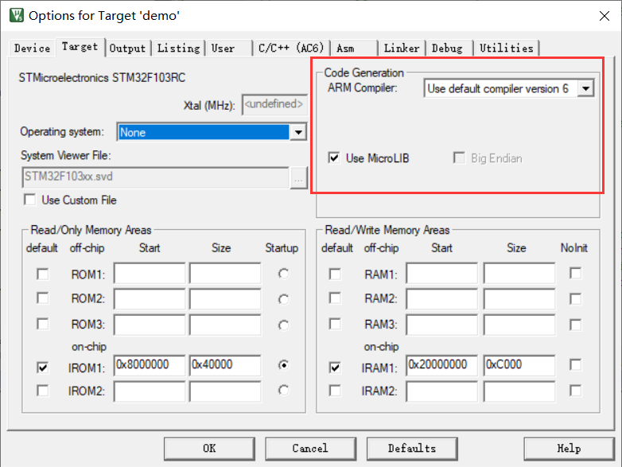

### 包安装

①

打开 CubeMX 的软件包管理器 `Manage Software Packs` ，

将 `Tencent.TencentOS-tiny.1.0.0.pack` 拖入以安装软件包。

②

打开 `Manage Software Packs`，添加控件。



③

勾选软件包



取消勾选（因OS已实现 `PendSV`、`SysTick_Handler`）



不生成默认 `main()` （因为 `main_example` 中已有）



生成工程。

④

在 `tos_config.h` 中：

```c
#include "mcu_platform_M3.h"
```



！！！注：这里每次 cubemx 更新工程的时候都要重新配置

⑤

串口重定向



```c
#include "tos_klib.h"//For using the tos_kprintf function

int fputc(int ch, FILE *f)
{
  if (ch == '\n') {
    HAL_UART_Transmit(&huart2, (void *)"\r", 1,HAL_MAX_DELAY);
  }
  HAL_UART_Transmit(&huart2, (uint8_t *)&ch, 1, HAL_MAX_DELAY);
  return ch;
}

int _write(int fd, char *ptr, int len)
{
    (void)HAL_UART_Transmit(&huart2, (uint8_t *)ptr, len, HAL_MAX_DELAY);
    return len;
}

int fgetc(FILE *f)
{
  uint8_t ch = 0;
  HAL_UART_Receive(&huart2, &ch, 1,HAL_MAX_DELAY);
  return ch;
}
```

⑥

在 `main.c` 中：

```c
#include "tos_k.h"
#include "tos_config.h"

#define APPLICATION_TASK_STK_SIZE 4096
k_task_t    application_task;
uint8_t     application_task_stk[APPLICATION_TASK_STK_SIZE];
extern void application_entry(void* arg);

int main(void){
    tos_kprintf("Welcome to TencentOS tiny\r\n");  // printf
    tos_knl_init();                                // TencentOS Tiny kernel initialize
    tos_task_create(&application_task, "application_task", application_entry, NULL, 4, application_task_stk, APPLICATION_TASK_STK_SIZE, 0);
    tos_knl_start();
}
```

⑦

新建 `apps.c`，导入到项目中，在里面添加任务（主要是为了简洁）

```c
#include "main.h"
#include "tos_config.h"
#include "tos_k.h"

#define TASK1_STK_SIZE 1024
k_task_t task1;
uint8_t  task1_stk[TASK1_STK_SIZE];

#define TASK2_STK_SIZE 1024
k_task_t task2;
uint8_t  task2_stk[TASK2_STK_SIZE];

void task1_entry(void* arg)
{
    while (1) {
        tos_kprintf("###I am task1\r\n");  // printf
        tos_task_delay(2000);
    }
}

void task2_entry(void* arg)
{
    while (1) {
        tos_kprintf("***I am task2\r\n");  // printf
        tos_task_delay(1000);
    }
}

void application_entry(void* arg)
{
    tos_task_create(&task1, "task1", task1_entry, NULL, 3, task1_stk, TASK1_STK_SIZE, 0);  // Create task1
    tos_task_create(&task2, "task2", task2_entry, NULL, 3, task2_stk, TASK2_STK_SIZE, 0);  // Create task2
}
```

