### 实时操作系统

常用的 RTOS 有国外的 FreeRTOS、μC/OS、 RTX 和国内的 RT-Thread、 Huawei LiteOS 和 AliOS-Things 等， 其中尤以国外开源且免费的 FreeRTOS 的市场占有率最高。今年9月开源的TencentOS tiny也进军物联网了。

根据程序的功能，我们把这个程序主体分割成一个个独立的，无限循环且无返回的小程序，这个小程序我们称之为任务。每个任务都是独立的，互不干扰的，且具备自身的优先级，它由操作系统调度管理。

#### 前后台系统

后台：应用程序通常是一个无限的循环，在循环中，通过调用相应的处理函数完成相应的操作。

前台：接收异步中断，来通知后台。

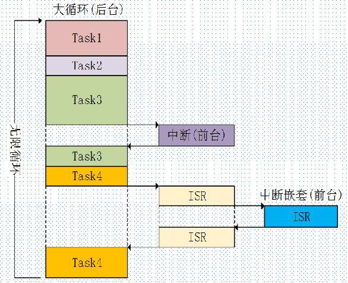

#### 层次架构

从层次来看，操作系统位于硬件之上，应用软件之下

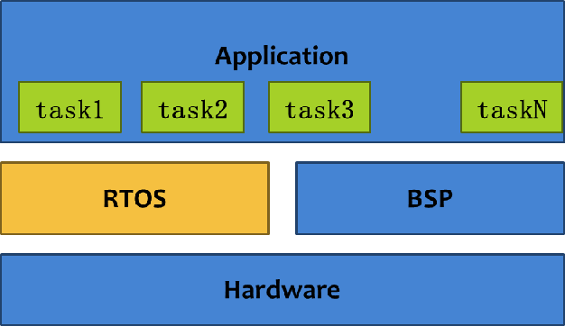

#### 比较

|                    | **前后台系统**                                               | **实时操作系统**                                             |
| ------------------ | ------------------------------------------------------------ | ------------------------------------------------------------ |
| 资源               | 不需要分配空间给os                                           | 需要分配资源给OS(不同的系统内核资源使用情况不同)，内核资源也有不同，可通过配置文件进行配置 |
| 学习难度           | 不需要学习OS的API，简单上手                                  | 开发者需要熟悉OS的基本操作(任务建立/删除、任务间通讯、优先级处理、中断处理…) |
| 实时性             | 难以确保每个操作能够实时响应，如果一个函数花费过长时间，将使整个系统的实时性下降实时响应，轮询处理 | 实时嵌入式OS的调度算法可以最大程度保证系统的实时性实时响应，实时处理 |
| 可扩展性、可维护性 | 可拓展性差、可维护性差                                       | 模块化、结构清晰                                             |

### 任务

任务是 TencentOS tiny 中最基本的调度单位，它描述了一个任务执行的运行环境，也描述了这个任务所处的优先级。

#### 概念

把一个复杂的应用分解成多个小的、可调度的、序列化的程序单元，当合理地划分任务并正确地执行。

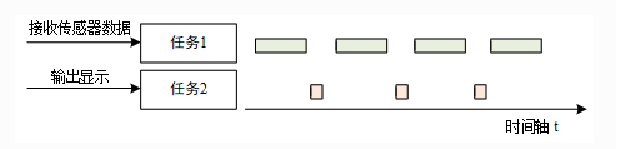

##### 上下文

任务执行时的运行环境称为上下文。

##### 类型

* 无限循环模式

任务中必须出现阻塞情况，以让出CPU使用权。

```c
void task_entry(void* paramenter)
{
      while (1)
      {
           /* 等待事件的发生 */ 
           /* 对事件进行服务、进行处理 */
      } 
}
```

* 顺序执行/有限次循环模式

此类任务不会循环或不会永久循环，而是 “一次性” 任务，一定会被执行完毕。

在执行完毕后，任务将被系统自动删除。

```c
void task_entry(void* paramenter)
{
       /* 处理事务 #1 */ 
       … 
       /* 处理事务 #2 */
       … 
       /* 处理事务 #3 */
}
```

##### 控制块

在多任务系统中，任务的执行是由系统调度的。系统为了顺利的调度任务，为每个任务都额外定义了一个任务控制块，这个任务控制块就相当于任务的身份证，里面存有任务的所有信息，比如任务的栈指针，任务名称，任务的形参等。有了这个任务控制块之后，以后系统对任务的全部操作都可以通过这个任务控制块来实现。

https://blog.csdn.net/jiejiemcu/article/details/99618912

| 参数      | 含义         |
| --------- | ------------ |
| task      | 任务控制块   |
| name      | 任务名字     |
| entry     | 任务主体     |
| arg       | 任务形参     |
| prio      | 优先级       |
| stk_base  | 任务栈基地址 |
| stk_size  | 任务栈大小   |
| timeslice | 时间片       |

```c
typedef struct k_task_st {
    k_stack_t          *sp;                 /**< 任务栈指针,用于切换上下文*/

#if TOS_CFG_OBJECT_VERIFY_EN > 0u
    knl_obj_t           knl_obj;            /**< 只是为了验证，测试当前对象是否真的是一项任务。*/
#endif

    char               *name;               /**< 任务名称 */
    k_task_entry_t      entry;              /**< 任务主体 */
    void               *arg;                /**< 任务主体形参 */
    k_task_state_t      state;              /**< 任务状态 */
    k_prio_t            prio;               /**< 任务优先级 */

    k_stack_t          *stk_base;           /**< 任务栈基地址 */
    size_t              stk_size;           /**< 任务栈大小 */

    k_tick_t            tick_expires;       /**< 任务阻塞的时间 */

    k_list_t            tick_list;          /**< 延时列表 */
    k_list_t            pend_list;          /**< 就绪、等待列表 */

#if TOS_CFG_MUTEX_EN > 0u
    k_list_t            mutex_own_list;     /**< 任务拥有的互斥量 */
    k_prio_t            prio_pending;       /*< 用于记录持有互斥量的任务初始优先级，在优先级继承中使用 */
#endif

    pend_obj_t         *pending_obj;       /**< 记录任务此时挂载到的列表 */
    pend_state_t        pend_state;         /**< 等待被唤醒的原因（状态） */

#if TOS_CFG_ROUND_ROBIN_EN > 0u
    k_timeslice_t       timeslice_reload;   /**< 时间片初始值（重装载值） */
    k_timeslice_t       timeslice;          /**< 剩余时间片 */
#endif

#if TOS_CFG_MSG_EN > 0u
    void               *msg_addr;           /**< 保存接收到的消息 */
    size_t              msg_size;			/**< 保存接收到的消息大小 */
#endif

#if TOS_CFG_EVENT_EN > 0u
    k_opt_t             opt_event_pend;     /**< 等待事件的的操作类型：TOS_OPT_EVENT_PEND_ANY 、 TOS_OPT_EVENT_PEND_ALL */
    k_event_flag_t      flag_expect;        /**< 期待发生的事件 */
    k_event_flag_t     *flag_match;         /**< 等待到的事件 */
#endif
} k_task_t;

```

##### 栈

TencentOS tiny  任务具有独立的栈空间，当进行任务切换时，会将当前任务的上下文存在栈中，当任务要恢复运行时，再从栈中读取上下文信息，进行恢复。
任务栈的增长方向是芯片构架密切相关的（比如stm32就是向下增长的）。

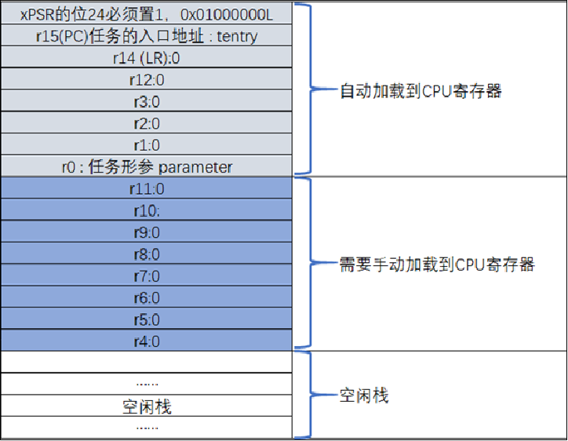

向下生长的满栈”模型：栈指针 SP 指向最后一个被压入栈的 32 位数值。在下一次压栈时， SP 先自减 4，再存入新的数值 。

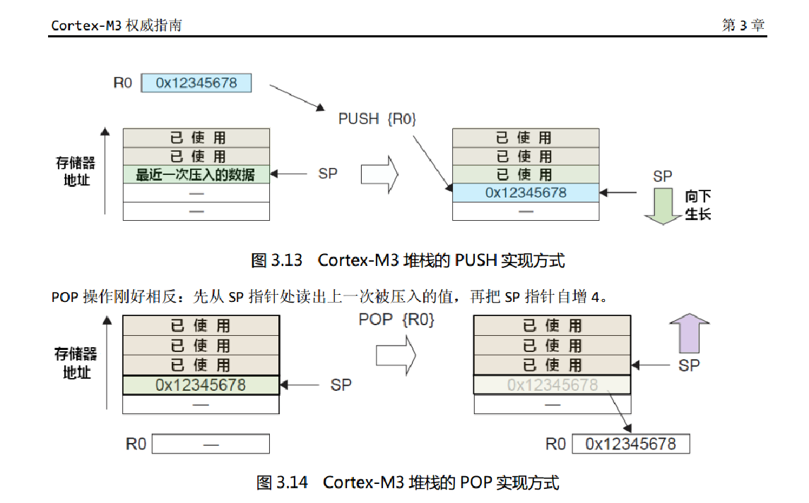

##### 优先级

TencentOS tiny  任务的优先级是表示任务被调度的优先程度。每个任务都具有优先级，任务越重要，赋予的优先级就应越高， 任务被调度的可能才会越大。默认支持 10 个任务优先级 (0~10)，数值越小的优先级越高，0 为最高优先级。最低优先级默认分配给空闲任务使用。不允许用户创建与空闲任务相同优先级的任务。

##### 时间片

相同优先级下时间片才有效。

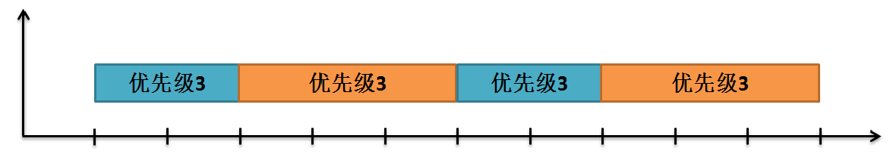

#### 状态

- 就绪态（**K_TASK_STATE_READY**）

该任务在就绪列表中，就绪的任务已经具备执行的能力，只等待调度器进行调度，新创建的任务会初始化为就绪态。

- 运行态（**K_TASK_STATE_READY**）

该状态表明任务正在执行，此时它占用处理器，其实此时的任务还是处于就绪列表中的，TencentOS调度器选择运行的永远是处于最高优先级的就绪态任务，当任务被运行的一刻，它的任务状态就变成了运行态。

- 睡眠态（**K_TASK_STATE_SLEEP**）

如果任务当前正在休眠让出CPU使用权，那么就可以说这个任务处于休眠状态，该任务不在就绪列表中，此时任务处于睡眠列表中（或者叫延时列表）。

- 等待态（**K_TASK_STATE_PEND**）

任务正在等待信号量、队列或者等待事件等状态。

- 挂起态（**K_TASK_STATE_SUSPENDED**）

任务被挂起，此时任务对调度器而言是不可见的。

- 退出态（**K_TASK_STATE_DELETED**）

该任务运行结束，并且被删除。

- 等待超时状态（**K_TASK_STATE_PENDTIMEOUT**）

任务正在等待信号量、队列或者等待事件发生超时的状态。

- 睡眠挂起态（**K_TASK_STATE_SLEEP_SUSPENDED**）

任务在睡眠中被挂起时的状态。

- 等待挂起态（**K_TASK_STATE_PEND_SUSPENDED**）

任务正在等待信号量、队列或者等待事件时被挂起的状态。

- 等待超时挂起态（**K_TASK_STATE_PENDTIMEOUT_SUSPENDED**）

任务正在等待信号量、队列或者等待事件发生超时，但此时任务已经被挂起的状态。

##### 迁移

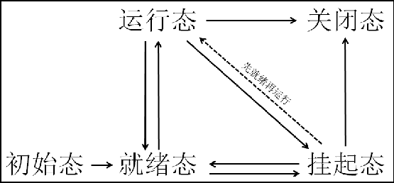

TencentOS tiny中维护任务的数据结构：

* 就绪列表 k_rdyq：用于挂载系统中的所有处于就绪态的任务。

* 延时列表 k_tick_list：与系统时间相关的任务都会被挂载到这个列表中，可能是睡眠、有期限地等待信号量、事件、消息队列等情况。

#### 函数

##### 创建

在TencentOS tiny中，凡是使用\_\_API\_\_修饰的函数都是提供给用户使用的，而使用\_\_KERNEL\_\_修饰的代码则是给内核使用的。

```c
__API__ k_err_t tos_task_create(k_task_t *task,  char *name,  k_task_entry_t entry,  void *arg,  k_prio_t prio, k_stack_t *stk_base,  size_t stk_size,  k_timeslice_t timeslice)
```

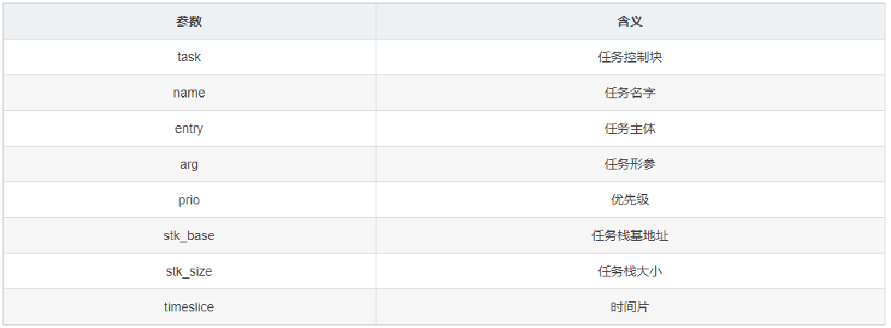

##### 销毁

```c
tos_task_destroy() 
```

这个函数十分简单，根据传递进来的任务控制块销毁任务，也可以传递进NULL表示销毁当前运行的任务。但是不允许销毁空闲任务k_idle_task，当调度器被锁住时不能销毁自身，会返回K_ERR_SCHED_LOCKED错误代码。如果使用了互斥量，当任务被销毁时会释放掉互斥量，并且根据任务所处的状态进行销毁，比如任务处于就绪态、延时态、等待态，则会从对应的状态列表中移除。

##### 睡眠

```c
tos_task_delay() 
```

任务睡眠非常简单，主要的思路就是将任务从就绪列表移除，然后添加到延时列表中k_tick_list，如果调度器被锁，直接返回错误代码K_ERR_SCHED_LOCKED，如果睡眠时间为0，则调用tos_task_yield函数发起一次任务调度；调用tick_list_add函数将任务插入延时列表中，睡眠的时间delay是由用户指定的。不过需要注意的是如果任务睡眠的时间是永久睡眠TOS_TIME_FOREVER，将返回错误代码K_ERR_DELAY_FOREVER，这是因为任务睡眠是主动行为，如果永久睡眠了，将没法主动唤醒，而任务等待事件、信号量、消息队列等行为是被动行为，可以是永久等待，一旦事件发生了、信号量呗释放、消息队列不为空时任务就会被唤醒，这是被动行为，这两点需要区分开来。最后调用readyqueue_remove函数将任务从就绪列表中移除，然后调用knl_sched函数发起一次任务调度，就能切换另一个任务。

##### 挂起&恢复 

```c
tos_task_suspend() // 挂起
tos_task_resume() // 恢复 
```

挂起指定任务。被挂起的任务绝不会得到CPU的使用权，不管该任务具有什么优先级。

任务可以通过调用 tos_task_suspend() 函数都可以将处于任何状态的任务挂起，被挂起的任务得不到CPU的使用权，也不会参与调度，它相对于调度器而言是不可见的，除非它从挂起态中恢复。


任务恢复就是通过调用 tos_task_resume() 让挂起的任务重新进入就绪状态，恢复的任务会保留挂起前的状态信息，在恢复的时候根据挂起时的状态继续运行。如果被恢复任务在所有就绪态任务中，处于最高优先级列表的第一位，那么系统将进行任务上下文的切换。

#### 设计要点

* 中断上下文环境：不能使用挂起当前任务的操作，不允许调用任何会阻塞运行的API函数接口。
* 任务上下文环境：任务中不允许出现死循环（此处的死循环是指没有不带阻塞机制的任务循环体），将紧急的处理事件的任务优先级设置得高一些。
* 空闲任务：不允许创建与空闲任务相同优先级的任务
* 任务的执行时间：程序运行时间、周期。

### 队列

#### 概念

队列是一种常用于任务间通信的数据结构，队列可以在任务与任务间、中断和任务间传递消息，实现了任务接收来自其他任务或中断的不固定长度的消息，任务能够从队列里面读取消息，当队列中的消息是空时，读取消息的任务将被阻塞，用户还可以指定任务等待消息的时间timeout，在这段时间中，如果队列为空，该任务将保持阻塞状态以等待队列数据有效。当队列中有新消息时，被阻塞的任务会被唤醒并处理新消息；当等待的时间超过了指定的阻塞时间，即使队列中尚无有效数据，任务也会自动从阻塞态转为就绪态，消息队列是一种异步的通信方式。

通过队列服务，任务或中断服务例程可以将一条或多条消息放入队列中。同样，一个或多个任务可以从队列中获得消息。当有多个消息发送到队列时，通常是将先进入队列的消息先传给任务，也就是说，任务先得到的是最先进入队列的消息，即先进先出原则（FIFO），其实TencentOS tiny 暂时不支持后进先出原则LIFO操作队列，但是支持后进先出操作消息队列。

可以参考博客：https://blog.csdn.net/jiejiemcu/article/details/80563422

消息支持先进先出方式排队，支持异步读写工作方式。

- 读消息队列支持超时机制
- 可以允许不同长度的任意类型消息
- 一个任务能够从任意一个消息队列接收和发送消息
- 多个任务能够从同一个消息队列接收和发送消息

#### 阻塞机制

假设有一个任务A对某个队列进行读操作的时候（出队），发现它此时是没有消息的，那么此时任务A有3个选择：

1. 第一个选择，任务A扭头就走，既然队列没有消息，那我也不等了，干其它事情去，这样子任务A不会进入阻塞态；
2. 第二个选择，任务A还是在这里等等吧，可能过一会队列就有消息，此时任务A会进入阻塞状态，在等待着消息的到来，而任务A的等待时间就由我们自己指定，当阻塞的这段时间中任务A等到了队列的消息，那么任务A就会从阻塞态变成就绪态；假如等待超时了，队列还没消息，那任务A就不等了，从阻塞态中唤醒；
3. 第三个选择，任务A死等，不等到消息就不走了，这样子任务A就会进入阻塞态，直到完成读取队列的消息。

#### 实现

* 队列控制块

TencentOS tiny 通过队列控制块操作队列，其数据类型为k_queue_t，队列控制块由多个元素组成，主要有 pend_obj_t 类型的pend_obj以及k_msg_queue_t类型的msg_queue。其实整个队列的实现非常简单，主要靠msg_queue中的queue_head成员变量（其实是一个链表（列表）），所有的消息都会被记录在这个消息列表中，当读取消息的时候，会从消息列表读取消息。

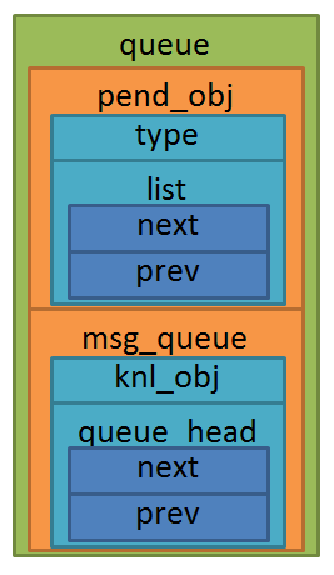

* 消息控制块

除了上述的队列控制块外，还有消息队列控制块，这是因为TencentOS tiny中实现队列是依赖消息队列的，既然队列可以传递数据（消息），则必须存在一种可以存储消息的数据结构，我称之为消息控制块，消息控制块中记录了消息的存储地址msg_addr，以及消息的大小msg_size，此外还存在一个list成员变量，可以将消息挂载到队列的消息列表中。

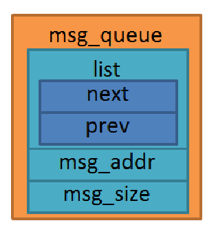

* 任务控制块中的消息成员变量

假设任务A在队列中等待消息，而中断或其他任务往任务A等待的队列写入（发送）一个消息，那么这个消息不会被挂载到队列的消息列表中，而是会直接被记录在任务A的任务控制块中，表示任务A从队列中等待到这个消息，因此任务控制块必须存在一些成员变量用于记录消息相关信息（如消息地址、消息大小等）

* 与消息相关的宏定义

在tos_config.h中，使能队列组件的宏定义TOS_CFG_QUEUE_EN，使能消息队列组件宏定义TOS_CFG_MSG_EN，系统支持的消息池中消息个数宏定义TOS_CFG_MSG_POOL_SIZE。

* 消息池

在TencentOS tiny中定义了一个数组k_msg_pool[TOS_CFG_MSG_POOL_SIZE]作为消息池，它的数据类型是消息控制块类型k_msg_t，因为在使用消息队列的时候存取消息比较频繁，而在系统初始化的时候就将这个大数组的各个元素串初始化，并挂载到空闲消息列表中k_msg_freelist，组成我们说的消息池k_msg_pool，而池中的成员变量就是我们所说的消息。

#### 函数

##### 创建

```
tos_queue_create()
```

队列就是一个数据结构，用于任务间的数据的传递。每创建一个新的队列都需要为其分配RAM，在创建的时候我们需要自己定义一个队列控制块，其内存是由编译器自动分配的。在创建的过程中实际上就是将队列控制块的内容进行初始化，将队列控制块的 pend_obj成员变量中的type 属性标识为PEND_TYPE_QUEUE，表示这是一个队列，然后调用消息队列中的API函数tos_msg_queue_create()将队列的消息成员变量msg_queue初始化，实际上就是初始化消息列表。

可以参考博客：https://blog.csdn.net/jiejiemcu/article/details/99687678

##### 销毁

```
tos_queue_destroy()
```

当队列不在使用是可以将其销毁，销毁的本质其实是将队列控制块的内容进行清除，首先判断一下队列控制块的类型是PEND_TYPE_QUEUE，这个函数只能销毁队列类型的控制块。然后判断是否有任务在等待队列中的消息，如果有则调用pend_wakeup_all()函数将这项任务唤醒，然后调用tos_msg_queue_flush()函数将队列的消息列表的消息全部“清空”，“清空”的意思是将挂载到队列上的消息释放回消息池（如果队列的消息列表存在消息，使用msgpool_free()函数释放消息），knl_object_deinit()函数是为了确保队列已经被销毁，此时队列控制块的pend_obj成员变量中的type 属性标识为KNL_OBJ_TYPE_NONE。最后在销毁队列后进行一次任务调度，以切换任务（毕竟刚刚很可能唤醒了任务）。

有一点要注意：因为队列控制块的RAM是由编译器静态分配的，所以即使是销毁了队列，这个内存也是没办法释放的~

##### 清空

```
tos_msg_queue_flush()
```

清空队列实际上就是将消息释放回消息池中。它是依赖于消息队列实现的。

##### 等待（消息）

当任务试图从队列中的获取消息时，用户可以指定一个等待时间，当且仅当队列存在消息的时候，任务才能获取到消息。在等待的这段时间中，如果队列为空，该任务将保持阻塞状态以等待队列消息有效。当其他任务或中断服务程序往其等待的队列中写入了数据，该任务将自动由阻塞态转为就绪态。当任务等待发生超时，即使队列中尚无有效消息，任务也会自动从阻塞态转为就绪态。

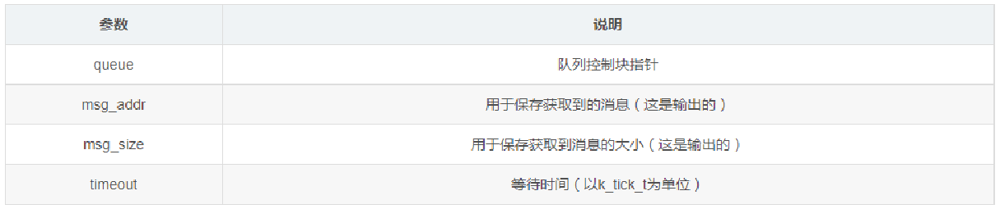

其中msg_addr与msg_size参数是用于保存函数返回的内容，即输出。

##### 写入（消息）

```
tos_queue_post()
tos_queue_post_all()
```

任务或者中断服务程序都可以给消息队列发送消息，当发送消息时，TencentOS tiny会从消息池中取出一个消息，挂载到队列的消息列表末尾（FIFO发送方式）。tos_queue_post()是唤醒一个等待队列消息任务，tos_queue_post_all()则会唤醒所有等待队列消息的任务，无论何种情况，都是调用queue_do_post将消息写入队列中。

### 信号量

#### 简介

信号量（sem）在操作系统中是一种实现系统中任务与任务、任务与中断间同步或者临界资源互斥保护的机制。在多任务系统中，各任务之间常需要同步或互斥，信号量就可以为用户提供这方面的支持。

抽象来说，信号量是一个非负整数，每当信号量被获取（pend）时，该整数会减一，当该整数的值为 0 时，表示信号量处于无效状态，将无法被再次获取，所有试图获取它的任务将进入阻塞态。通常一个信号量是有计数值的，它的计数值可以用于系统资源计数（统计）。

一般来说信号量的值有两种：

* 0：表示没有积累下来的post信号量操作，且可能有任务阻塞在此信号量上。
* 正值：表示有一个或多个post信号量操作。

信号量也如队列一样，拥有阻塞机制。任务需要等待某个中断发生后，再去执行对应的处理，那么任务可以处于阻塞态等待信号量，直到中断发生后释放信号量后，该任务才被唤醒去执行对应的处理。在释放（post）信号量的时候能立即将等待的任务转变为就绪态，如果任务的优先级在就绪任务中是最高的，任务就能立即被运行，这就是操作系统中的“实时响应，实时处理”。在操作系统中使用信号量可以提高处理的效率。

#### 阻塞机制

信号量也如队列一样，拥有阻塞机制。任务需要等待某个中断发生后，再去执行对应的处理，那么任务可以处于阻塞态等待信号量，直到中断发生后释放信号量后，该任务才被唤醒去执行对应的处理。在释放（post）信号量的时候能立即将等待的任务转变为就绪态，如果任务的优先级在就绪任务中是最高的，任务就能立即被运行，这就是操作系统中的“实时响应，实时处理”。在操作系统中使用信号量可以提高处理的效率。

#### 相关数据结构

* 信号量控制块

TencentOS tiny 通过信号量控制块操作信号量，其数据类型为k_sem_t，信号量控制块由多个元素组成，主要有 pend_obj_t 类型的pend_obj以及k_sem_cnt_t类型的count。而pend_obj有点类似于面向对象的继承，继承一些属性，里面有描述内核资源的类型（如信号量、队列、互斥量等，同时还有一个等待列表list）。而count则是一个简单的变量（它是16位的无符号整数），表示信号量的值。

* 与信号量相关的宏定义
  

在tos_config.h中，使能信号量的宏定义是TOS_CFG_SEM_EN

#### 函数

##### 创建

```
tos_sem_create()
```

系统中每个信号量都有对应的信号量控制块，信号量控制块中包含了信号量的所有信息，比如它的等待列表、它的资源类型，以及它的信号量值。

创建信号量函数是tos_sem_create()，传入两个参数，一个是信号量控制块的指针*sem，另一个是信号量的初始值init_count，该值是非负整数即可，但主要不能超过65535。

实际上就是调用pend_object_init()函数将信号量控制块中的sem->pend_obj成员变量进行初始化，它的资源类型被标识为PEND_TYPE_SEM。然后将sem->count成员变量设置为传递进来的信号量的初始值init_count。

##### 销毁

```
pend_is_nopending()
```

信号量销毁函数是根据信号量控制块直接销毁的，销毁之后信号量的所有信息都会被清除，而且不能再次使用这个信号量，当信号量被销毁时，其等待列表中存在任务，系统有必要将这些等待这些任务唤醒，并告知任务信号量已经被销毁了PEND_STATE_DESTROY。然后产生一次任务调度以切换到最高优先级任务执行。


1. 调用pend_is_nopending()函数判断一下是否有任务在等待信号量
2. 如果有则调用pend_wakeup_all()函数将这些任务唤醒，并且告知等待任务信号量已经被销毁了（即设置任务控制块中的等待状态成员变量pend_state为PEND_STATE_DESTROY）。
3. 调用pend_object_deinit()函数将信号量控制块中的内容清除，最主要的是将控制块中的资源类型设置为PEND_TYPE_NONE，这样子就无法使用这个信号量了。
4. 进行任务调度knl_sched()

##### 获取

```
tos_sem_pend()
```

当信号量有效的时候，任务才能获取信号量。任务获取了某个信号量时，该信号量的可用个数减一，当它为0的时候，获取信号量的任务会进入阻塞态，阻塞时间timeout由用户指定，在指定时间还无法获取到信号量时，将发送超时，等待任务将自动恢复为就绪态。

##### 释放

```
tos_sem_post()
tos_sem_post_all()
```

任务或者中断服务程序都可以释放信号量（post），释放信号量的本质就是将信号量控制块的count成员变量的值加1，表示信号量有效，不过如果有任务在等待这个信号量时，信号量控制块的count成员变量的值是不会改变的，因为要唤醒等待任务，而唤醒等待任务的本质就是等待任务获取到信号量，信号量控制块的count成员变量的值要减1，这一来一回中，信号量控制块的count成员变量的值是不会改变的。

TencentOS tiny 中可以只让等待中的一个任务获取到信号量，也可以让所有等待任务都获取到信号量。分别对应的API是tos_sem_post()与tos_sem_post_all()。


1. 首先判断一下信号量是否溢出了，因为一个整数始终都会溢出的，总不能一直释放信号量让count成员变量的值加1吧，因此必须要判断一下是否溢出，如果sem->count的值为 (k_sem_cnt_t)-1，则表示已经溢出，无法继续释放信号量，返回错误代码K_ERR_SEM_OVERFLOW。

2. 调用pend_is_nopending()函数判断一下是否有任务在等待信号量，如果没有则将count成员变量的值加1，返回K_ERR_NONE表示释放信号量成功，因为此时没有唤醒任务也就无需任务调度，直接返回即可。

3. 如3果有任务在等待信号量，则count成员变量的值无需加1，直接调用pend_wakeup唤醒对应的任务即可，唤醒任务则是根据opt参数进行唤醒，可以唤醒等待中的一个任务或者是所有任务。

4. 进行一次任务调度knl_sched()。

##### 补充

关于为什么判断sem->count是(k_sem_cnt_t)-1就代表溢出呢？

我在C语言中举了个简单的例子：

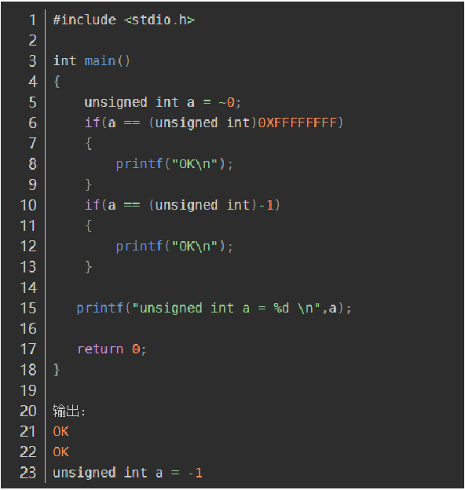