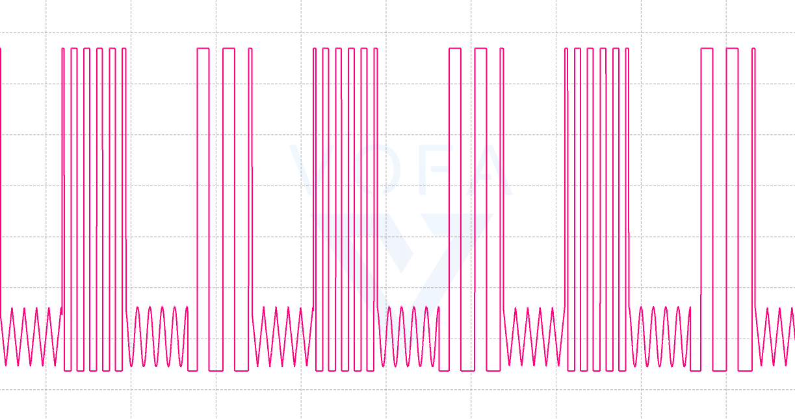

#### CONNECT

| AD9833 | STM32     |
| ------ | --------- |
| VCC    | 3V3       |
| DGND   | GND       |
| SDATA  | PB5(MOSI) |
| SCLK   | PB3(SCLK) |
| FSYNC  | PB7(CS)   |
| AGND   | -         |
| OUT    | PA6(ADC)  |

#### DEMO

每500ms切换1次输出波形：

