### JDK8

重要！！开发环境不能含有 JDK8 以外的 JDK 版本！否则每次 CubeMX 生成 Keil 项目时都提示找不到设备 / 目标芯片。

---

设置环境变量，防止生成代码时，中文注释乱码：

```
JAVA_TOOL_OPTIONS
-Dfile.encoding=UTF-8
```

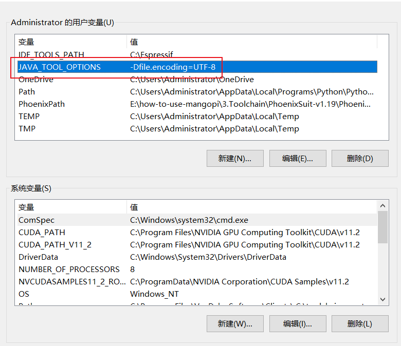

### CubeMX

创建项目：

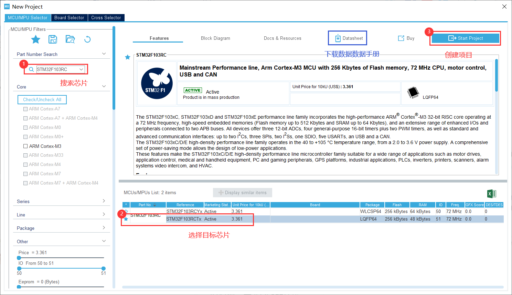

设置调试模式：SWD

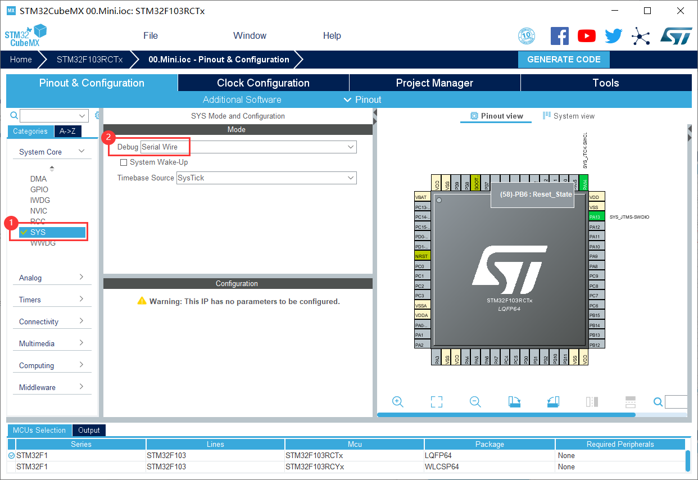

设置晶振源：

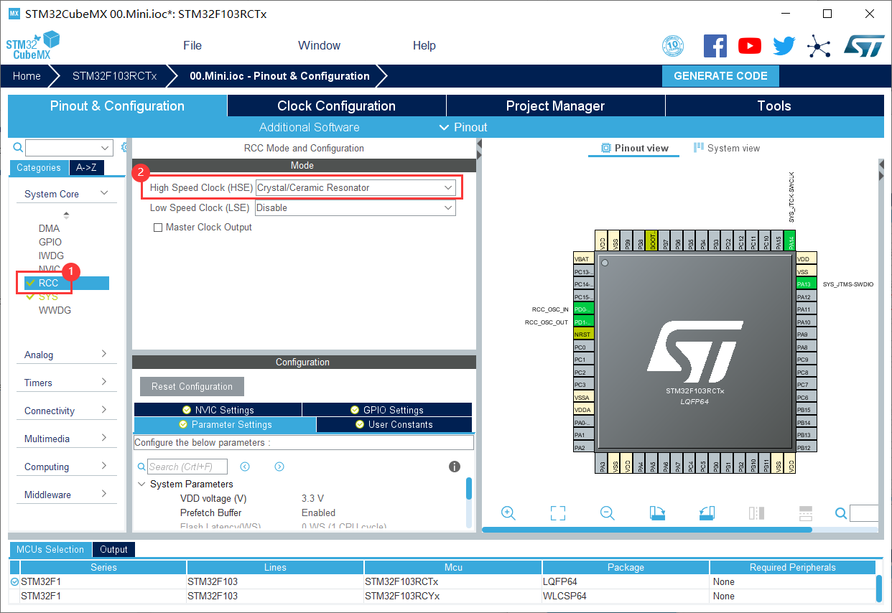

设置时钟树：在 HCLK 处输入数值后，按回车键即可。

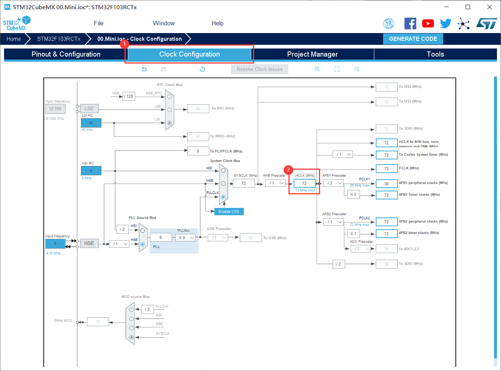

STM32 有内部晶振，也可以配置为外部低速晶振（32.768k）和外部高速晶振（8M）。

| 时钟源             | **使用**                           |
| ------------------ | ---------------------------------- |
| 外部低速时钟 LSE   | 须配置 RTC 和 RCC 后才能配置该时钟 |
| 内部低速时钟 LSI   | 须配置 RTC 后才能配置该时钟        |
| 外部高速时钟 HSE   | 须配置 RCC 后才能配置该时钟        |
| 外部低速时钟 HSI   | 可直接配置                         |
| 内部主时钟输出 MCO | 须在 RCC 中配置后才能配置该时钟    |

此处配置为最大速率 72MHz：

- 1 选择外部时钟HSE 8MHz  
- 2 PLL锁相环倍频9倍
- 3 系统时钟来源选择为PLL
- 4 设置APB1分频器为 /2

项目配置：

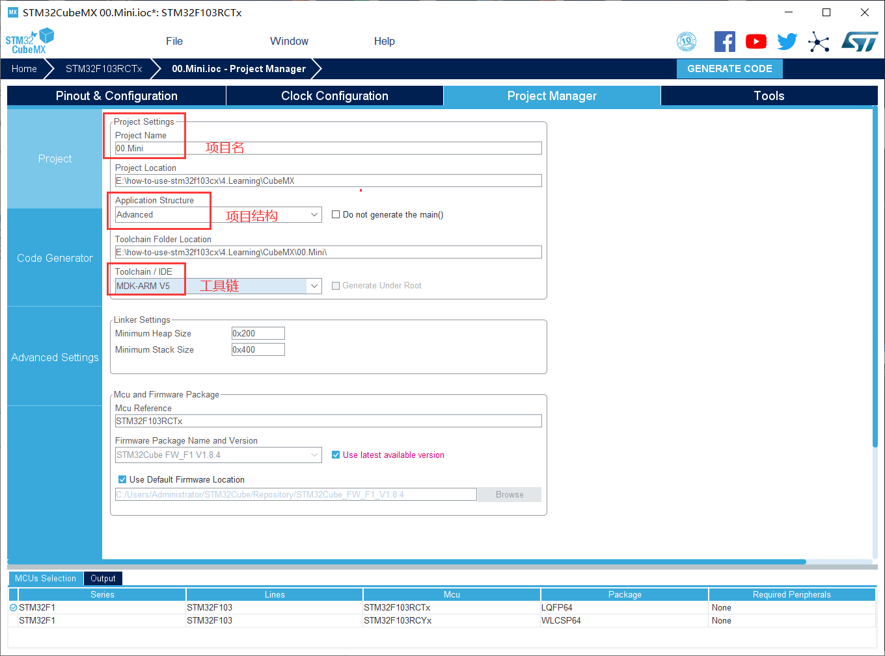

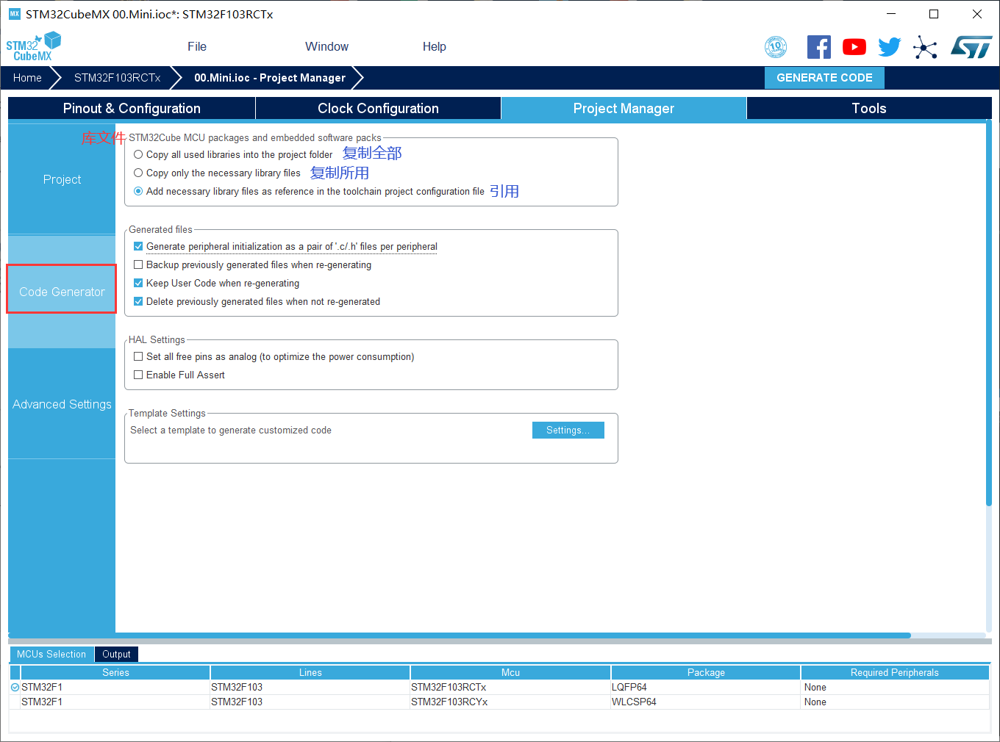

点击 `GENERATE CODE` 即可生成项目。

### Keil5

选择编译器版本，以加快编译速度：

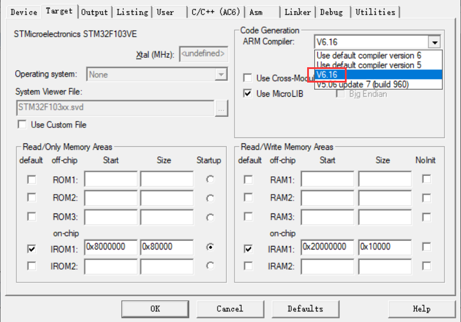

选择烧录工具（合宙的基于 Air32f103 的 DAPLINK）：

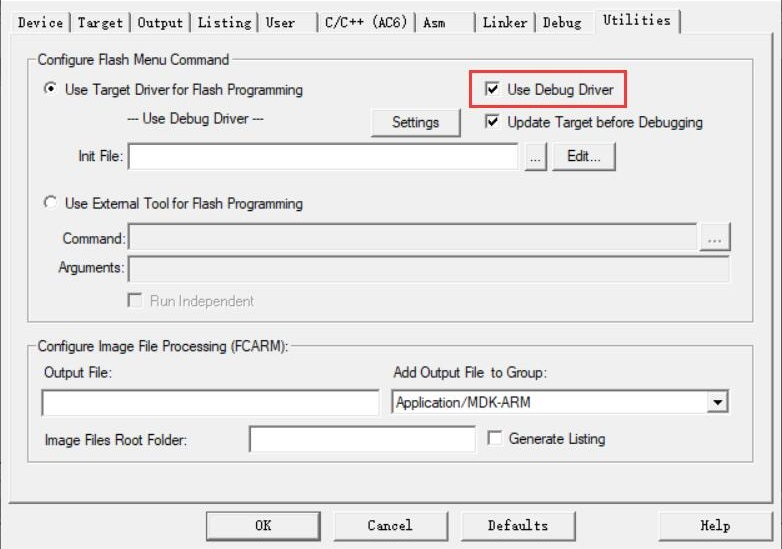

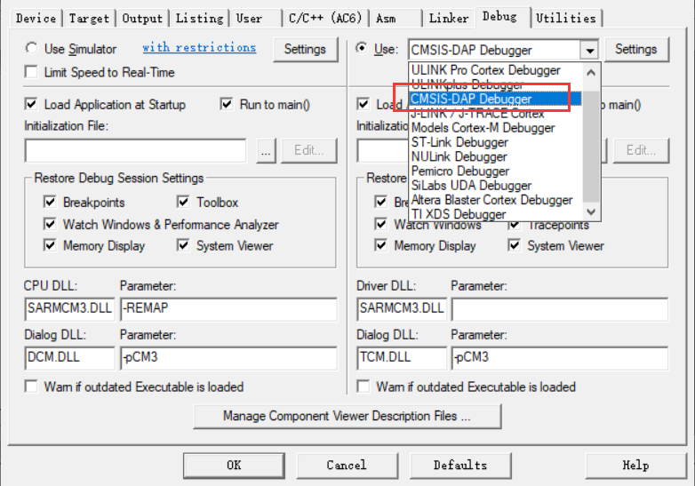

设置烧录速度：

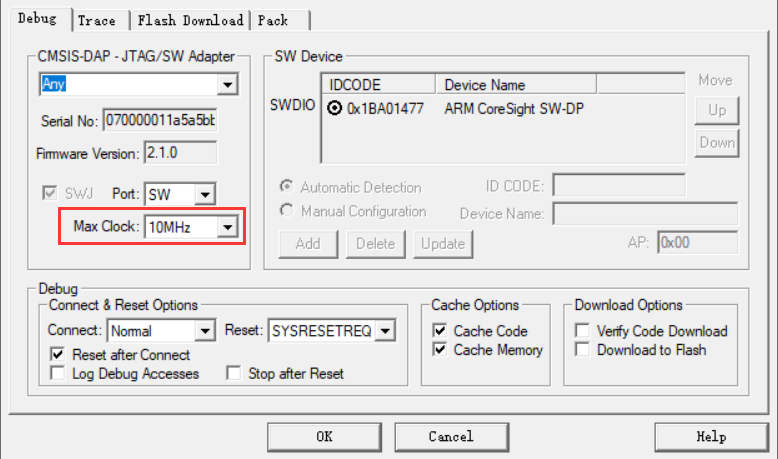

设置烧录完成后自动复位：

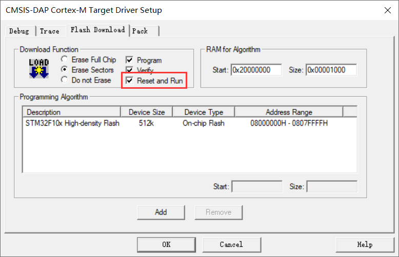

### VS Code

插件安装和路径配置：

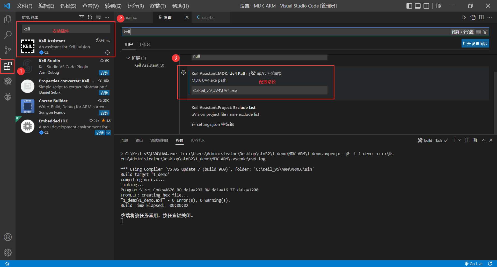

编译与烧录：

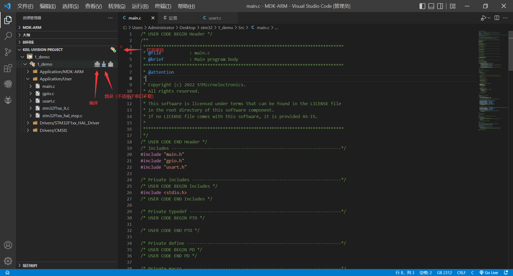