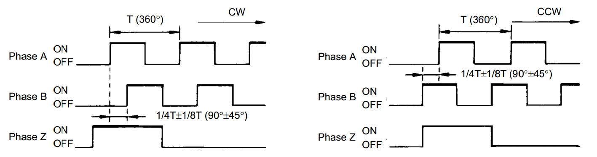
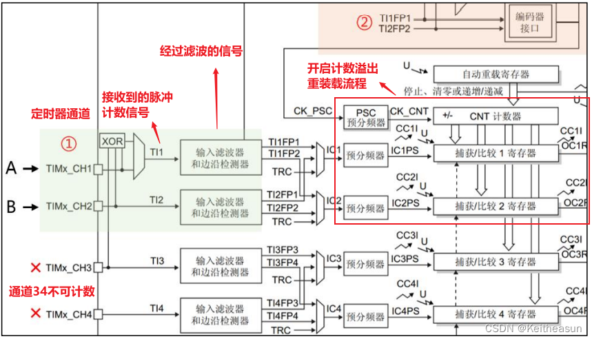
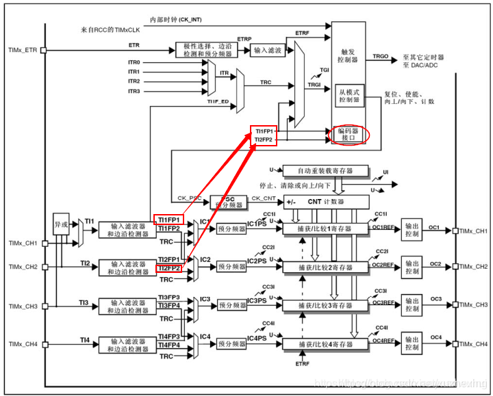
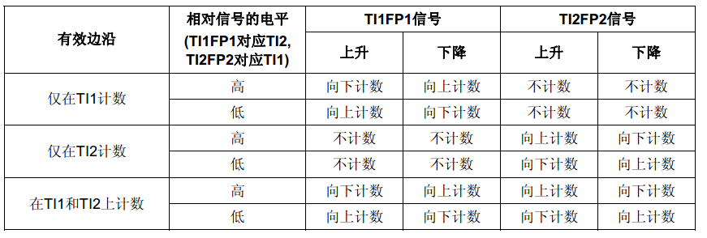
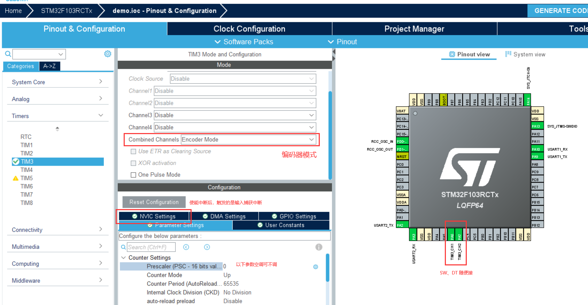
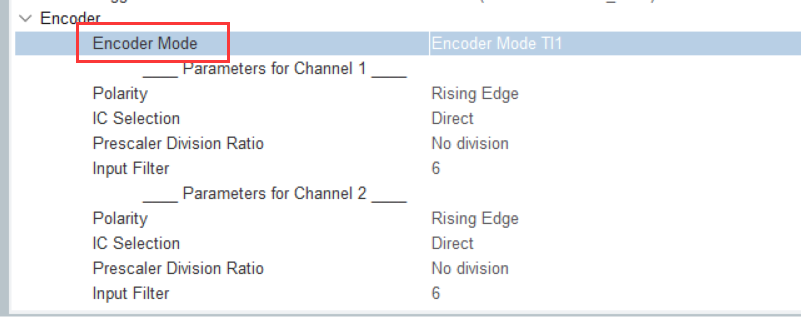

https://www.jianshu.com/p/41fa67ecb248

编码器是有ABZ三相，其中ab相是用来计数，z相输出零点信号。

AB相根据旋转的方向不同，输出的波形如下图所示：



顺时针，A下降沿B高电平，A上升沿B低电平；逆时针，A下降沿B低电平，A上升沿B高电平。

|      |  正转  |  正转  |  反转  | 反转   |
| :--: | :----: | :----: | :----: | ------ |
|  A   | 上升沿 | 下降沿 | 上升沿 | 下降沿 |
|  B   |   L    |   H    |   H    | L      |

#### 流程







T1 就按 Channel 1 的 Polarity 所选定的有效边沿来计数。

T2 就按 Channel 2 的 Polarity 所选定的有效边沿来计数。

T1 and T2 就 Channel 1 和  Channel 2 都计数。

#### 配置



Encoder Mode：计数模式选择



#### 函数

开启计数：

```c
HAL_TIM_Encoder_Start(&htimx, TIM_CHANNEL_ALL);
```

获取方向：

```c
__HAL_TIM_IS_TIM_COUNTING_DOWN(&htimx);
```

获取计数值：

```c
__HAL_TIM_GET_COUNTER(&htimx);
```

设置计数值：

```c
__HAL_TIM_SET_COUNTER(&htimx,number);
```

设置最大值：

```c
__HAL_TIM_SET_AUTORELOAD(&htimx,number);
```

关闭计数：

```c
HAL_TIM_Encoder_Stop(&htimx, TIM_CHANNEL_ALL);
```

