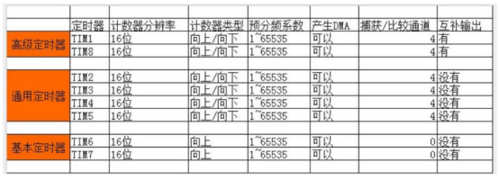
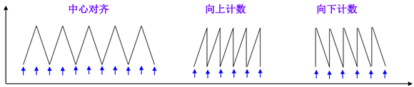
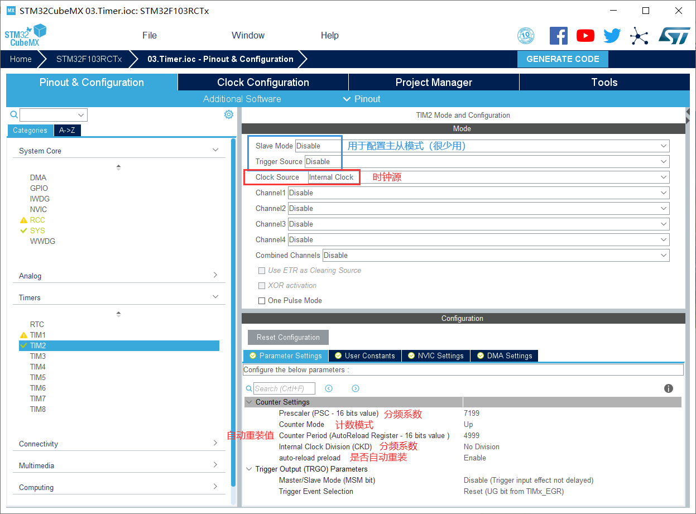
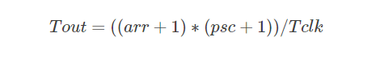
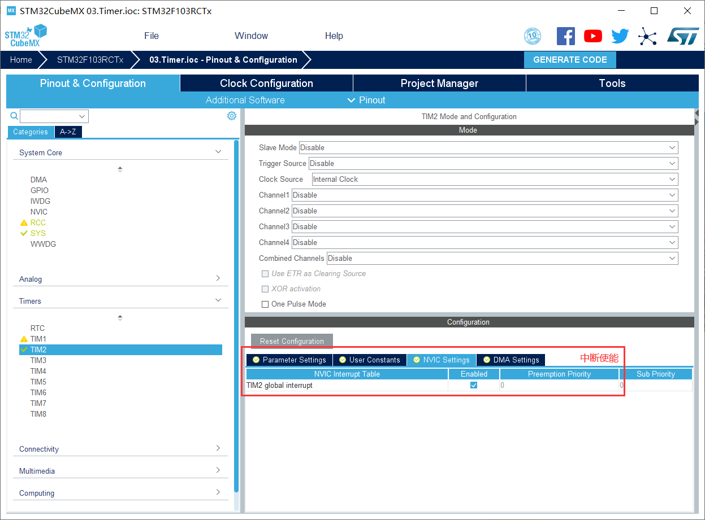
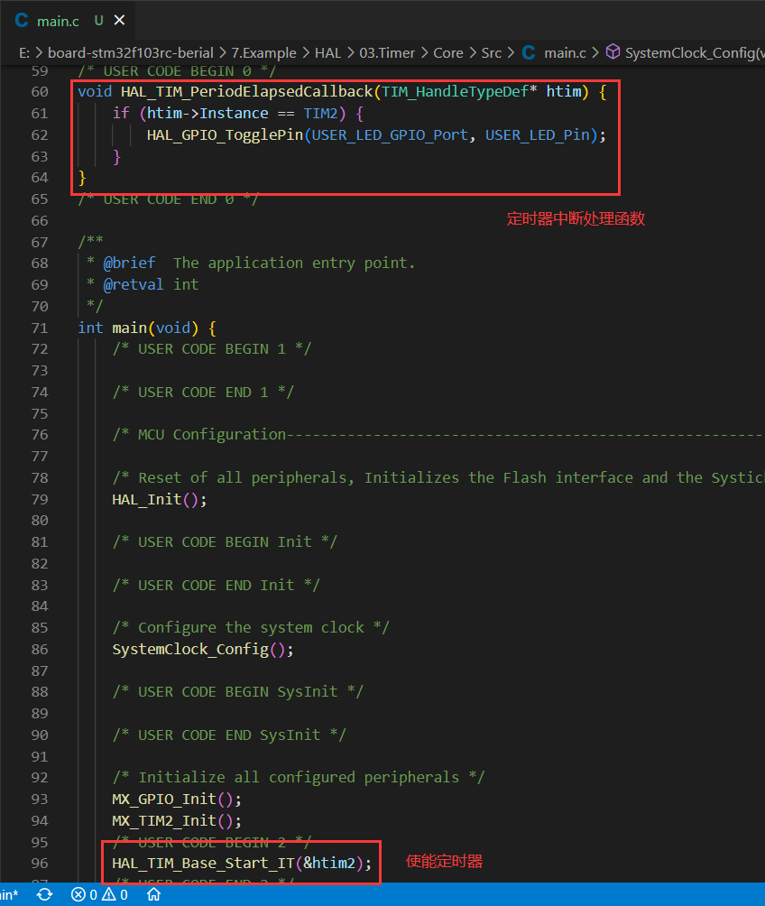

# TIM

Tim：timer 定时器

STM32F103 系列共 11 个定时器：2个高级定时器、4个普通定时器、2个基本定时器、2个看门狗定时器、1个系统嘀嗒定时器。




#### 主要功能

基本定时器（TIM6、TIM7）

* 计数器 + 预分频器
* 挂载于 APB1 总线上
* 没有连接到外部IO口

通用定时器（TIM2~TIM5）

* 计数器 + 预分频器
* 输入捕获：测量输入信号的脉冲长度
* 输出方波：输出比较和PWM

高级定时器（TIM1，TIM8）

* 通用定时器的所有功能
* 控制交直流电动机（输出6路互补带死区的信号，刹车功能...）
* 挂载于 APB2 总线上

#### 计数模式



* 双向计数：从`0`开始向上计数到`自动重装值-1`并产生计数器溢出事件，然后向下计数到`1`并产生计数器溢出事件，之后再从`0`开始重新计数。（0→TIMx_ARR→1）
* 向上计数：从`0`开始向上计数到`自动重装值`，然后从`0`重新开始计数并产生计数器溢出事件。（0→TIMx_ARR）
* 向下计数：从`自动重装值`开始向下计数到`0`，然后从`自动重装值`重新开始计数并产生计数器溢出事件。（TIMx_ARR→0）

#### 时钟来源

1. 内部时钟（CK_INT）：来自 RCC 的时钟

2. 外部输入脚（TIx）：捕获外部引脚的边沿信号

3. 外部触发输入（ETR：External Trigger）

4. 内部触发输入（ITRx：Internal Trigger）：由其他定时器触发

#### 相关寄存器

| Reg      | Func       |
| -------- | ---------- |
| TIMx_CNT | 计数器     |
| TIMx_PSC | 预分频器   |
| TIMx_ARR | 自动重载值 |

#### 相关函数

在 `stm32f1xx_hal_tim.h` 中，有以下函数（部分）：

* 使能定时器（中断模式）

```c
HAL_StatusTypeDef HAL_TIM_Base_Start_IT(TIM_HandleTypeDef *htim)
```

* 停止定时器（中断模式）

```c
HAL_StatusTypeDef HAL_TIM_Base_Stop_IT(TIM_HandleTypeDef *htim)
```
* 周期已过半

```c
void HAL_TIM_PeriodElapsedCallback(TIM_HandleTypeDef *htim);
```

* 周期已完成

```c
void HAL_TIM_PeriodElapsedHalfCpltCallback(TIM_HandleTypeDef *htim);
```


#### 基本定时器的配置流程





此处：arr = 4999、psc = 7199、Tclk =  72Mhz → Tout = (5000 * 7200) / 72 us = 500ms





中断使能函数：

```c
HAL_TIM_Base_Start_IT(&htimx);
```

中断回调函数：

```c
void HAL_TIM_PeriodElapsedCallback(TIM_HandleTypeDef* htim) {
    if (htim->Instance == TIMx) {
        // do something
    }
}
```

### 延时 Delay

```c
void HAL_Delay_us(uint32_t us);

void HAL_Delay_us(uint32_t us) {
    HAL_SYSTICK_Config(HAL_RCC_GetHCLKFreq() / 1000000);
    HAL_Delay(us - 1);
    HAL_SYSTICK_Config(HAL_RCC_GetHCLKFreq() / 1000);
}

#define delay_ms(ms) HAL_Delay(ms)
#define delay_us(us) HAL_Delay_us(us)
```

