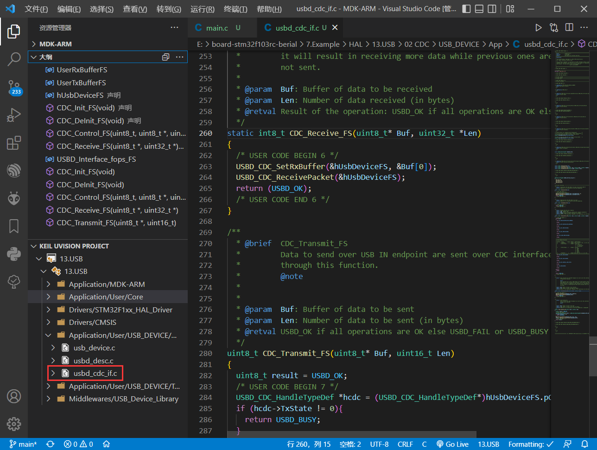
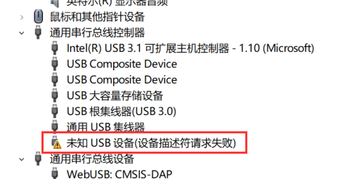
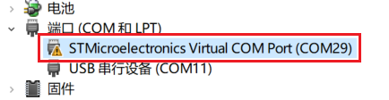
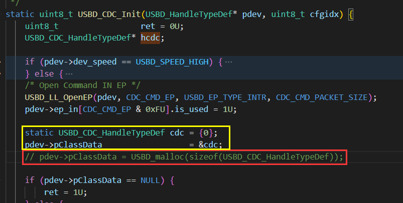
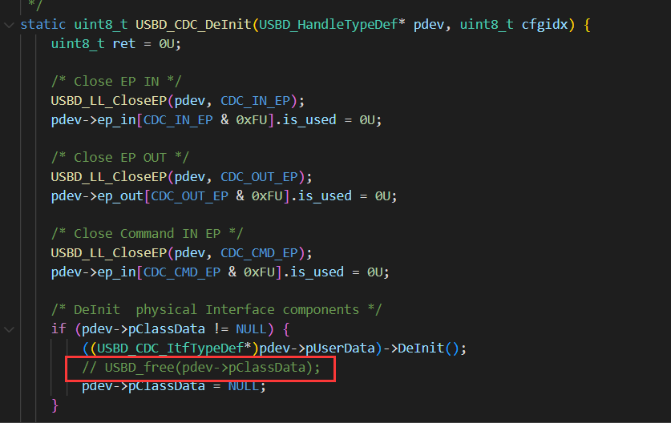
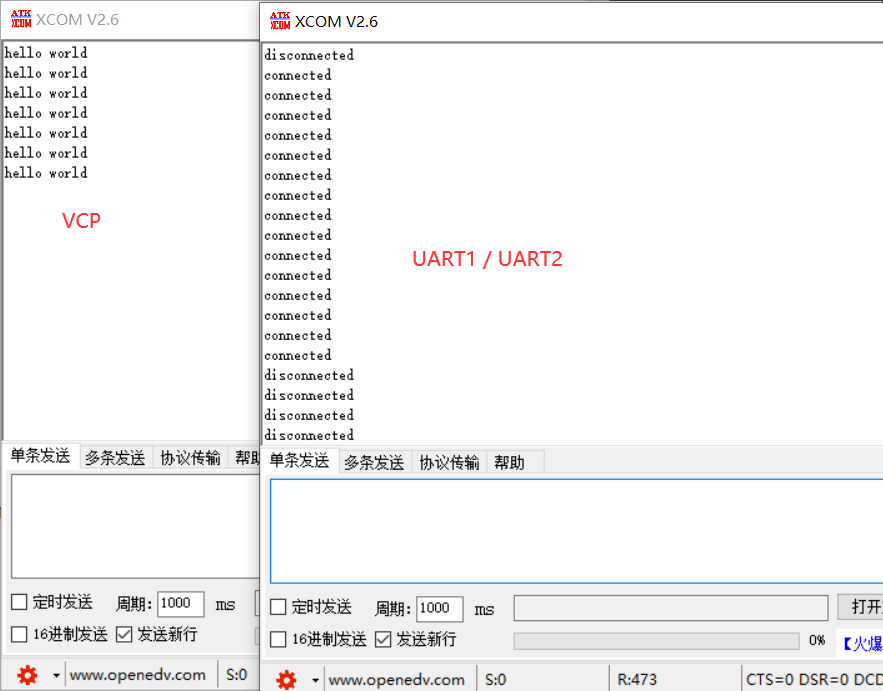

#### 重定向

无法使用 `fputc` 进行重定向：

```c
#include <stdio.h>
#include "usbd_cdc_if.h"
int fputc(int ch, FILE* f) {
    CDC_Transmit_FS((uint8_t*)&ch, 1);
    return ch;
}
```

需使用如下方式进行重定向：

```c
#include <stdio.h>
#include <stdarg.h>
#include "usbd_cdc_if.h"
static uint8_t TxBuffer[APP_TX_DATA_SIZE] = {0};
void usb_printf(const char* format, ...) {
    va_list  args;
    uint32_t length;
    va_start(args, format);
    length = vsnprintf((char*)TxBuffer, APP_TX_DATA_SIZE, (char*)format, args);
    va_end(args);
    CDC_Transmit_FS(TxBuffer, length);
}
// usb_printf("hello world\r\n");
```

---

注：波特率，停止位，校验位什么的不需要管。

---

#### 功能配置

有什么要修改的就在 `usbd_cdc_if.c` 中进行修改。



#### 错误处理

1. 未知设备：



按下 RST，再插上数据线。（注：win10 是不需要安装虚拟串口驱动的 ）

2. 能识别到 `虚拟串口` 却打不开：



修改 `usbd_cdc.c` 文件，将动态分配改为静态分配。（**加黄删红**）





```c
static USBD_CDC_HandleTypeDef cdc = {0};
pdev->pClassData                  = &cdc;
```

#### DEMO

