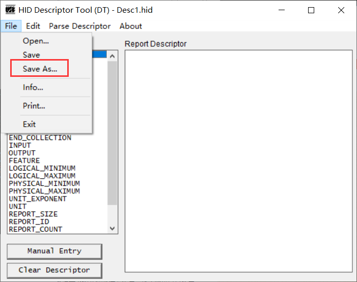
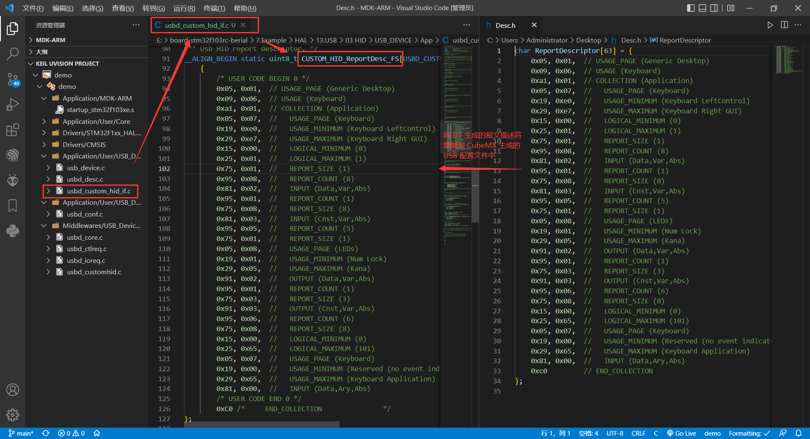
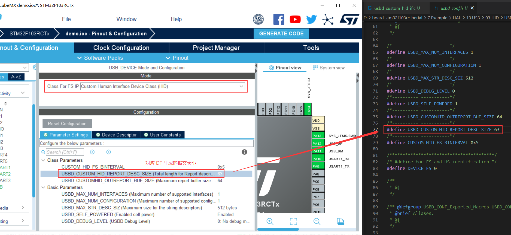
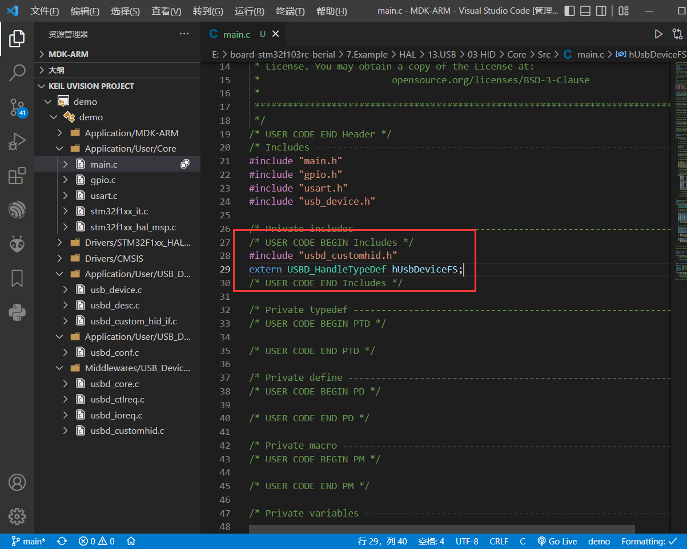
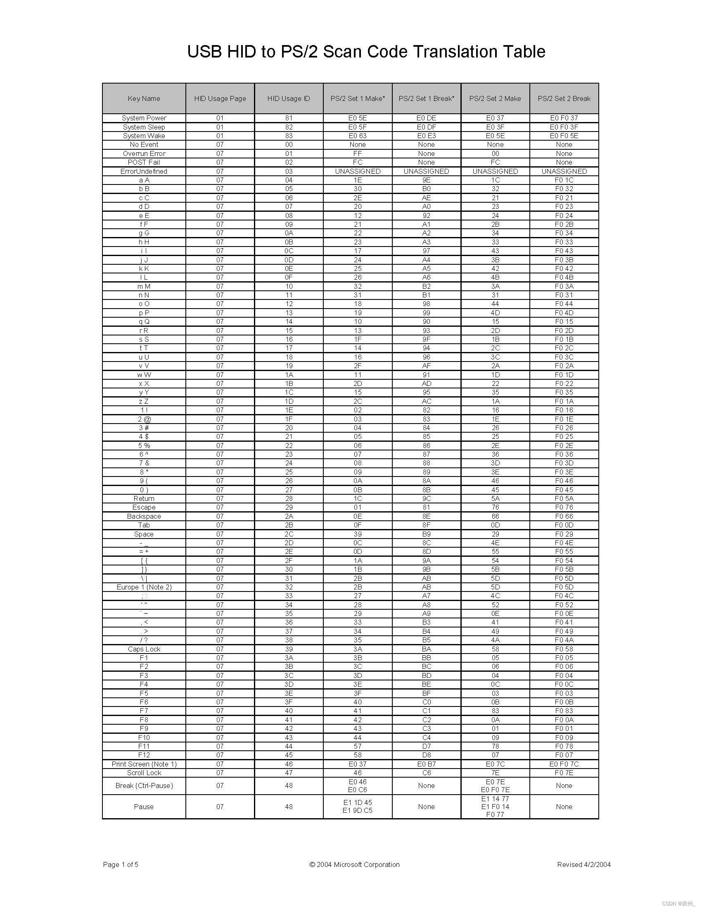
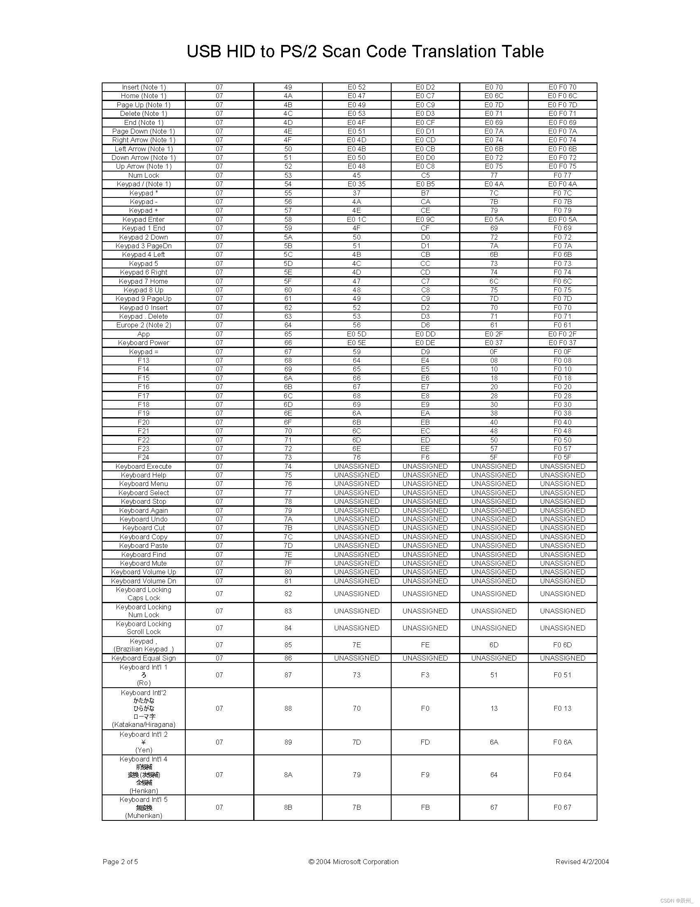
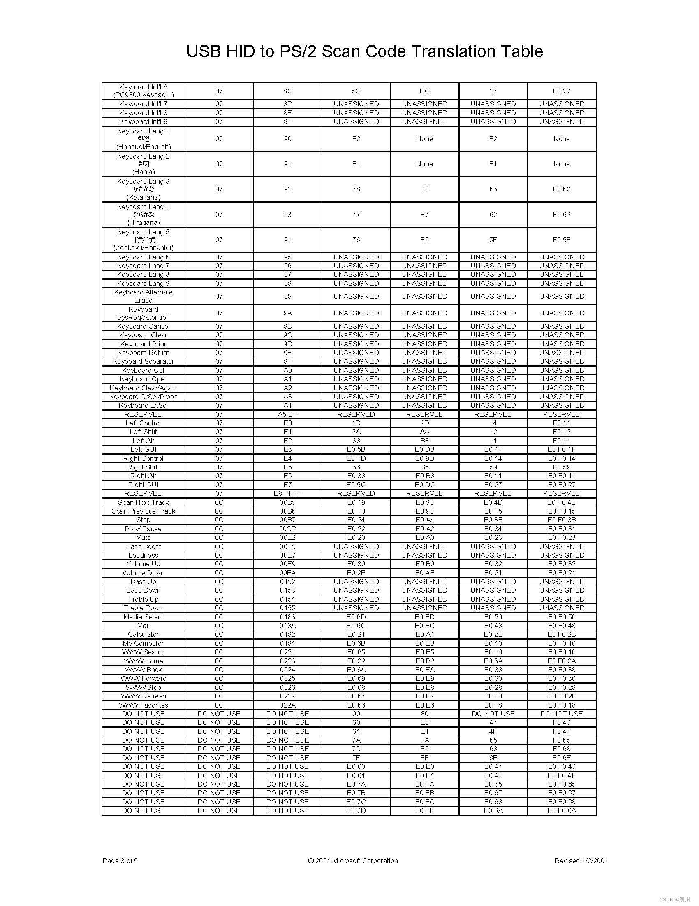
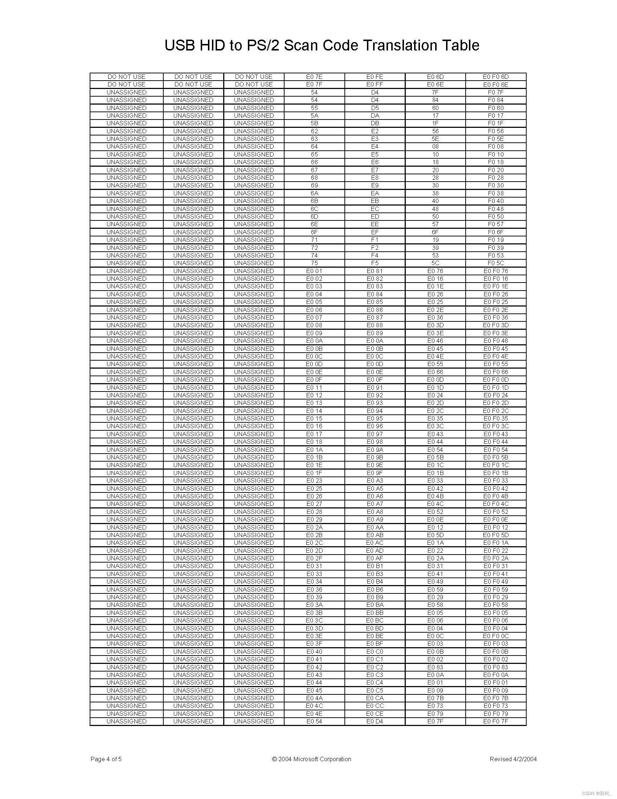
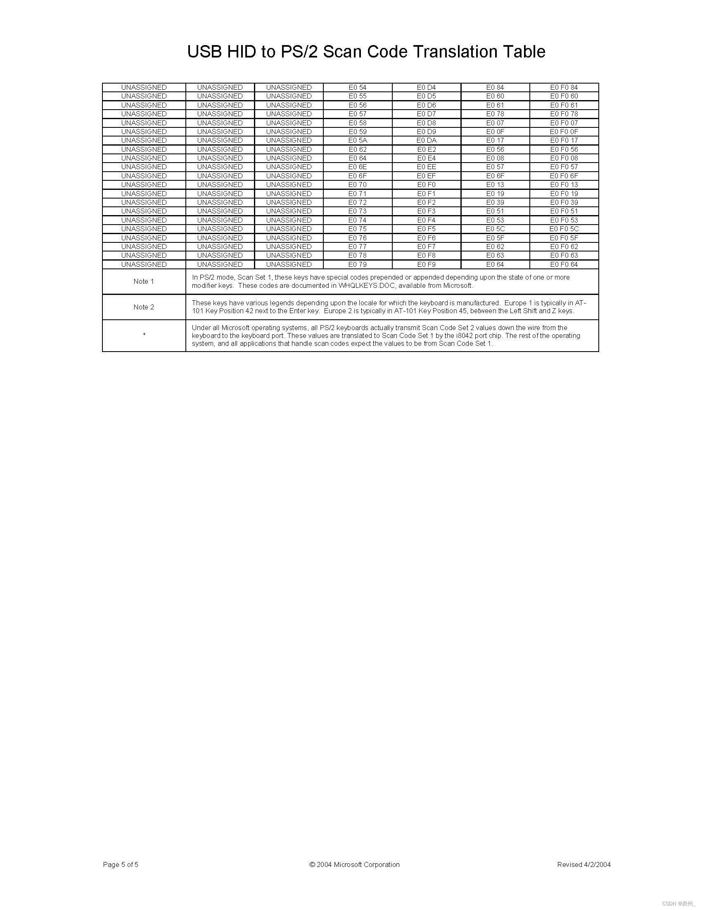

### 报文描述符

使用 HID Description Tool （DT）工具生成报文描述符，并导出为 .h 文件：



然后将生成的报文复制到 CubeMX 生成的 USB 配置文件 `usbd_custom_hid_if.c` 中：



报文大小对应中 `usbd_conf.h` 的 `USBD_CUSTOM_HID_REPORT_DESC_SIZE`



在 `main.c` 中导入头文件并声明变量：



```c
#include "usbd_customhid.h"
extern USBD_HandleTypeDef hUsbDeviceFS;
```

调用函数 `USBD_CUSTOM_HID_SendReport()` 进行数据发送：

注：该函数实际上是将数据写入到单片机内部的缓冲区，并不是直接发送到上位机中。二十上位机每隔一段时间来读取键值，所以写入之后需要将缓冲区手动清空，即往缓冲区填充 `0x00`。


键盘键值：列3 `HID usage ID`












