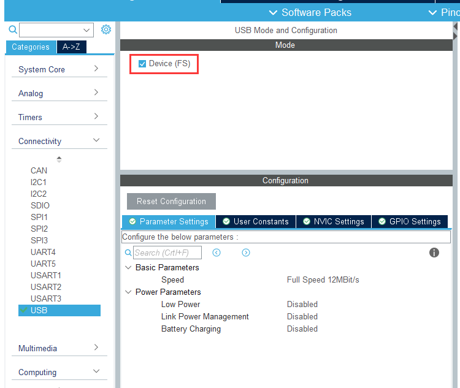
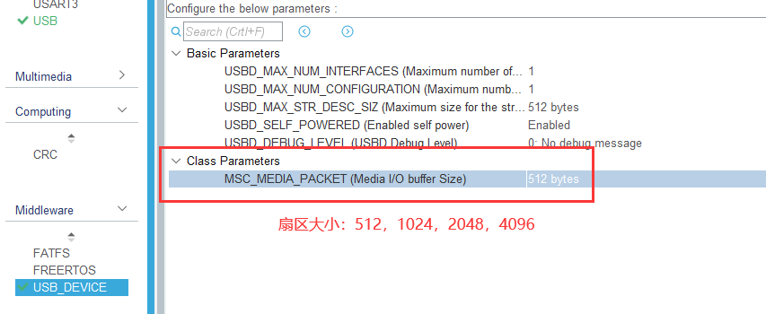
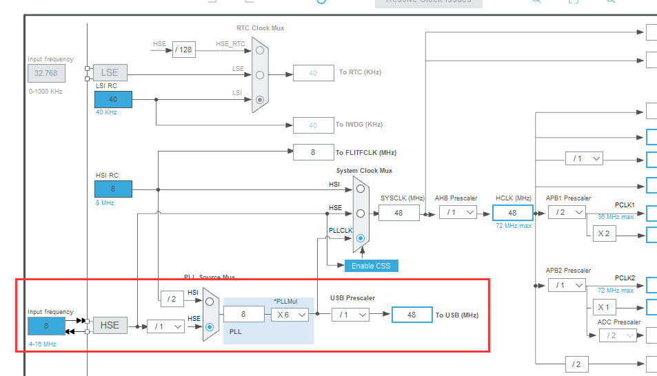
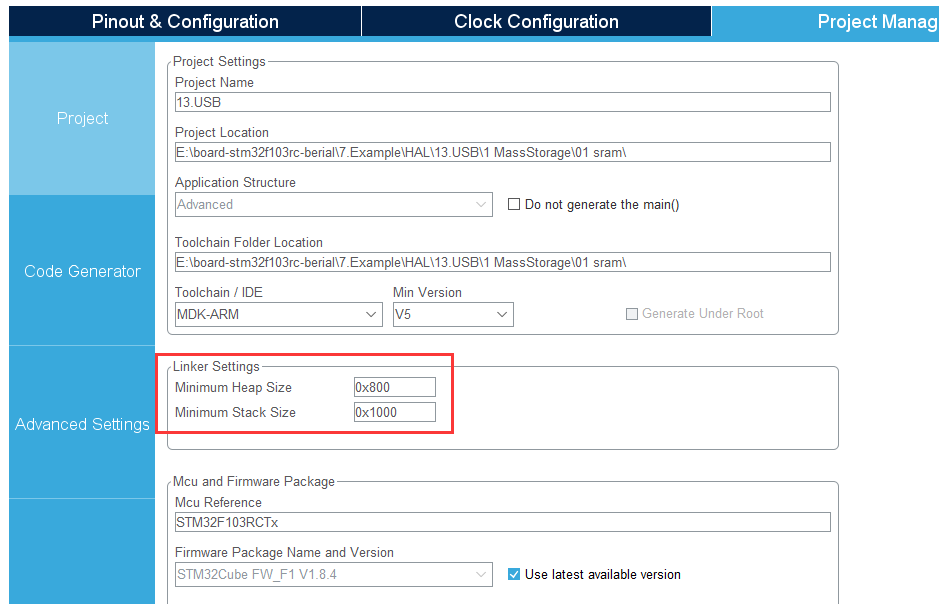
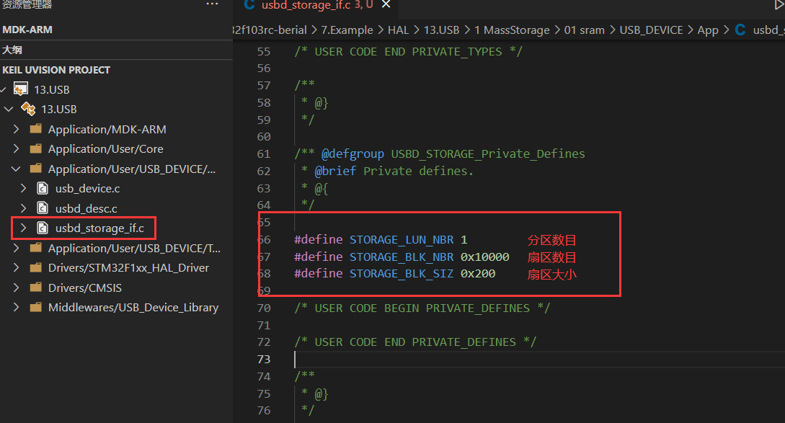

https://blog.csdn.net/mirco_mcu/article/details/106995258

https://blog.csdn.net/qq_45661238/article/details/108568854

https://blog.csdn.net/qq_36201602/article/details/111687764

https://blog.csdn.net/liuliyinhezi/article/details/122818914

https://blog.csdn.net/weixin_44096390/article/details/124137581

https://blog.csdn.net/qq_38420206/article/details/110572003

#### MSC

Mass Storage Class 大容量储存设备。

##### 配置

* 配置 USB





* 配置时钟



* 调整堆栈大小

若不够，还要再调大点。



* 底层IO代码

**容量**



容量 capacity = STORAGE_BLK_SIZ * STORAGE_BLK_NBR 

注：0x200=512，0x400=1024，0x800=2048，0x1000=4096

**IO**

仅需实现以下函数即可：

```c
int8_t STORAGE_Read_FS(uint8_t lun, uint8_t* buf, uint32_t blk_addr, uint16_t blk_len);
int8_t STORAGE_Write_FS(uint8_t lun, uint8_t* buf, uint32_t blk_addr, uint16_t blk_len);
```

* 插入电脑

首次使用需要格式化。

#### 无法识别

无法识别：

1. USB座虚焊（typec 虚焊，浪费我1天）。

表现为：

2. DP 未通过1.5k电阻上拉到3.3V。

表现为：电脑没检测到有设备插入。

---

- stlink ？不需要
- 重定向 printf ? 不需要，串口都不需要开
- usb 供电不足 ？挺足的，42步进电机都能转
- 短接下 usb 的 DM，DP ？不需要
- 库有问题？我没改过（win10 + cubemx_v6.1.2 + fw_f1_v1.8.4 + stm32f103rct6 ）

---