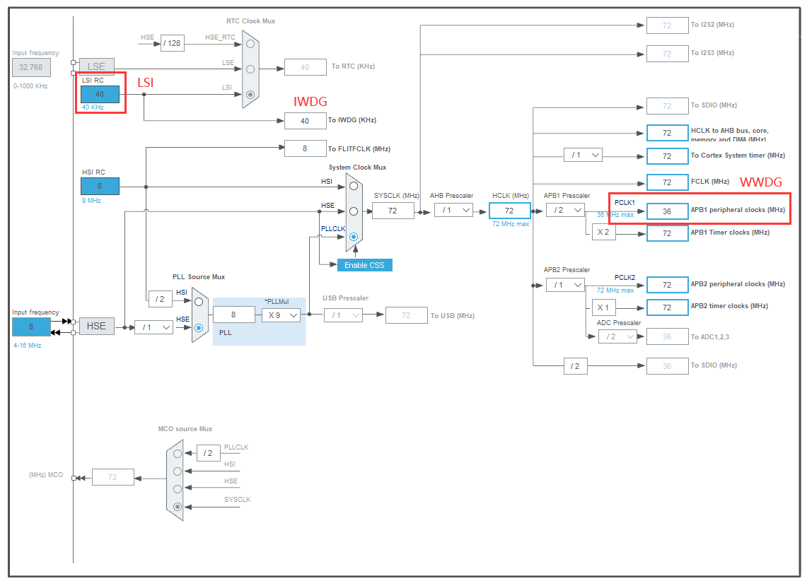
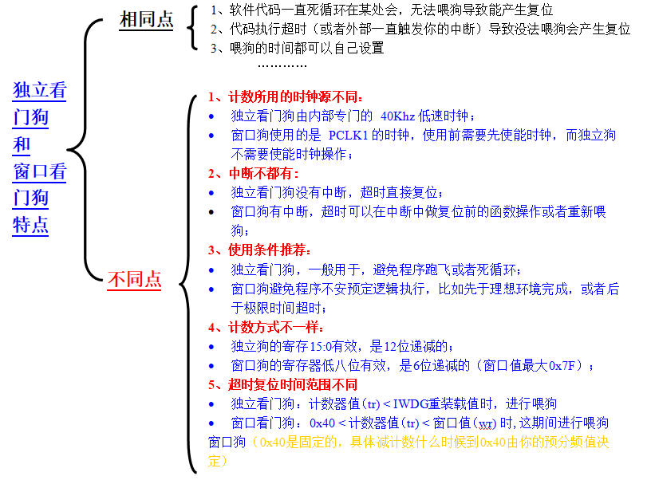
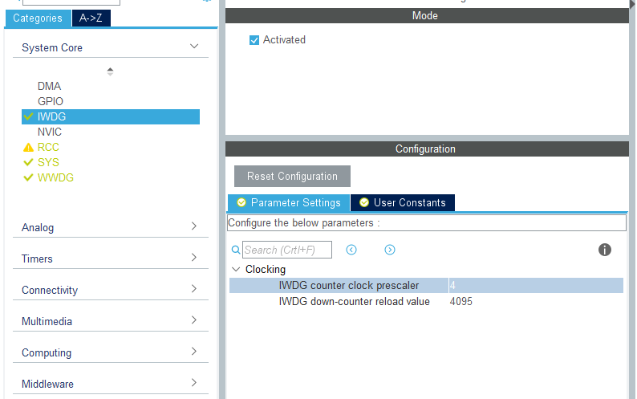
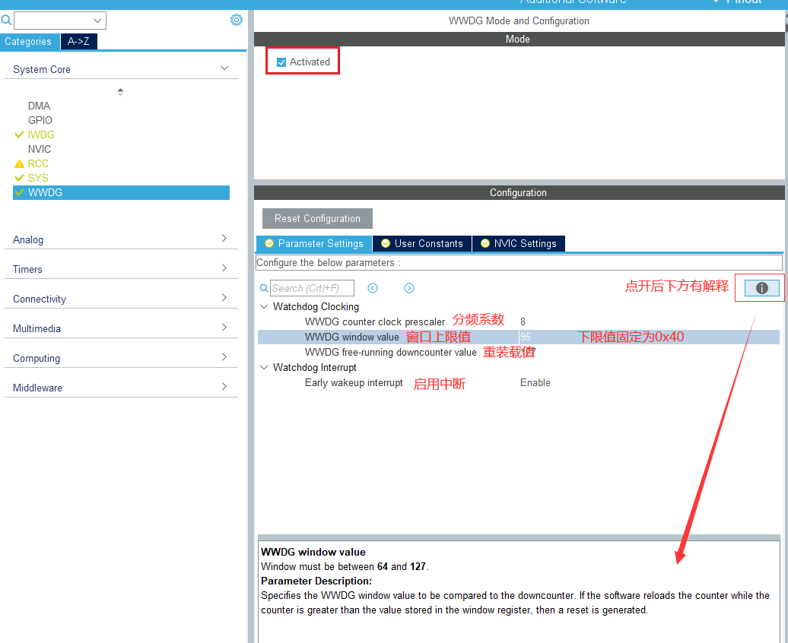
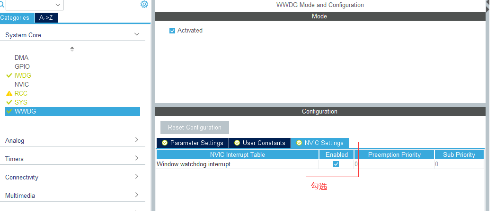
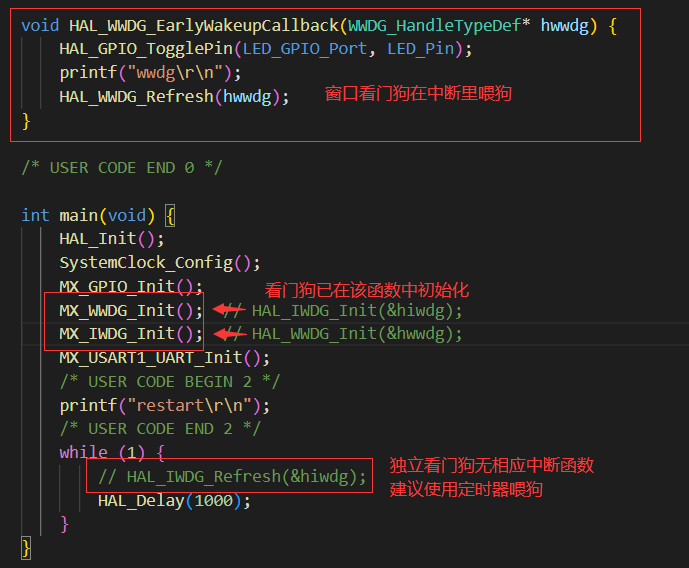

# Watch Dog

IWDG：独立看门狗

WWDG：窗口看门狗

看门狗的本质是向下递减的计数器。

#### 时钟



#### 区别



独立看门狗（IWDG）使用的是由片内专用的低速时钟（LSI，40kHz）。

* 无中断功能，在计数器减到 0 之前重新装载计数器的值(喂狗)，就不会产生复位。

窗口看门狗（WWDG）由 APB1 分频后得到的时钟 PCLK1 进行驱动。

* 有中断功能，其在计数器到达下限 0x40（0x3f+1）时产生，如不进行喂狗，则当计数器的值变为 0x3f 时将会产生系统复位。

#### 相关函数（部分）

* 独立看门狗复位

```c
HAL_StatusTypeDef HAL_IWDG_Refresh(IWDG_HandleTypeDef *hiwdg)
```

* 窗口看门狗复位

```c
HAL_StatusTypeDef HAL_WWDG_Refresh(WWDG_HandleTypeDef *hwwdg)
```

* 窗口看门狗中断回调

```c
void HAL_WWDG_EarlyWakeupCallback(WWDG_HandleTypeDef* hwwdg) 
```

#### 配置

* 独立看门狗



溢出时间：Tout = 分频系数 * 重装载值 / 时钟频率(LSI)。

此处：64 * 4095 / 40000 ≈ 410ms

* 窗口看门狗



| 时段            | 复位 |
| --------------- | ---- |
| 上限值 ~ 重载值 | 是   |
| 下限值 ~ 上限值 | 否   |
| 0 ~ 下限值      | 是   |

下限值固定为 0x40（64），上限值最大为 0x7F（127）。



#### 使用



```c
void HAL_WWDG_EarlyWakeupCallback(WWDG_HandleTypeDef* hwwdg) {
    HAL_WWDG_Refresh(hwwdg);
}
```

