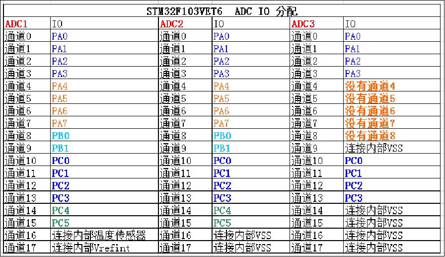
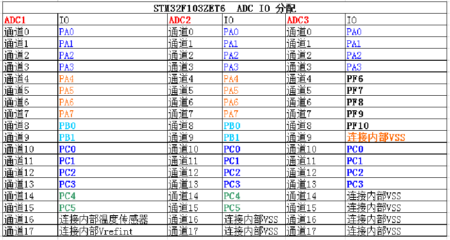
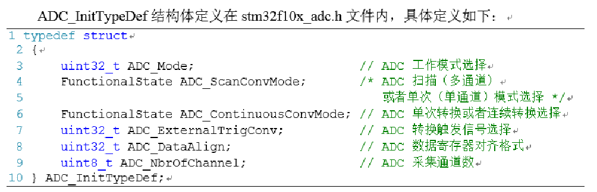
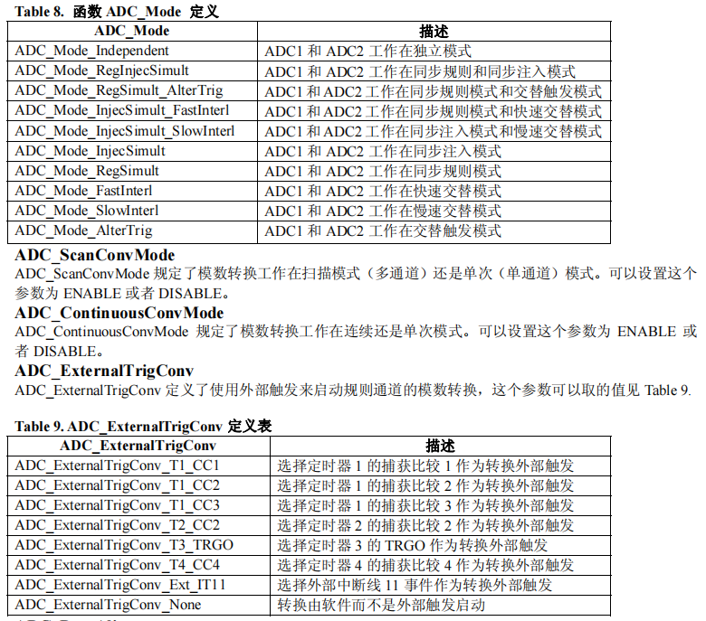
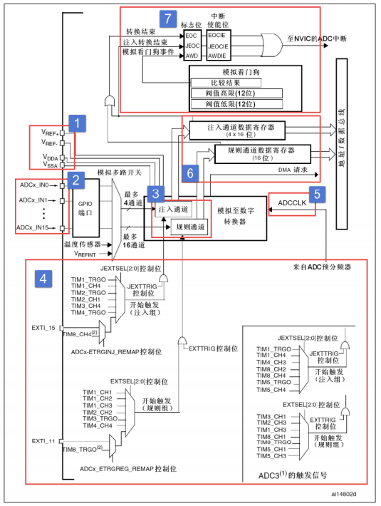
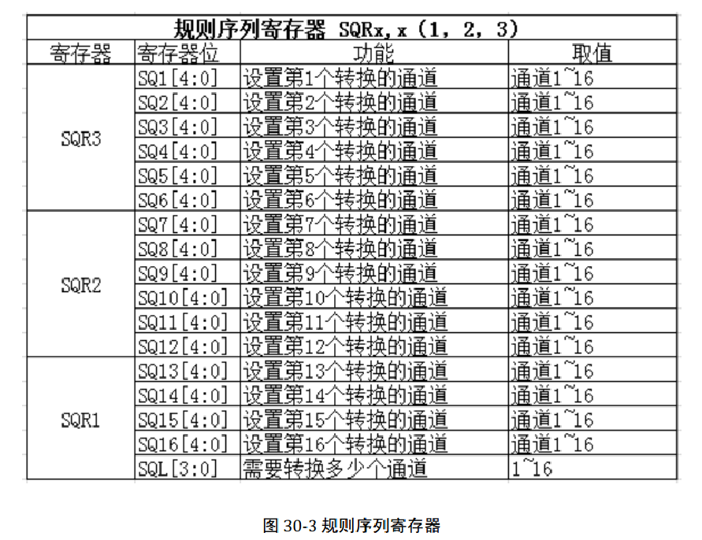
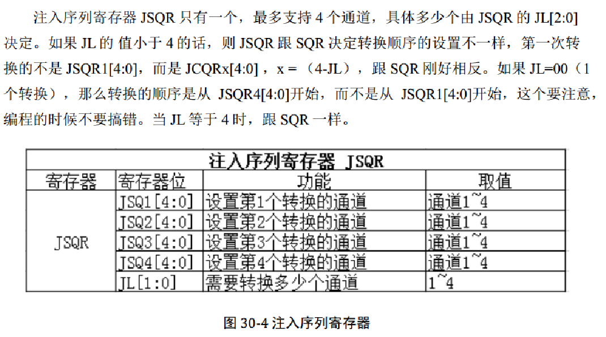

#### 通道





通道16：内部温度传感器

导通17：内部参考电压

#### 初始化





#### 结构



1. 电压输入范围

输入电压：VREF- ≤ VIN ≤ VREF+

VSSA 和 VREF-接地，把 VREF+和 VDDA 接 3V3，则 ADC 的输入电压范围为 0~3.3V。

2. 输入通道

3. 转换顺序

规则通道：最多16路；注入通道：最多4路。





！！！对于启用了规则通道，ADC_DR 寄存器只保留最后1次的转换结果。

---

规则通道类似程序顺序执行，注入通道则类似中断。

注入通道打断当前规则通道的转换，从而开始转换注入的通道，转换完成后再继续转换规则通道。

---

4. 触发源

5. 转换时间

Tconv = 采样周期 + 12.5 个周期 （注：周期 = 1/ADC_CLK）

ADC_CLK：ADC模拟电路时钟，最大值为14M，由PCLK2（72M）提供，还可2/4/6/8分频。

```
最短的转换时间：
PCLK2 = 72M，ADC_CLK = 72/6 = 12M
Tconv = 1.5 + 12.4 = 14周期 = 14/12us = 1.17us
```

6. 数据寄存器

7. 中断

规则通道转换完成会将 EOC 置位，注入通道转换完成会将 JEOC 置位。

模拟看门狗，应该就是两个比较器。（门：有高阈值，有低阈值）

#### DMA

仅 ADC1，ADC3 有 DMA 功能。

但 ADC2 可通过双ADC 模式，利用 ADC1 的 DMA 进行数据搬运。


