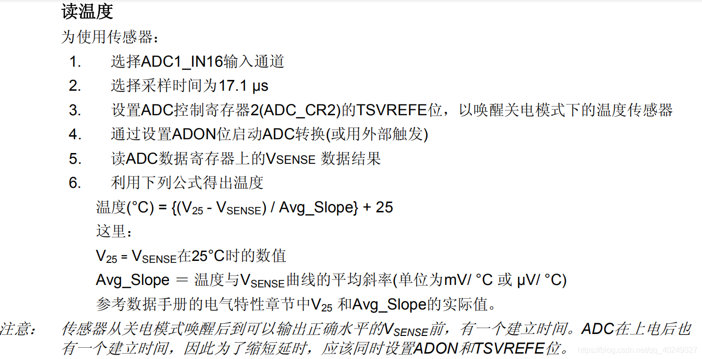
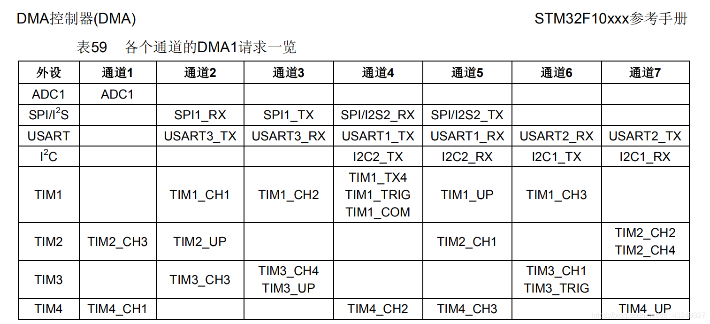

##### 内部温度传感器



注：读取出的数据明显不正确时，请确定供电是否充足。

#### 转换时间

转换时间 = 采样时间 + 12.5 个周期（固定时间）

eg：14MHz + 1.5 个采样周期 的转换时间：

```
TCONV = 1.5 + 12.5 = 14 个周期 = 14×(1 / (14 × 1000000)) = 1us
```

#### DMA

DMA -> ADC1

