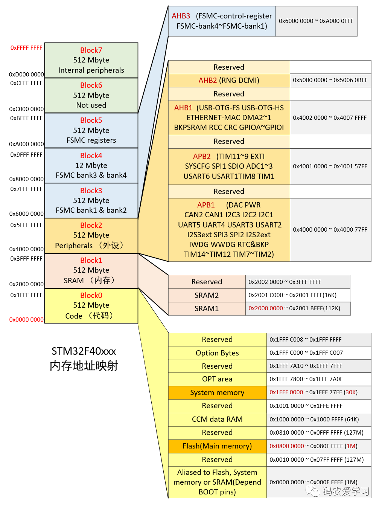
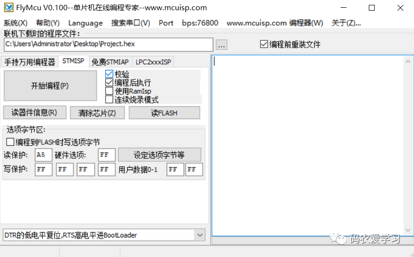
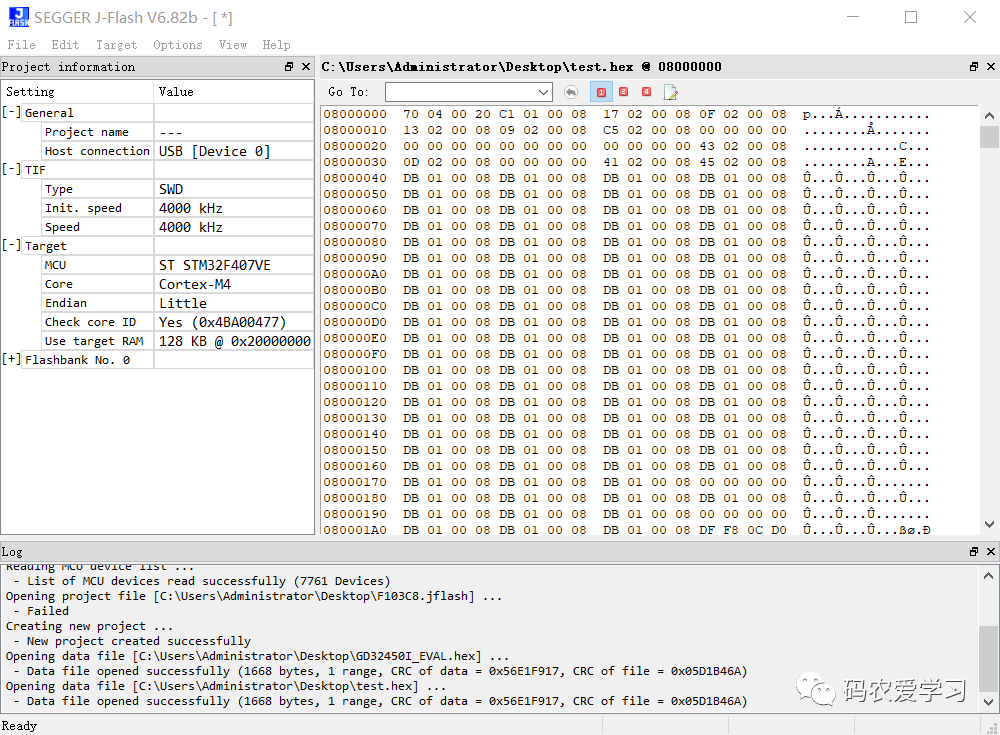
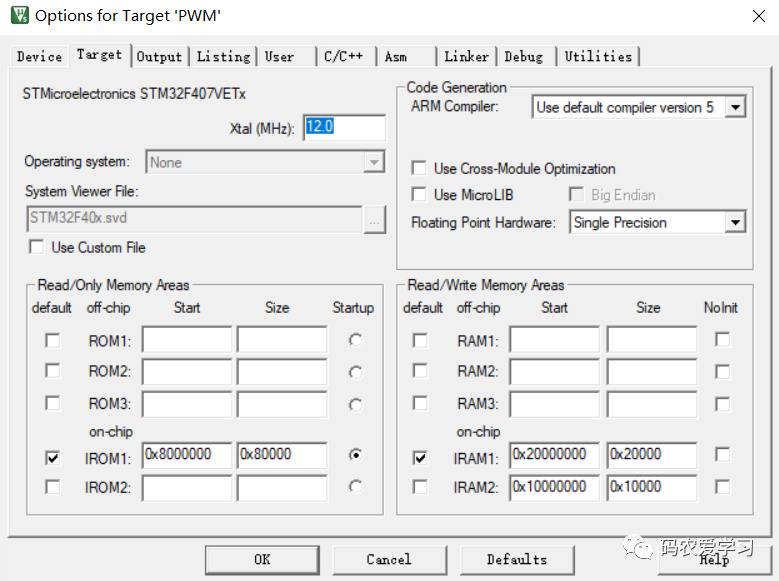
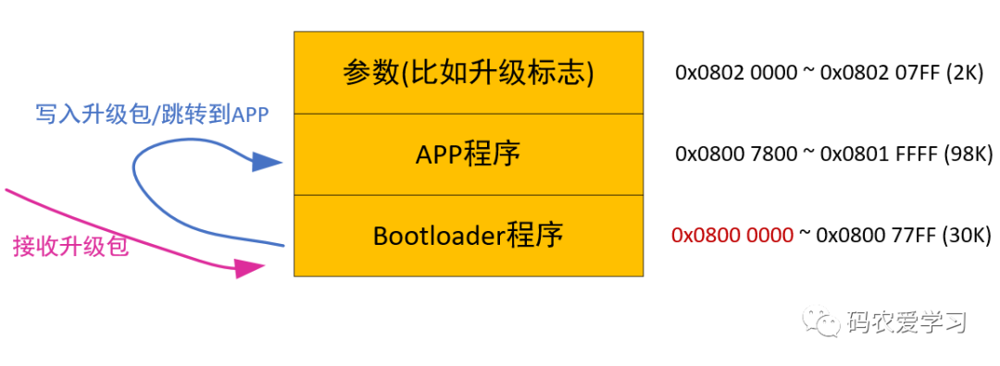
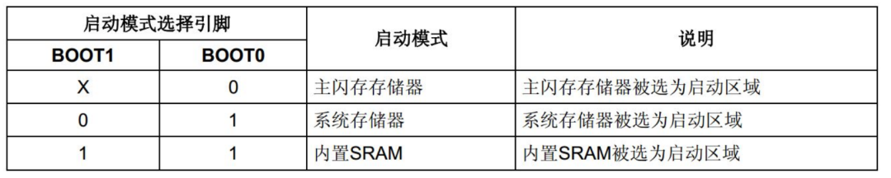

https://mp.weixin.qq.com/s?__biz=MzI1OTQ2OTcxMg==&mid=2247494881&idx=1&sn=0b23cecd2716682534fdbacb5f5f1c7d&chksm=ea7ad41edd0d5d089f0320d17581340847704cff63191c077e7cfa29a8af0fedd3666ca0a664&scene=21#wechat_redirect

批量烧录防止出错就用hex，因为会完整覆写其文件内指定写入地址范围里的数据；
调试可以用bin烧，因为其不指定写入地址，且可以指定烧录的起始地址；
比如要修改flash中后段的数据，就可以用bin从中间的地址开始烧，达到修改任意区域内数据的目的。

ISP（In-System Programming）：在系统编程，使用引导程序（Bootloader）加上外围**UART/SPI等接口**进行烧录。

ICP （In-circuit programmer）：在电路编程，使用**SWD/JTAG接口**。

IAP（In-Application Programming）：指MCU可以在系统中获取新代码并对自己重新编程，即**用程序来改变程序**。

**单片机Flash在地址映射表中位置**

下图是一张STM32F4xx的地址映射表，从0x0000 0000到0xFFFF FFFF，总计4Gbyte。单片机的片上Flash、片上RAM、片上外设以及外部扩展接口的访问地址，都被映射到这4Gbyte的范围之内。

这张图中，我们需要先注意下半部分

- Main memory 主存储区

通常，我们编写的代码，是放到主存储区的起始位置（0x0800 0000）开始运行的，烧录程序时，直接将程序烧录到这里即可（KEIL软件给STM32烧录程序的默认烧写地址就是0x0800 0000开始）

- System memory系统存储区

System memory（起始位置0x1FFF 0000）是STM32在出厂时，由ST在这个区域内部预置了一段BootLoader， 也就是我们常说的ISP程序 ，这是一块ROM，出厂后无法修改。

了解了程序的具体地址，还要看一下单片机的启动方式：

**启动方式选择**

  STM32有两个BOOT引脚，通过配置不同的高低电平，可以让单片机从不同的地址开始运行。

- BOOT0=0, BOOT1任意

通常我们是在Main memory 主存储区（0x0800 0000）运行程序，BOOT0引脚拉低即可。

这种情况，KEIL软件给STM32烧录程序，就是直接在这个地址烧录，烧录完，直接在这个地址处运行。

- BOOT0=1,BOOT1=0

这种情况就用在使用串口方式给STM32烧录程序，这时单片机从系统存储器（0x1FFF 0000）启动，运行的是出厂预置的BootLoader程序，可以接收串口发来的程序，并将其写入Main memory（0x0800 0000），程序烧录完成后，再将BOOT0引脚拉低，Main memory（0x0800 0000）处运行刚烧录的代码了。

- BOOT0=1,BOOT1=1

这种情况是从内存中启动，内置SRAM（也就是STM32的内存中），既然是SRAM，自然也就没有程序存储的能力了，这个模式一般用于程序调试。目前我还没用过这种方式，大家平时用这种方式的多么？

| BOOT0 | BOOT1 | 启动方式     | 说明                       |
| ----- | ----- | ------------ | -------------------------- |
| 0     | ×     | 主闪存存储器 | 主闪存存储器被选为启动区域 |
| 1     | 0     | 系统存储器   | 系统存储器被选为启动区域   |
| 1     | 1     | 内置SRAM     | 内置SRAM被选为启动区域     |

**ISP（串口烧录）**

特点：

- **BOOT0 = 1**，BOOT1 = 0
- 启动地址：**0x1FFF0000**
- 使用串口下载程序
- 系统存储器(System memory)启动方式运行内置的Bootloader，将程序写入主存储区
- 重启后，需要再将BOOT0拉低，从主存储区启动程序

下图是ISP方式的烧录，使用FlyMcu这个软件，通过串口给STM32烧录程序

**ICP（JTAG口烧录）**

特点：

- **BOOT0 = 0**，BOOT1 = x
- 启动地址：**0x08000000**
- 使用JTAG或者SWD模式下载程序
- 主闪存存储器(Flash memory)启动方式，将程序在主存储区写入
- 重启后也直接从这启动程序

下图是ICP方式的烧录，使用JFlash软件或KEIL，通过J-Link给STM32烧录程序

KEIL软件的默认下载地址，就是从0x0800 0000 开始的。

 

**IAP（升级/跳转程序）**

IAP的原理与上面两种有较大区别，这种方式将主存储区又分成了两个区域（根据实际需要由开发者自行分配），0800 0000起始处的这部分，存储一个开发者自己设计的Bootloader程序，另一部分存储真正需要运行的APP程序。

单片机的Bootloader程序，其主要作用就是给单片机升级。在单片机启动时，首先从Bootloader程序启动，一般情况不需要升级，就会立即从Bootloader程序跳转到存储区另一部分的APP程序开始运行。

假如Bootloader程序时，需要进行升级（比如APP程序运行时，接收到升级指令，可以在flash中的特定位置设置一个标志，然后触发重启，重启后进入Bootloader程序，Bootloader程序根据标志位就能判断是否需要升级），则会通过某种方式（比如通过WIFI接收升级包，或借助另一块单片机接收升级包，Bootloader再通过串口或SPI等方式从另一块单片机获取升级包数据）先将接收到的程序写入存储区中存储APP程序的那个位置，写入完成后再跳转到该位置，即实现了程序的升级

---

**三种BOOT模式**

  所谓启动，一般来说就是指我们下好程序后，重启芯片时，SYSCLK的第4个上升沿，BOOT引脚的值将被锁存。用户可以通过设置BOOT1和BOOT0引脚的状态，来选择在复位后的启动模式，相关文章:[详解STM32启动文件](http://mp.weixin.qq.com/s?__biz=MzI0OTExODc1Nw==&mid=2648023443&idx=1&sn=deabc998491ead923faab3eae91704dc&chksm=f1b768d9c6c0e1cf236c11b2a50adb6441d89ffa1195c05af46b730940a396fec4c971468642&scene=21#wechat_redirect)。

- **Main Flash memory**
  是STM32内置的Flash，一般我们使用JTAG或者SWD模式下载程序时，就是下载到这个里面，重启后也直接从这启动程序。
- **System memory**
  从系统存储器启动，这种模式启动的程序功能是由厂家设置的。一般来说，这种启动方式用的比较少。系统存储器是芯片内部一块特定的区域，STM32在出厂时，由ST在这个区域内部预置了一段BootLoader， 也就是我们常说的ISP程序， 这是一块ROM，
  出厂后无法修改。一般来说，我们选用这种启动模式时，是为了从串口下载程序，因为在厂家提供的BootLoader中，提供了串口下载程序的固件，可以通过这个BootLoader将程序下载到系统的Flash中。但是这个下载方式需要以下步骤：
  **Step1:**将BOOT0设置为1，BOOT1设置为0，然后按下复位键，这样才能从系统存储器启动BootLoader
  **Step2:**最后在BootLoader的帮助下，通过串口下载程序到Flash中
  **Step3:**程序下载完成后，又有需要将BOOT0设置为GND，手动复位，这样，STM32才可以从Flash中启动可以看到， 利用串口下载程序还是比较的麻烦， 需要跳帽跳来跳去的，非常的不注重用户体验。
- **Embedded Memory**
  内置SRAM，既然是SRAM，自然也就没有程序存储的能力了，这个模式一般用于程序调试。假如我只修改了代码中一个小小的地方，然后就需要重新擦除整个Flash，比较的费时，可以考虑从这个模式启动代码（也就是STM32的内存中），用于快速的程序调试，等程序调试完成后，在将程序下载到SRAM中。

**开发BOOT模式选择**

  通常使用程序代码存储在主闪存存储器，配置方式：BOOT0=0，BOOT1=X。

**Flash锁死解决办法**

  开发调试过程中，由于某种原因导致内部Flash锁死，无法连接SWD以及Jtag调试，无法读到设备，可以通过修改BOOT模式重新刷写代码。相关文章:[STM32的Flash写了保护怎么办？](http://mp.weixin.qq.com/s?__biz=MzI1MDg4OTMwMw==&mid=2247495721&idx=6&sn=8d315395488552333f833d7a3ac1fae8&chksm=e9f9e511de8e6c07b676100248e23718354e1fbf8c4121b0b7207c591feb3bafeb9ca6b1945c&scene=21#wechat_redirect)

  修改为BOOT0=1，BOOT1=0即可从系统存储器启动，ST出厂时自带Bootloader程序，SWD以及JTAG调试接口都是专用的。重新烧写程序后，可将BOOT模式重新更换到BOOT0=0，BOOT1=X即可正常使用。

