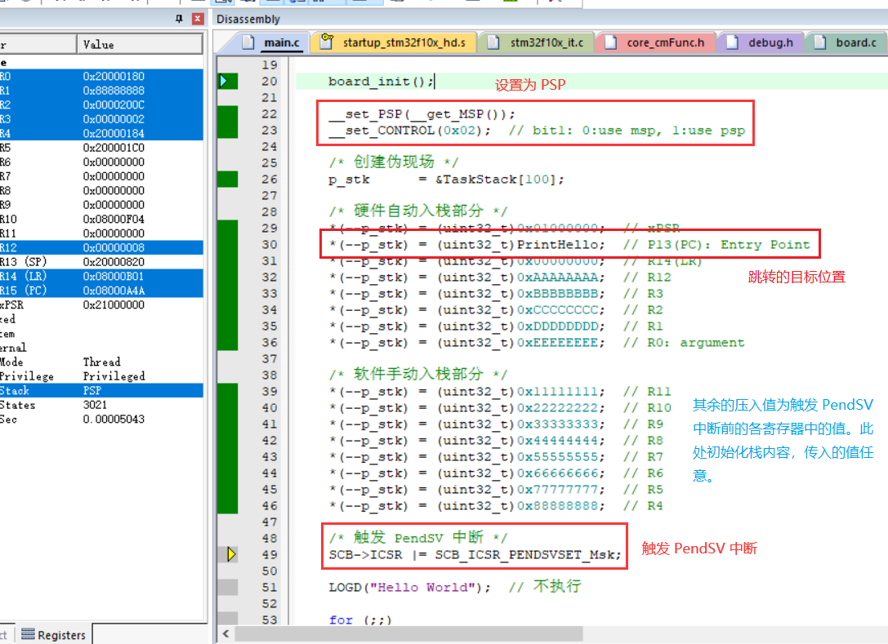
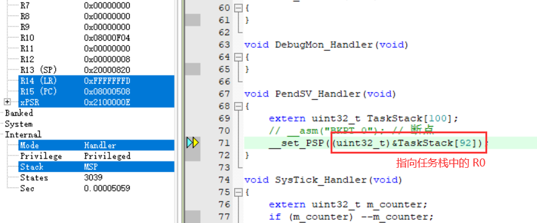
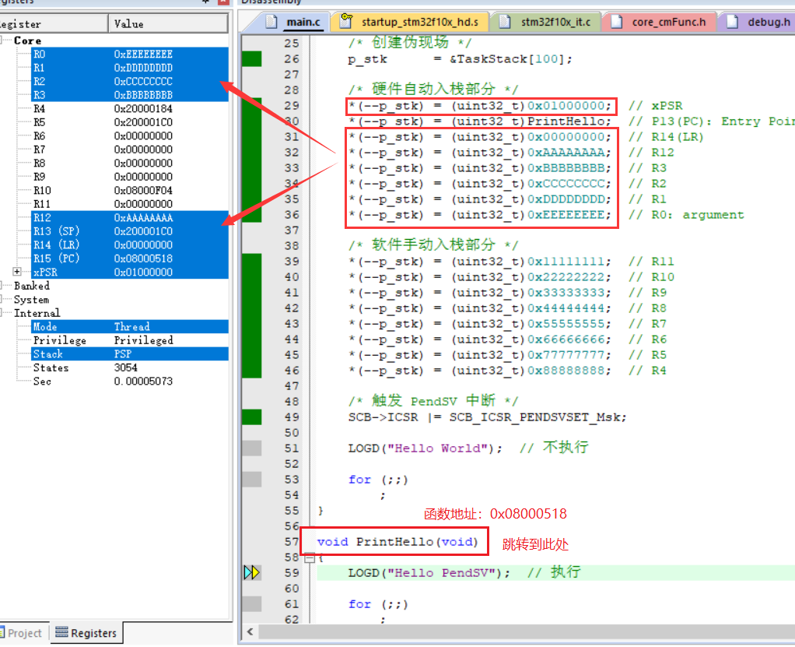

`任务切换` 的本质：

保存当前任务的现场（将当前寄存器的值压入当前任务栈），

恢复目标任务的现场（将目标任务栈的值恢复到当前寄存器）。

---

执行流程：

设置当前栈为 PSP，并将目标函数地址压入目标任务栈。

将寄存器SCB.ICSR的第29个比特位置1，R13寄存器(PC)自动指向 PendSV 中断处理子程序。

在 PendSV 中将 PSP 指向目标任务栈。

在退出中断时将任务栈内容自动出栈传入寄存器，此时 PC 指向先前压入的目标函数地址。

（通常从中断退出应从被中断位置继续往下执行的）

