启动过程：

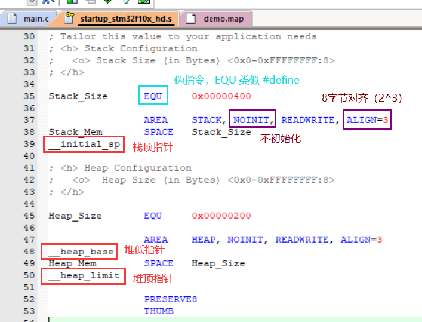

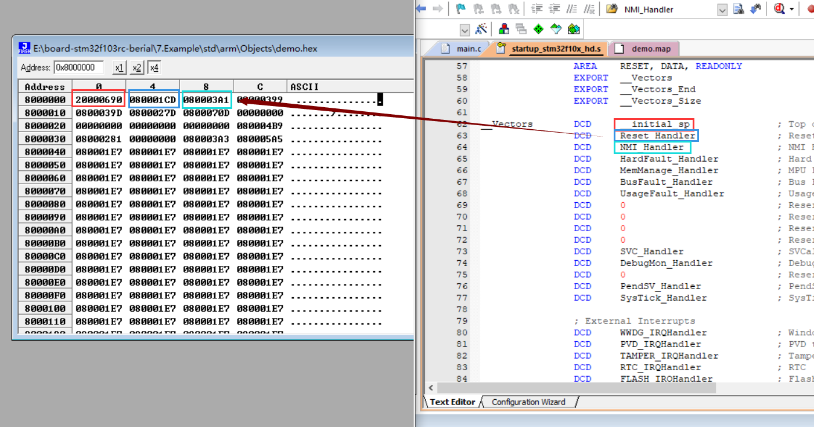

| __inital_sp                                   | Reset_Handler                                 | NMI_Handler                                       |
| --------------------------------------------- | --------------------------------------------- | ------------------------------------------------- |
| 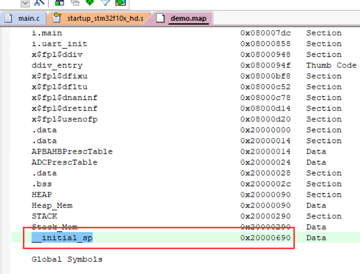 | 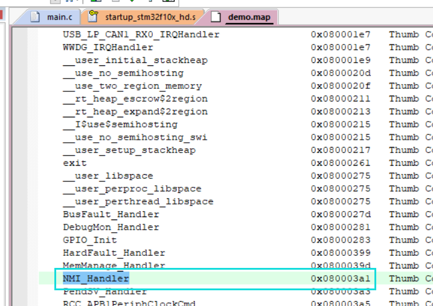 | 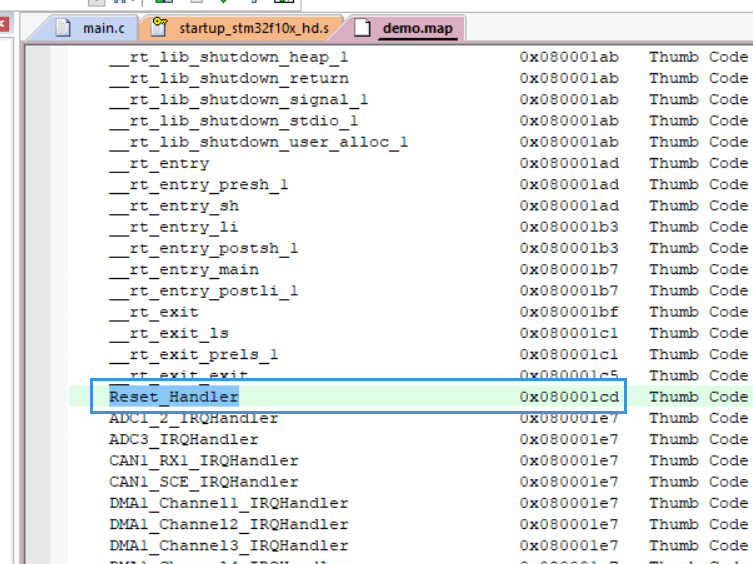 |

R14（LR，Link Register）：

SP：

heap：动态内存的申请和释（ malloc、realloc、free...）

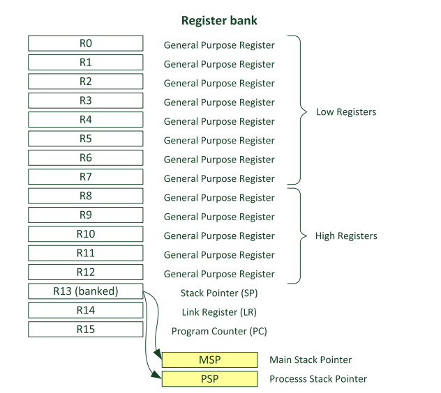

##### 双堆栈

主栈指针（MSP，Main Stack Pointer），进程栈指针（ PSP，Process Stack Pointer）。

`R13`（SP，Stack Pointer）：中断里只能指向 MSP，中断外可指向 MSP 或 PSP。

`R15`（PC，Program Counter）：程序计数器，直向下一条指令的位置。

注：在 RTOS 中，中断以外全使用 PSP，中断以内只使用 MSP。

CM3 和 CM4 是向下生长的满栈，即从高地址向低地址生长。

① 

进入 `main()` 之前，R13 寄存器的内容为栈顶指针 `__inital_sp` 。

进入 `main()` 之后，给局部变量分配了64个字节的空间，R13 寄存器的值减少了 0x40。

| 进入 `main()` 之前                            | 进入 `main()` 之后                          |
| --------------------------------------------- | ------------------------------------------- |
| 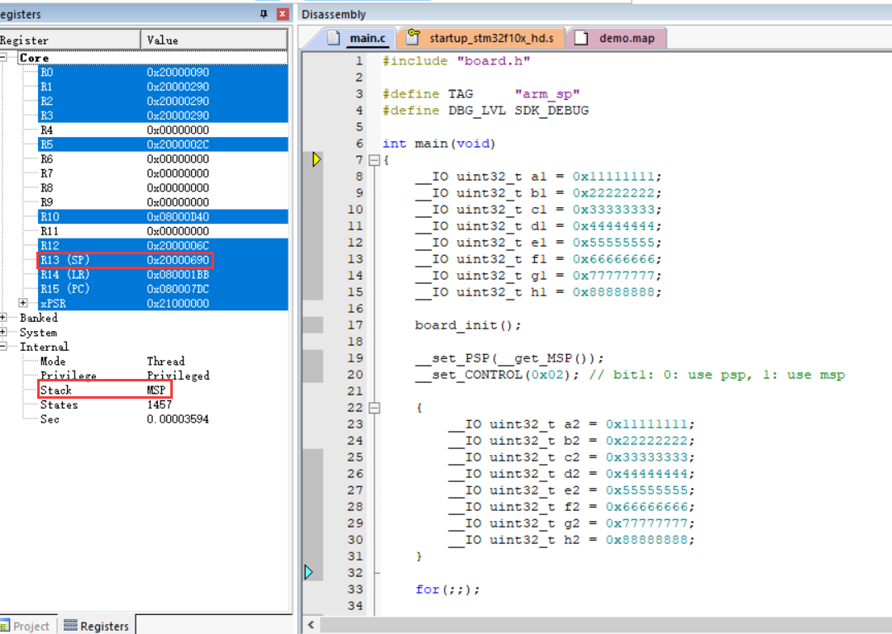 | 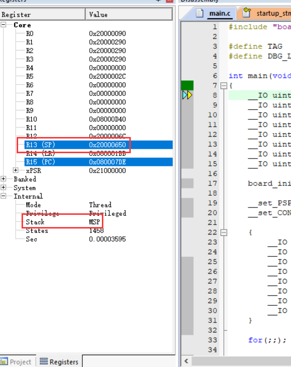 |

② 

单步往下，给变量赋值。

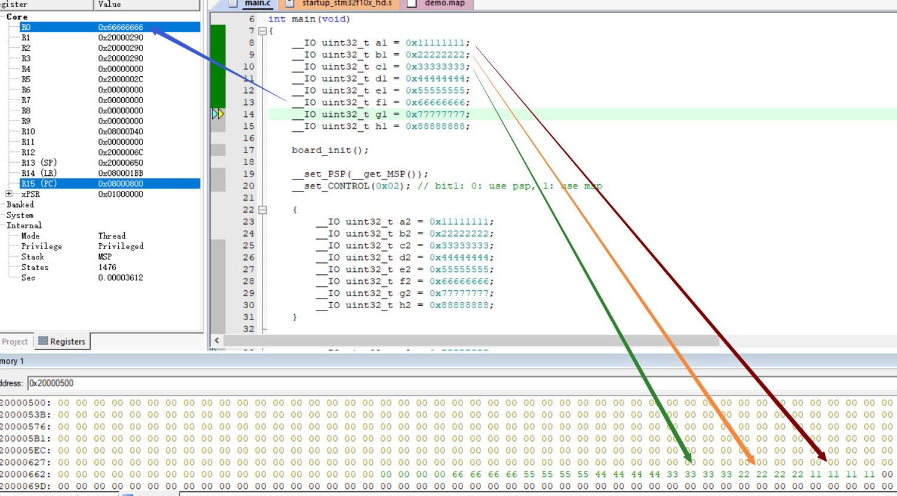

③

设置 PSP 指向的位置，并切换为使用 PSP 模式。

| 设置 PSP 指针之前                                   | 设置 PSP 指针之后                                 | 切换到 PSP                            |
| --------------------------------------------------- | ------------------------------------------------- | ------------------------------------- |
| 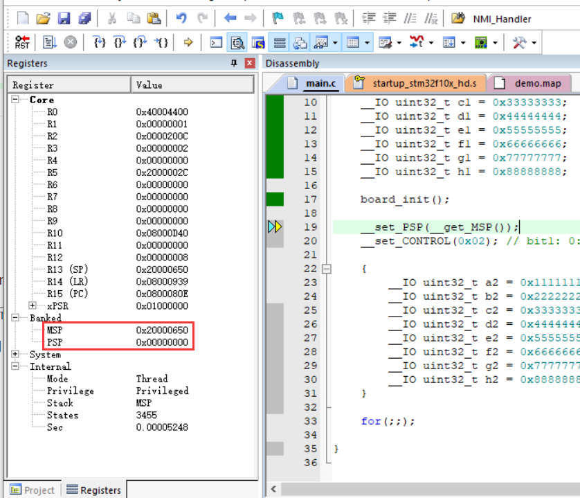 | 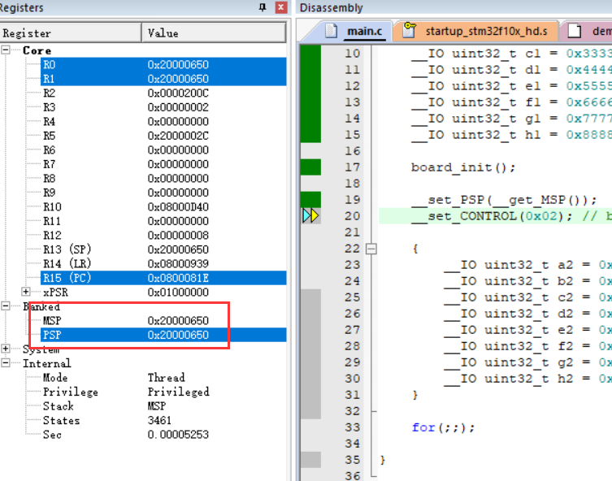 | 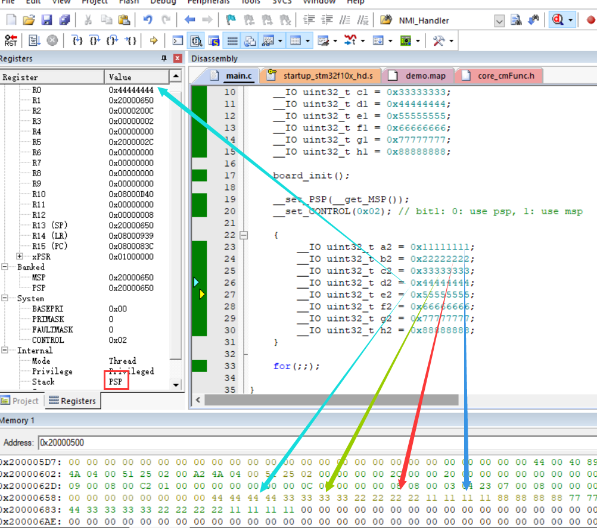 |

④

触发中断前为 PSP，触发中断时自动切换到 MSP，处理完中断后自动切换回 PSP。

| 调用 `delay` 前                                 | 调用 `delay` 中                         | 调用 `delay` 后                               |
| ----------------------------------------------- | --------------------------------------- | --------------------------------------------- |
| 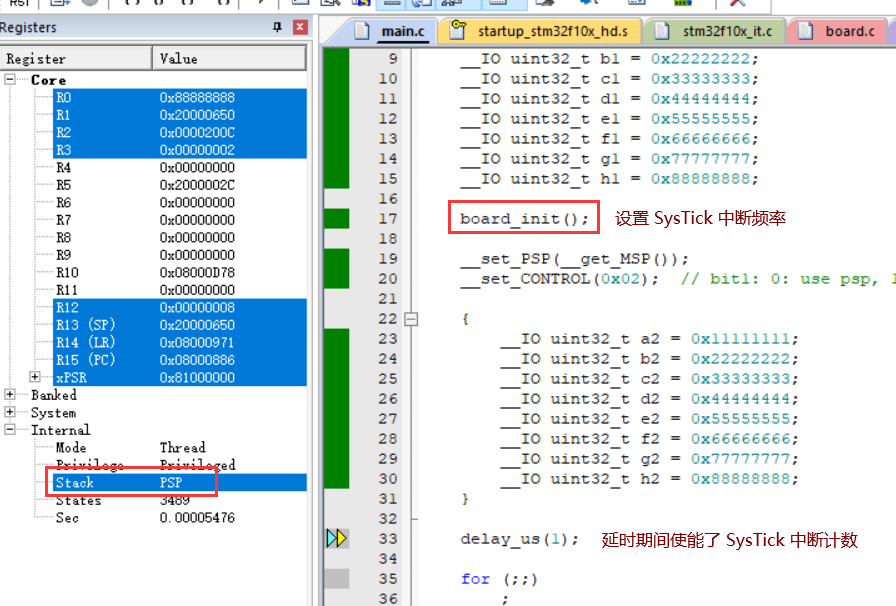 | 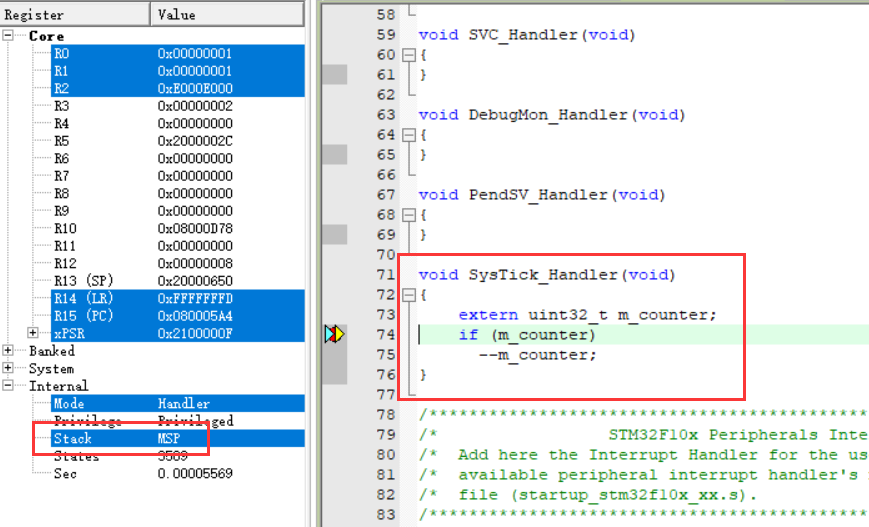 | 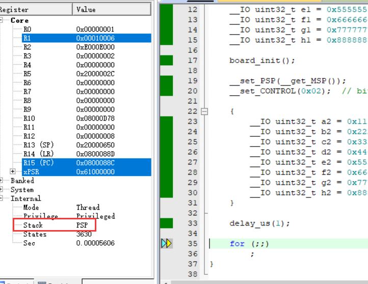 |

