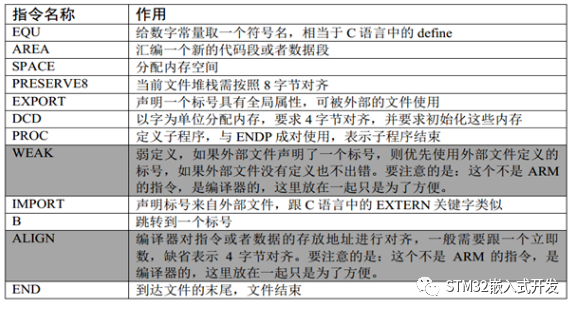
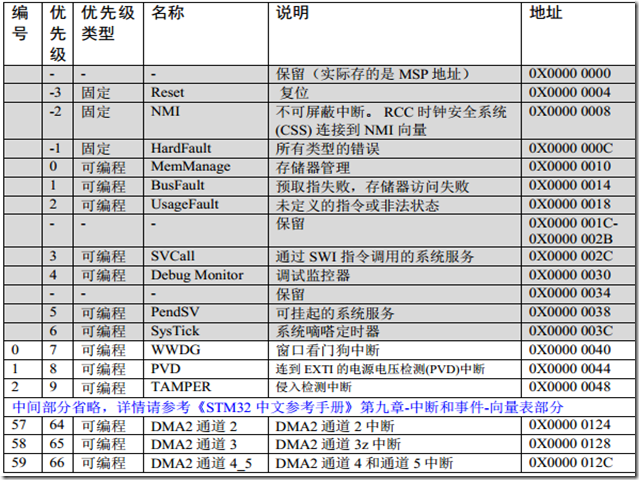
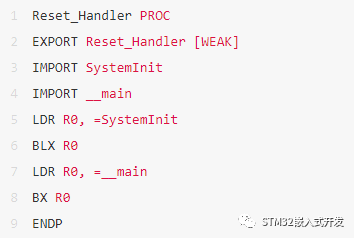
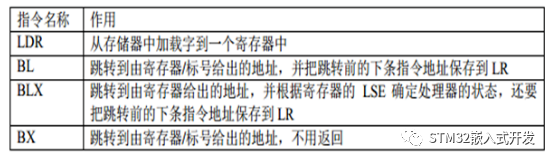
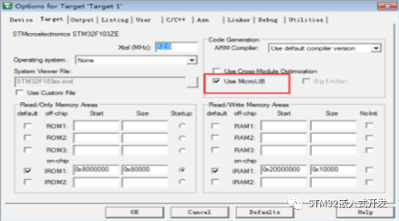

https://mp.weixin.qq.com/s/pYxmM_GxdrZDJjyDK35qlw


 本文对STM32启动文件startup_stm32f10x_hd.s的代码进行讲解，此文件的代码在任何一个STM32F10x工程中都可以找到。

**启动文件使用的ARM汇编指令汇总**



**Stack——栈**

```
Stack_Size EQU 0x00000400
AREA STACK, NOINIT, READWRITE, ALIGN=Stack_Mem SPACE Stack_Size__initial_sp
```

  开辟栈的大小为 0X00000400（1KB），名字为 STACK， NOINIT 即不初始化，可读可写， 8（2^3）字节对齐。

  栈的作用是用于局部变量，函数调用，函数形参等的开销，栈的大小不能超过内部SRAM 的大小。如果编写的程序比较大，定义的局部变量很多，那么就需要修改栈的大小。如果某一天，你写的程序出现了莫名奇怪的错误，并进入了硬 fault 的时候，这时你就要考虑下是不是栈不够大，溢出了。

  EQU：宏定义的伪指令，相当于等于，类似于C 中的 define。

  AREA：告诉汇编器汇编一个新的代码段或者数据段。STACK 表示段名，这个可以任意命名；NOINIT 表示不初始化；READWRITE 表示可读可写， ALIGN=3，表示按照 2^3对齐，即 8 字节对齐。

  SPACE：用于分配一定大小的内存空间，单位为字节。这里指定大小等于 Stack_Size。

  标号__initial_sp 紧挨着 SPACE 语句放置，表示栈的结束地址，即栈顶地址，栈是由高向低生长的。

**Heap——堆**



  开辟堆的大小为 0X00000200（512 字节），名字为 HEAP， NOINIT 即不初始化，可读可写， 8（2^3）字节对齐。__heap_base 表示对的起始地址， __heap_limit 表示堆的结束地址。堆是由低向高生长的，跟栈的生长方向相反。

  堆主要用来动态内存的分配，像 malloc()函数申请的内存就在堆上面。这个在 STM32里面用的比较少。

```
PRESERVE8 THUMB
```

  PRESERVE8：指定当前文件的堆栈按照 8 字节对齐。

  THUMB：表示后面指令兼容 THUMB 指令。THUBM 是 ARM 以前的指令集， 16bit，现在 Cortex-M 系列的都使用 THUMB-2 指令集， THUMB-2 是 32 位的，兼容 16 位和 32 位的指令，是 THUMB 的超集。关于堆栈的文章：[关于C语言堆栈的经典讲解](http://mp.weixin.qq.com/s?__biz=MzI0OTExODc1Nw==&mid=2648023286&idx=5&sn=1f72ebbb679f4144c6313901d1754790&chksm=f1b769bcc6c0e0aaedbe19591af55d4c720f849d2384c9d6050cd65989239c08a52a85441095&scene=21#wechat_redirect)。

**向量表**

```
AREA RESET, DATA, READONLYEXPORT __VectorsEXPORT __Vectors_EndEXPORT __Vectors_Size
```

  定义一个数据段，名字为 RESET，可读。并声明 __Vectors、 __Vectors_End 和__Vectors_Size 这三个标号具有全局属性，可供外部的文件调用。

  EXPORT：声明一个标号可被外部的文件使用，使标号具有全局属性。如果是 IAR 编译器，则使用的是 GLOBAL 这个指令。

  当内核响应了一个发生的异常后，对应的异常服务例程(ESR)就会执行。为了决定 ESR的入口地址， 内核使用了―向量表查表机制‖。这里使用一张向量表。向量表其实是一个WORD（32 位整数）数组，每个下标对应一种异常，该下标元素的值则是该 ESR 的入口地址。向量表在地址空间中的位置是可以设置的，通过 NVIC 中的一个重定位寄存器来指出向量表的地址。在复位后，该寄存器的值为 0。因此，在地址 0 （即 FLASH 地址 0） 处必须包含一张向量表，用于初始时的异常分配。要注意的是这里有个另类：0 号类型并不是什么入口地址，而是给出了复位后 MSP 的初值。下图是F103的向量表。


```
__Vectors DCD __initial_sp ;栈顶地址DCD Reset_Handler ;复位程序地址DCD NMI_HandlerDCD HardFault_HandlerDCD MemManage_HandlerDCD BusFault_HandlerDCD UsageFault_HandlerDCD 0 ; 0 表示保留DCD 0DCD 0DCD 0DCD SVC_HandlerDCD DebugMon_HandlerDCD 0DCD PendSV_HandlerDCD SysTick_Handler;外部中断开始DCD WWDG_IRQHandlerDCD PVD_IRQHandlerDCD TAMPER_IRQHandler;限于篇幅，中间代码省略DCD DMA2_Channel2_IRQHandlerDCD DMA2_Channel3_IRQHandlerDCD DMA2_Channel4_5_IRQHandler__Vectors_End__Vectors_Size EQU __Vectors_End - __Vectors
```

  __Vectors 为向量表起始地址， __Vectors_End 为向量表结束地址，两个相减即可算出向量表大小。

  向量表从 FLASH 的 0 地址开始放置，以 4 个字节为一个单位，地址 0 存放的是栈顶地址， 0X04 存放的是复位程序的地址，以此类推。从代码上看，向量表中存放的都是中断服务函数的函数名，可我们知道 C 语言中的函数名就是一个地址。

  DCD：分配一个或者多个以字为单位的内存，以四字节对齐，并要求初始化这些内存。在向量表中， DCD 分配了一堆内存，并且以 ESR 的入口地址初始化它们。

**复位程序**

```
AREA |.text|, CODE, READONLY
```

  定义一个名称为.text 的代码段，可读。



  复位子程序是系统上电后第一个执行的程序，调用 SystemInit 函数初始化系统时钟，然后调用 C 库函数_mian，最终调用 main 函数去到 C 的世界。

  WEAK：表示弱定义，如果外部文件优先定义了该标号则首先引用该标号，如果外部文件没有声明也不会出错。这里表示复位子程序可以由用户在其他文件重新实现，这里并不是唯一的。

  IMPORT：表示该标号来自外部文件，跟 C 语言中的 EXTERN 关键字类似。这里表示 SystemInit 和__main 这两个函数均来自外部的文件。

  SystemInit()是一个标准的库函数，在 system_stm32f10x.c 这个库文件中定义。主要作用是配置系统时钟，这里调用这个函数之后，单片机的系统时钟配被配置为 72M。__main 是一个标准的 C 库函数，主要作用是初始化用户堆栈，并在函数的最后调用main 函数去到 C 的世界。这就是为什么我们写的程序都有一个 main 函数的原因。

   LDR、 BLX、 BX 是 CM4 内核的指令，可在《CM3 权威指南 CnR2》第四章-指令集里面查询到，具体作用见下表：



 **中断服务程序**

  在启动文件里面已经帮我们写好所有中断的中断服务函数，跟我们平时写的中断服务函数不一样的就是这些函数都是空的，真正的中断服务程序需要我们在外部的 C 文件里面重新实现，这里只是提前占了一个位置而已。

  如果我们在使用某个外设的时候，开启了某个中断，但是又忘记编写配套的中断服务程序或者函数名写错，那当中断来临的时，程序就会跳转到启动文件预先写好的空的中断服务程序中，并且在这个空函数中无线循环，即程序就死在这里。

```
__Vectors DCD __initial_sp ;栈顶地址
DCD Reset_Handler ;复位程序地址
DCD NMI_Handler
DCD HardFault_Handler
DCD MemManage_Handler
DCD BusFault_Handler
DCD UsageFault_Handler
DCD 0 ; 0 表示保留
DCD 0
DCD 0
DCD 0
DCD SVC_Handler
DCD DebugMon_Handler
DCD 0
DCD PendSV_Handler
DCD SysTick_Handler
;外部中断开始
DCD WWDG_IRQHandler
DCD PVD_IRQHandler
DCD TAMPER_IRQHandler
;限于篇幅，中间代码省略
DCD DMA2_Channel2_IRQHandler
DCD DMA2_Channel3_IRQHandler
DCD DMA2_Channel4_5_IRQHandler
__Vectors_End
__Vectors_Size EQU __Vectors_End - __Vectors
```

  B：跳转到一个标号。这里跳转到一个‘.’，即表示无线循环

**用户堆栈初始化**

```
ALIGN
```

  ALIGN：对指令或者数据存放的地址进行对齐，后面会跟一个立即数。缺省表示 4 字节对齐。

```
;用户栈和堆初始化,由 C 库函数_main 来完成IF :DEF:__MICROLIB ;这个宏在 KEIL 里面开启EXPORT __initial_spEXPORT __heap_baseEXPORT __heap_limitELSEIMPORT __use_two_region_memory ; 这个函数由用户自己实现EXPORT __user_initial_stackheap__user_initial_stackheapLDR R0, = Heap_MemLDR R1, =(Stack_Mem + Stack_Size)LDR R2, = (Heap_Mem + Heap_Size)LDR R3, = Stack_MemBX LRALIGNENDIFEND
```

  首先判断是否定义了__MICROLIB ，如果定义了这个宏则赋予标号__initial_sp（栈顶地址）、 __heap_base（堆起始地址）、 __heap_limit（堆结束地址）全局属性，可供外部文件调用。有关这个宏我们在 KEIL 里面配置，具体见下图。然后堆栈的初始化就由 C 库函数_main 来完成。



  如果没有定义__MICROLIB，则才用双段存储器模式，且声明标号__user_initial_stackheap 具有全局属性，让用户自己来初始化堆栈。

  前文的汇编代码，需要注意：

- IF,ELSE,ENDIF：汇编的条件分支语句，跟 C 语言的 if ,else 类似
- END：文件结束