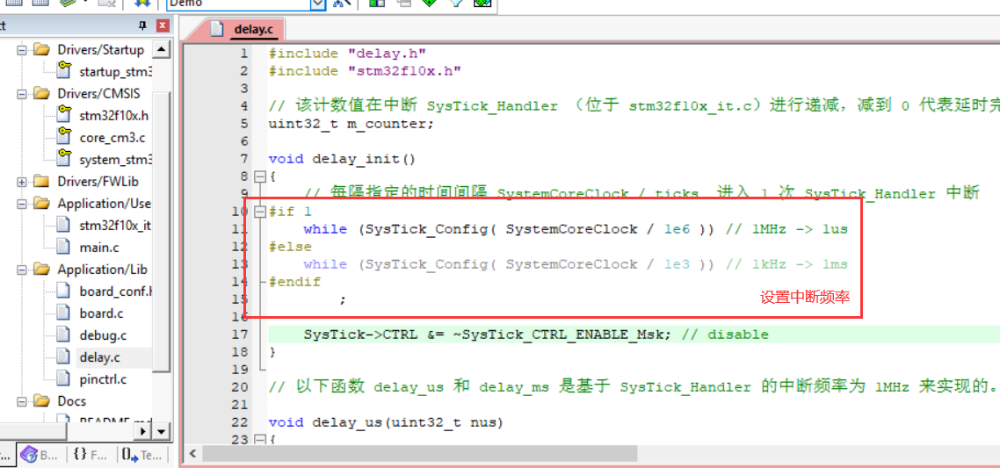
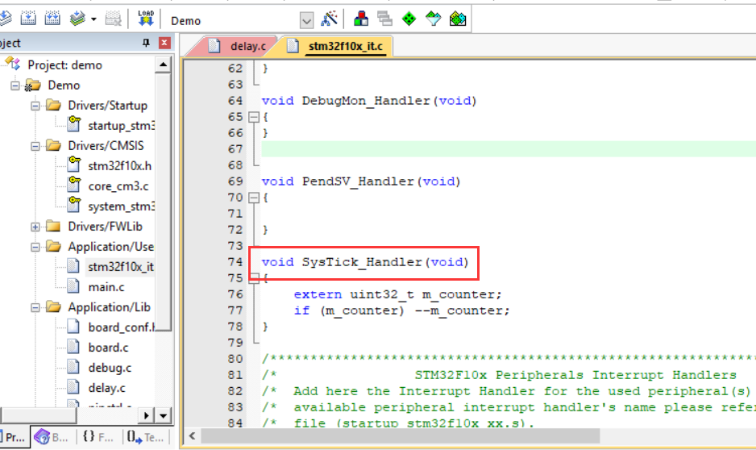
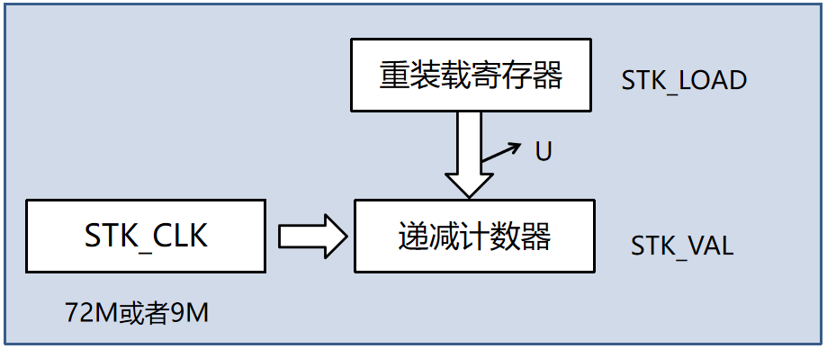
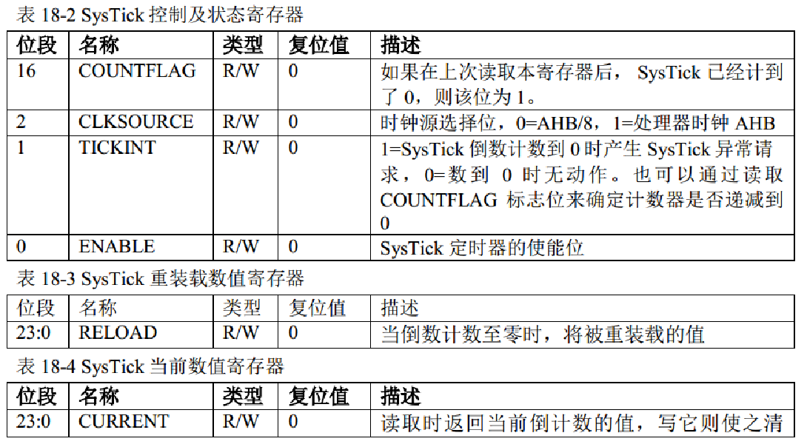
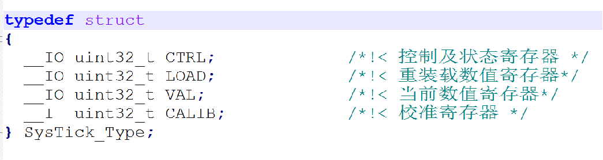
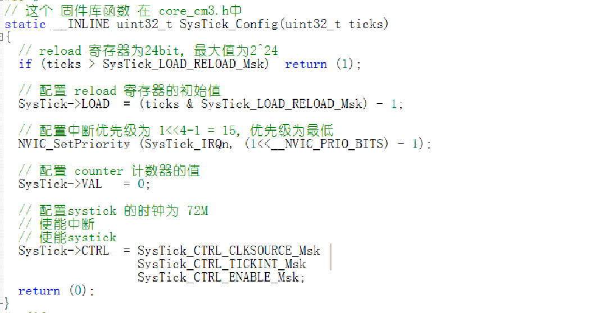
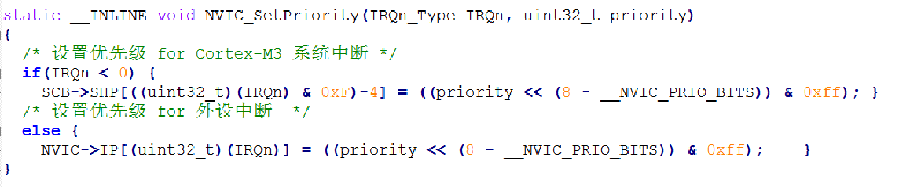

中断频率设置：



```c
SysTick->CTRL |= SysTick_CTRL_ENABLE_Msk; // 启用
SysTick->CTRL &= ~SysTick_CTRL_ENABLE_Msk; // 禁用
```

中断处理函数：



---

#### SysTick

系统定时器，内核外设，24位，只能递减，存在于内核，嵌套在NVIC中，所有 Cortex-M 内核的单片机都具有该定时器。

* 功能框图：



counter 在时钟的驱动下，从 reload 初值开始往下递减计数到 0，产生中断和置位 COUNTFLAG 标志。然后又从reload 值开始重新递减计数，如此循环。

* 定时时间

单个计数周期的时间 `t`，跟 CLK（72M/9M，由 CTRL 寄存器进行配置）和 RELOAD（24位，用户自行配置） 有关。（注：1s = 1e3 ms = 1e6 us = 1e9 ns）

```
t = reload * ( 1/clk )
Clk = 72M, t = (72) *(1/ 72 M) = 1us
Clk = 72M, t = (72000) *(1/ 72 M) = 1ms
```

* 默认配置









* 中断优先级

内核外设（SysTick）和片上外设（EXTI...）哪个中断优先级高？

答：自行配置，EXTI 可比 SysTick 高，也可比其低。

---

STM32 里无论是内核还是外设都是使用4个二进制位来表示中断优先级。

systick 中断优先级配置的是 scb->shprx 寄存器。

外设的中断优先级配置的是 nvic->iprx 寄存器。

都有优先级分组，有抢占优先级和子优先级。


、、