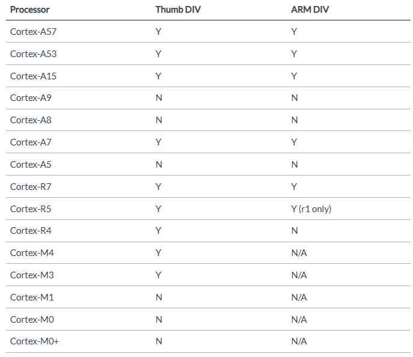
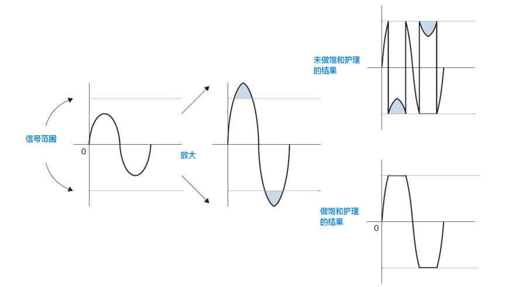

http://www.dspguide.com/

#### 支持硬件除法的 ARM 内核

[Divide and Conquer: Arm cores and division - Architectures and Processors blog - Arm Community blogs - Arm Community](https://community.arm.com/arm-community-blogs/b/architectures-and-processors-blog/posts/divide-and-conquer)，没有列出M7, M23, M33，M55, M85，新出的这些都是支持硬件除法的

#### 饱和运算指令

* 绝对值：QSUB，QSUB16、QSUB8

* 求和：QADD，QADD16、QADD8

* 点乘：SMLALD、SMLAD

* 乘法：PKHBT、SSAT

Src from `CM3权威指南`：

#### 傅里叶变换再合成时的吉布斯现象

https://www.armbbs.cn/forum.php?mod=viewthread&tid=95136&extra=page%3D6