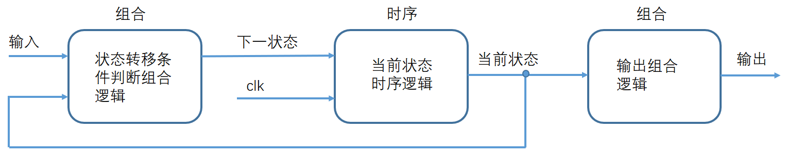
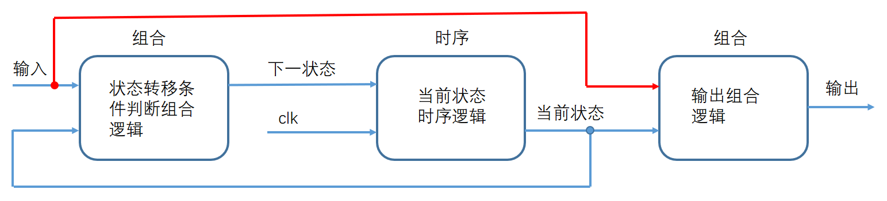

FSM（Finite State Machine，状态机）


FSM将时序部分（状态转移部分）和组合部分（判断状态转移条件和产生输出）分开，写为两个always语句，即为两段式有限状态机。

将组合部分中的判断状态转移条件和产生输入再分开写，则为三段式有限状态机。

二段式在组合逻辑特别复杂时适用，但要注意需在后面加一个触发器以消除组合逻辑对输出产生的毛刺。三段式没有这个问题，由于第三个always会生成触发器。


## 分类

①

摩尔（Moore）状态机：输出结果的判断条件只有当前状态。



迷你（Mealy）状态机：输出结果的判断条件为当前状态和输入信号。



```verilog
assign dout = state == s_0001; // Moore
assign dout = state == s_0001 && Din == 1'b1; // Mealy
```

②


#### 状态机

* 一段式：

```verilog
module top(
        input clk_i,
        input nrst_i,
        input din,
        output reg dout
    );
    
    parameter IDLE = 1'b0;
    parameter BUSY = 1'b1;
    reg state;
    
    always@( posedge clk_i or posedge nrst_i ) begin
        if ( nrst_i ) begin
            state <= IDLE;
            dout <= 1'b1;
        end
        else begin
            case ( state )
                IDLE: begin
                    state <= din ? IDLE : BUSY;
                    dout <= din;
                end
                BUSY: begin
                    state <= din ? BUSY : IDLE;
                    dout <= !din;
                end
                default: begin // 免除综合工具综合出锁存器
                    state <= IDLE;
                    dout <= 1'b1;
                end
            endcase
        end
    end
    
endmodule
```

* 二段式：同步时序描述状态转移 + 组合逻辑判断状态转移条件。

写法1：

```verilog
module top(
        input clk_i,
        input nrst_i,
        input din,
        output reg dout
    );
    
    parameter IDLE = 1'b0;
    parameter BUSY = 1'b1;
    reg cstate, nstate;
    /* cstate: current state, nstate: next state */
    
    always@( posedge clk_i or negedge nrst_i ) begin
        cstate <= nrst_i ? nstate : IDLE;
    end
    
    always@( * ) begin
        case ( cstate )
            IDLE: begin
                nstate = din ? IDLE : BUSY;
                dout = 1'b1;
            end
            BUSY: begin
                nstate = din ? BUSY : IDLE;
                dout = 1'b0;
            end
            default: begin
                nstate = IDLE;
                dout = 1'b1;
            end
        endcase
    end
    
endmodule
```

写法2：

```verilog
module top(
        input clk_i,
        input nrst_i,
        input din,
        output reg dout
    );
    
    parameter IDLE = 1'b0;
    parameter BUSY = 1'b1;
    reg cstate, nstate;
    
    always@( posedge clk_i or negedge nrst_i ) begin
        cstate <= nrst_i ? nstate : IDLE;
    end
    
    always@( * ) begin
        case ( cstate )
            IDLE: begin
                nstate = din ? IDLE : BUSY;
            end
            BUSY: begin
                nstate = din ? BUSY : IDLE;
            end
            default: begin
                nstate = IDLE;
            end
        endcase
    end
    
    always@( * ) begin
        case ( cstate )
            IDLE: begin
                dout = 1'b1;
            end
            BUSY: begin
                dout = 1'b0;
            end
            default: begin
                dout = 1'b1;
            end
        endcase
    end
    
endmodule
```

* 三段式：同步时序描述状态转移 + 组合逻辑判断状态转移条件 + 同步时序电路描述逻辑输出

```verilog
module top(
        input clk_i,
        input nrst_i,
        input din,
        output reg dout
    );
    
    parameter IDLE = 1'b0;
    parameter BUSY = 1'b1;
    reg cstate, nstate;
    
    always@( posedge clk_i or negedge nrst_i ) begin
        cstate <= nrst_i ? nstate : IDLE;
    end
    
    always@( * ) begin
        case ( cstate )
            IDLE: begin
                nstate = din ? IDLE : BUSY; // 阻塞逻辑
            end
            BUSY: begin
                nstate = din ? BUSY : IDLE;
            end
            default: begin
                nstate = IDLE;
            end
        endcase
    end
    
    always@( posedge clk_i or posedge nrst_i ) begin
        if ( nrst_i ) begin
            dout <= 1'b1;
        end
        else begin
            case ( cstate )
                IDLE: begin
                    dout <= 1'b1; // 非阻塞逻辑
                end
                BUSY: begin
                    dout <= 1'b0;
                end
                default: begin
                    dout <= 1'b1;
                end
            endcase
        end
    end
    
endmodule
```


