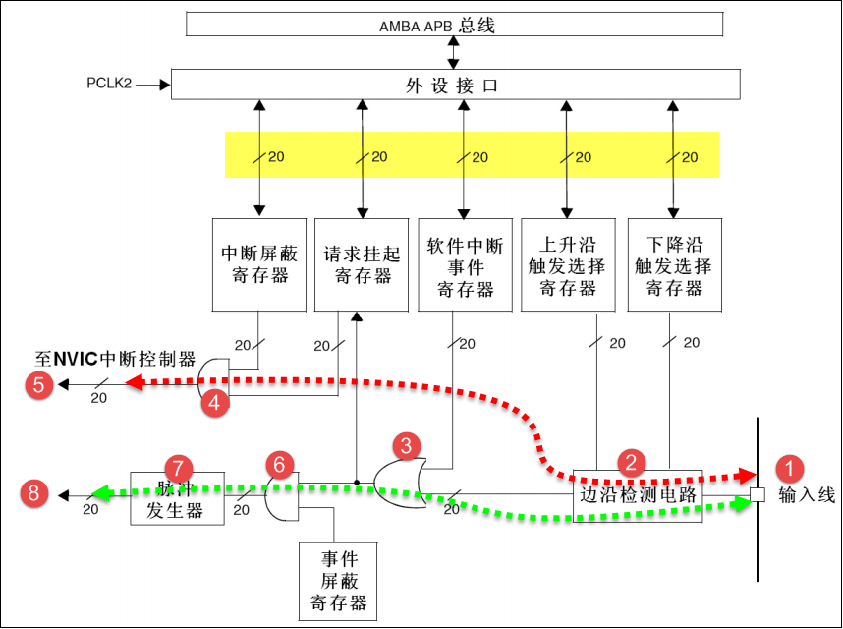
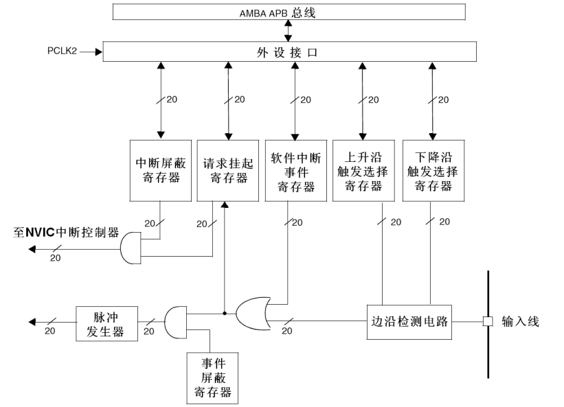
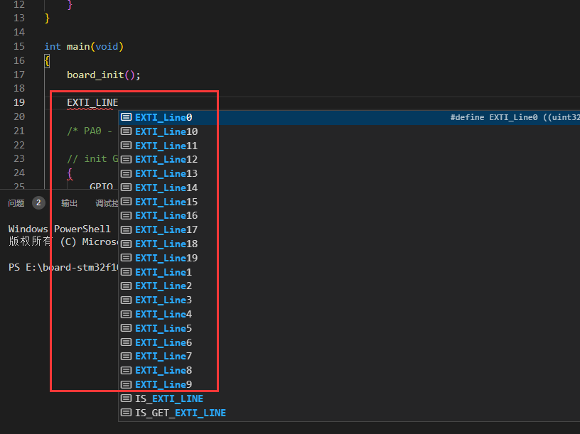
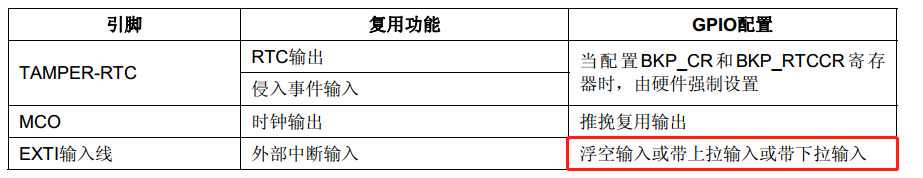

EXTI：External interrupt / event controller，外部 中断/事件 控制器

#### 寄存器

- 中断屏蔽寄存器（EXTI_IMR）：相应位置1则允许中断请求
- 事件屏蔽寄存器（EXTI_EMR）
- 上升沿触发选择寄存器（EXTI_RTSR）：相应位置1，使能上升沿中断
- 下降沿触发选择寄存器（EXTI_FTSR）：相应位置1，使能下降沿中断
- 软件中断事件寄存器（EXTI_SWIER）：相应位置1，则触发软中断
- 挂起寄存器（EXTI_PR）：触发中断时，相应位被置1

#### 事件源

GPIOx 外部中断：Line0~Line15

PVD 输出：Line16

RTC 闹钟事件：LIne17

USB 唤醒事件：Line18

以太网唤醒事件：Line19

#### IO 模式配置

#### 中断服务函数

|GPIO|	IRQn|	IRQHandler|
|-|-|-|
|GPIO_Pin0|	EXTI0_IRQn	|EXTI0_IRQHandler|
|GPIO_Pin1	|EXTI1_IRQn	|EXTI1_IRQHandler|
|GPIO_Pin2|	EXTI2_IRQn	|EXTI2_IRQHandler|
|GPIO_Pin3	|EXTI3_IRQn|	EXTI3_IRQHandler|
|GPIO_Pin4	|EXTI4_IRQn	|EXTI4_IRQHandler|
|GPIO_Pin5~GPIO_Pin9	|EXTI9_5_IRQn	|EXTI9_5_IRQHandler|
|GPIO_Pin10~GPIO_Pin15|	EXTI15_10_IRQn	|EXTI15_10_IRQHandler|

#### 中断模式

- EXTI_Trigger_Rising：上升沿触发
- EXTI_Trigger_Falling：下降沿触发
- EXTI_Trigger_Rising_Falling：上升沿触发和下降沿触发