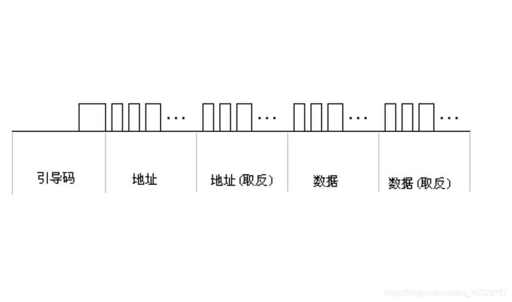
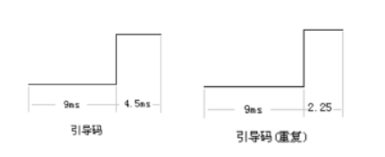

https://blog.csdn.net/qq_45529757/article/details/102737948

红外线接收头/红外线接收模组（InfraRed Receiver Module，IRM）

编码：NEC 、 RC5

引导码：9ms 低电平 + 4.5ms 高电平

数据帧

* 0 ：560us 低电平 + 560us 高电平

* 1 ：560us 低电平 + 1690us 高电平

https://blog.csdn.net/qq_45529757/article/details/102737948