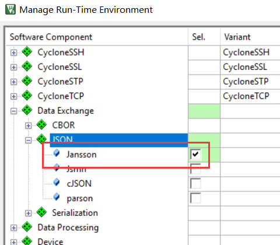
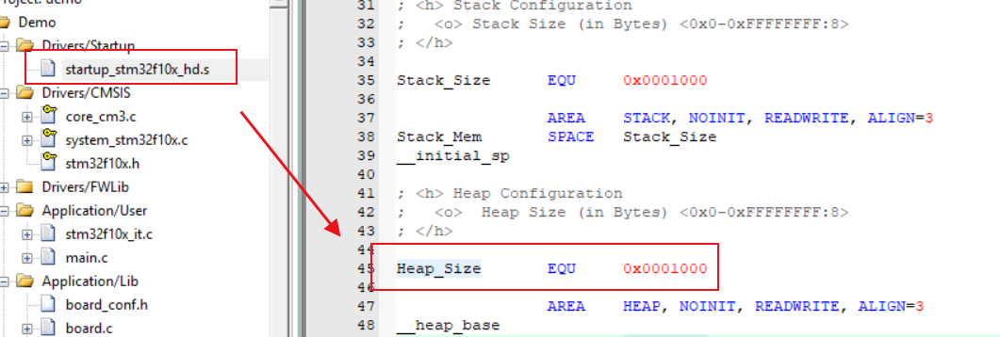

输出结果：

```C
out:{}
out:{"foo": 42, "bar": 7}
out:{"foo": 42, "bar": 7}
out:[[1, 2], {"cool": true}]
out:"test"
out:"foobarbaz"
out:P 
out:P 
out:{"arr1": [[1, 2, 3], [4, 5, 6]], "arr2": [[1, 2, 3, 4], [5, 6, 7, 8], [9, 10, 11, 12], [13, 14, 15, 16]]}
----------------
out:{"Title": "jansson test", "v2": false, "name": "test_obj", "Children1": [{"name": "item1_obj"}, {"name": "item2_obj"}], "v1": true, "v5": 1.65, "v3": 1, "v4": 2}
Array_obj1 size : 2
test_obj1 v1 type is 5: val:  1,0.000000
test_obj1 v2 type is 6: val:  0,0.000000
test_obj1 v3 type is 3: val:  1,1.000000
test_obj1 v4 type is 3: val:  2,2.000000
test_obj1 v5 type is 4: val:  1.650000,1.650000
item1_obj1 name : item1_obj
item2_obj1 name : item2_obj
```

若无输出，需把堆调大：

