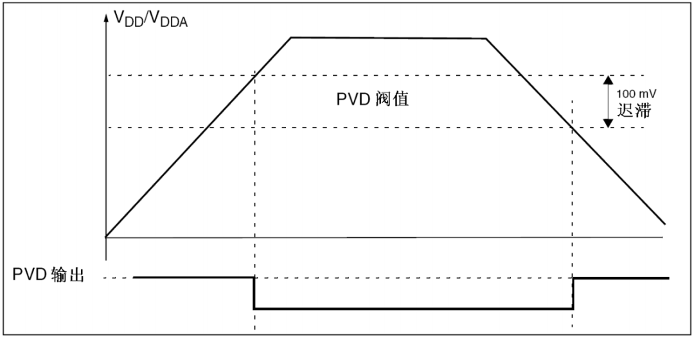
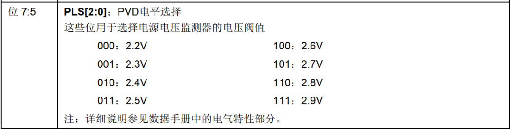
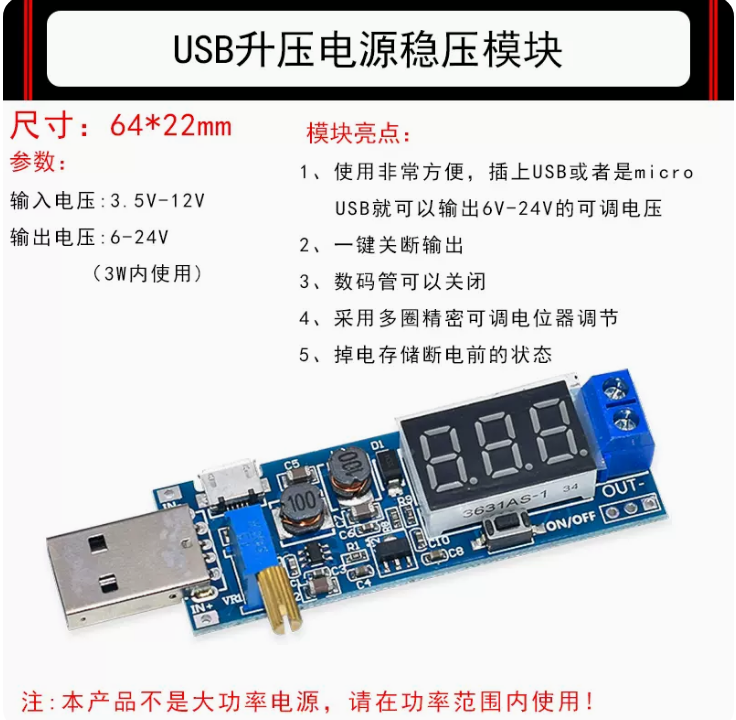

PVD（Programmable Voltage Detecter，可编程电压检测器）：设定阈值电压，当芯片的供电电压高于或低于该基准电压时便产生 PVD 中断。

100mv 迟滞，所以准确地说，在掉电时是要当VDD电压小于（PVD阈值-100mv）时才会触发PVD中断。

* 上电时，当 VDD 超过 (PVD阈值+100mv) 时产生下降沿中断
* 掉电时，当 VDD 低于 (PVD阈值-100mv) 时产生上升沿中断

注：在掉电的时候时钟供电不稳定，如使用了串口发送数据，可能别的设备收到的是乱码。

##### 用途

* 记录掉电时间。
* 如在工厂里发送掉电时，立即停止运动控制，以防造成伤亡。

* 如掉电过程中 PC 指针乱跑，指向了 ISP 升级程序的擦除 Flash 部分，导致程序丢失。（防止掉电过程中程序跑飞）

---

可使用 USB 升压电源模块进行调试：

