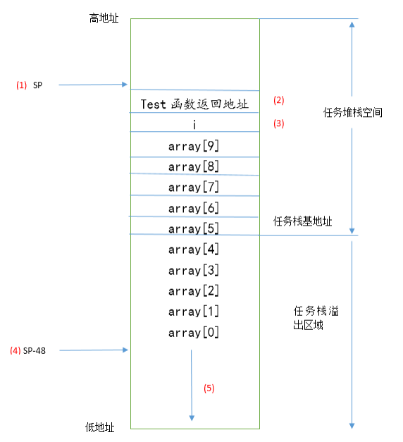
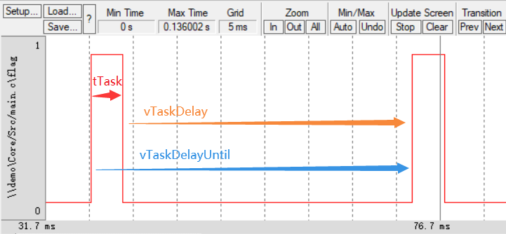
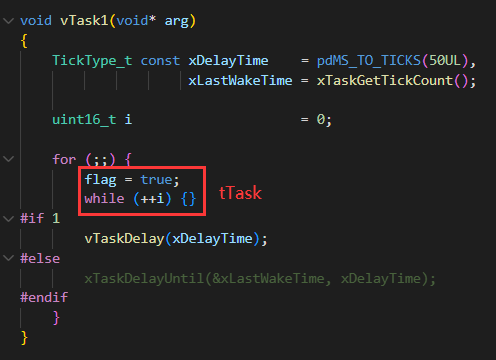
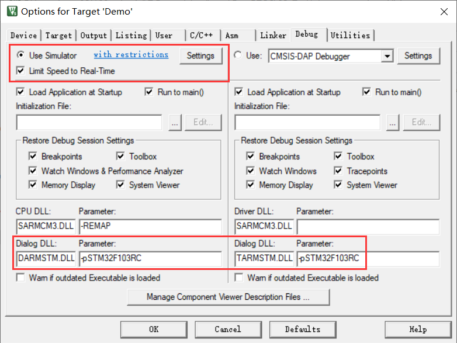
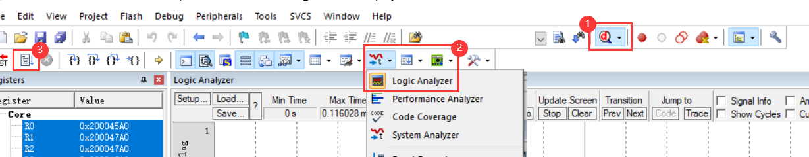

栈溢出

① 任务正运行，某函数导致栈总量超过任务创建时分配的栈空间大小，会触发钩子函数 `vApplicationStackOverflowHook()`

② 不断使用 `pvPortMallo()` 申请栈空间（不是消耗创建任务分配的栈空间），但没用 `vPortFree()` 去释放，最终会由于栈空间不足而调用 STM32 的 `HardFault_Handler()` 中断函数。

## 延时

vTaskDelay：相对延时。

vTaskDelayUntil：绝对延时。

---

##### 逻辑分析仪

