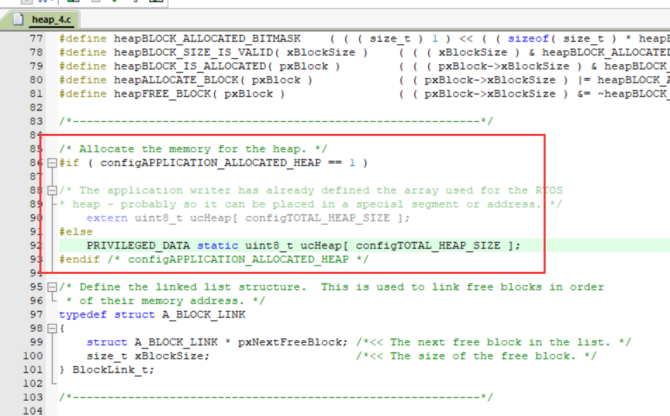
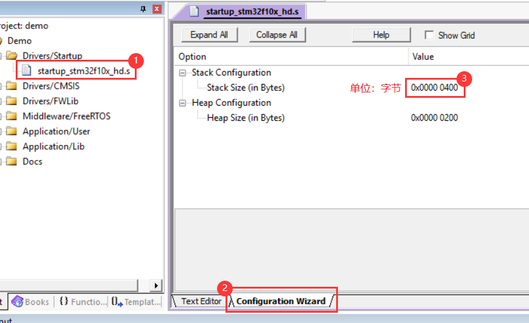
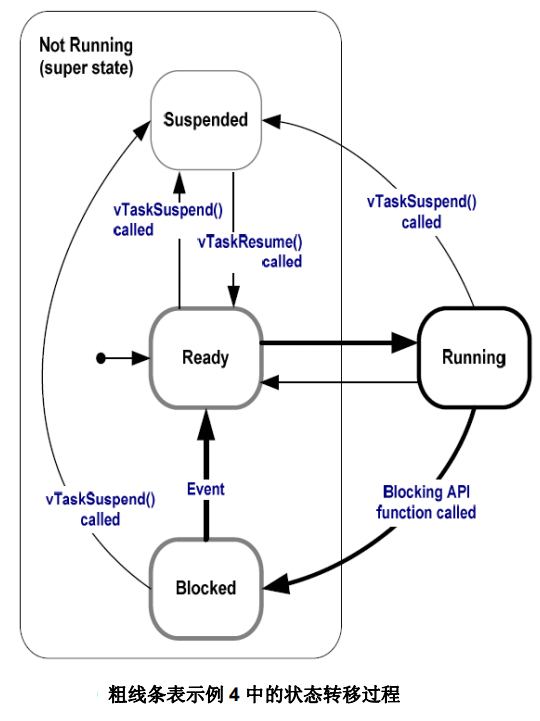

### 堆空间



```c
#define configTOTAL_HEAP_SIZE	( ( size_t ) ( 17 * 1024 ) )
```

* `vTaskStartScheduler()` ：启动 FreeRTOS 调度器

空闲函数和定时器任务是在该函数中创建的 。

如启动失败，极有可能是因为堆空间不足造成的。

*  `xPortGetFreeHeapSize()` ：获取当前未分配的内存堆大小（单位字节）

可动态检测申请的内存有没有释放。

* `xPortGetMinimumEverFreeHeapSize()`：获取未分配的内存堆历史最小值（单位字节）

### 栈空间

Cortex-M3 和 M4 内核具有双堆栈指针（主堆栈指针 `MSP` 和 进程堆栈指针/任务堆栈指针 `PSP` ）。

在 FreeRTOS 中，MSP 指向系统栈，PSP 指向当前任务的任务栈。

**系统栈**：用于 `中断函数` 和 `中断嵌套`。



* 空间估算

https://www.armbbs.cn/forum.php?mod=viewthread&tid=21084

任务 -> 中断，即任务执行过程中发生中断，部分寄存器压任务栈；

中断 -> 中断，即中断处理过程中发生中断（中断嵌套），全压系统栈。

① M3 内核和未使用 FPU（符点运算单元）功能的 M4 内核发生中断时，需将 16个通用寄存器全部压栈，每个寄存器占用 4 字节，就需 64 字节的空间（其中 8 个通用寄存器自动入任务栈）。发生 n 次中断嵌套就是 64 乘以n 个字节。

② 具有 FPU 的 M4 内核在任务进行了浮点运算时发生了中断，需将 16个通用寄存器 和 34 个浮点寄存器全部压栈，就需 200 字节的空间（其中 8 个通用寄存器和 18 个浮点寄存器自动入任务栈）。可发生 n 次中断嵌套就是 200 乘以 n 个字节。

**任务栈**：用于`局部变量`、`函数形参`、`现场保存`、`函数返回地址`...

---

① uC/OS-III：静态创建的数组。

② FreeRTOS：从堆空间动态申请。

* 空间估算/栈深度估计：xTaskCreate - usStackDepth


每个任务的栈空间的应用不同，所需的栈空间不同。

注：实际分配的栈大小可在最小栈需求的基础上乘以一个安全系数（如 1.5\~2）。

函数中调用其他函数时，局部变量和函数形参（最好不要用递归）全部入任务栈，保存了函数返回地址的 LR（Link Register）寄存器内容也要入任务栈（在哪调用了函数，调用完后跳回哪），函数运行状态。

任务切换时，通用寄存器 和 浮点寄存器全部入任务栈。

中断发生时，部分寄存器入任务栈。

注：通常形参是直接使用的 CPU 寄存器，不需要使用栈空间，如果函数嵌套的话，这个存储了函数形参的 CPU 寄存器内容是要入栈的。

---

* `uxTaskGetStackHighWaterMark()`：监测任务栈使用情况

其返回值为任务剩余可用栈空间（单位为 word，即 4 bytes ）

### 任务状态

运行态（running）：CPU 的使用权正被该任务占用。

就绪态（ready）：能够运行（没有被阻塞和挂起）但没运行的任务（因同优先级或更高优先级任务正运行）。

阻塞态（blocked）：调用了延迟函数、或者处于等待信号量、消息队列、事件标志组等的状态。

挂起态（suspended）：使用 vTaskSuspend 挂起任务（类似永远阻塞），使用 xTaskResume 恢复任务。

