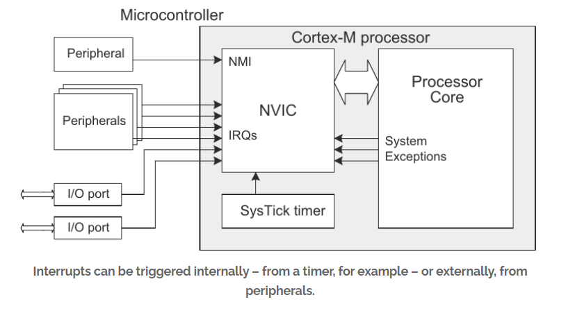
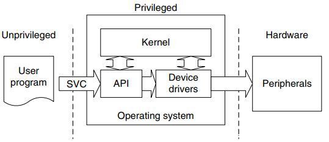
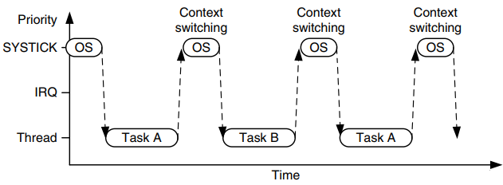
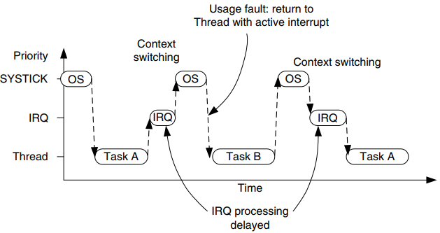
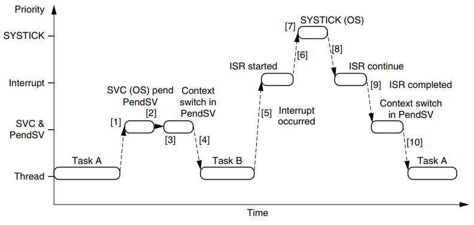
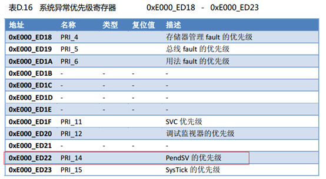
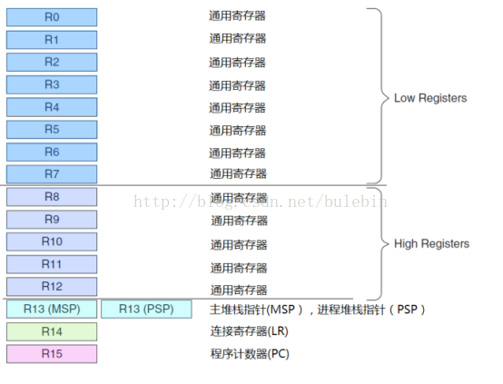

### Cortex-M

NVIC（Nested vector interrupt control，嵌套矢量中断控制）：中断管理

* Priority（中断优先级）：

最多256级可编程优先级（0x00~0xFF），优先级数值越低其逻辑优先级越高。

某个中断从产生到处理完成的过程中间有新中断产生时，是打断当前中断去执行新中断，还是将新中断挂起。

ISR（Interrupt Service Routines，中断处理程序）

* Exceptions（异常）
  * SVC（Supervisor Call）

  

  

  * PendSV（Pendable Service）

xTaskCreate_usStackDepth

SysTick 系统时钟中断，RTOS 的 Timebas（时基），其中断频率常设为 1kHz 或 100Hz。最低优先级

PendSV（Pendable SerVice）：

OS 上下文切换（context switch）时，会强制产生 PendSV 中断，以进行 task 间的上下文切换操作。

FreeRTOS 各Task使用的是PSP(Process Stack Pointer), 而中断使用的是MSP(Main Stack Pointer)， vPortPendSVHandler()则只能在PSP之间切换，不能在MSP和PSP之间切换：

SVCall (SuperVisor Call)

启动调度器中断，SVC指令会触发该中断，通过来调用FreeRTOS Scheduler调度器，该中断只在启动时产生一次

FreeRTOS 

RTOS 内核中断运行在最低优先级

`Usage fault`

若中断请求 `IRQ` 发生在 `SysTick` 异常之前，`SysTick` 异常将抢占 `IRQ` 处理程序。在此情况下，`OS` 不应该进行上下文切换，否则 IRQ  处理程序进程将被延迟执行。

Prio：SysTick > IRQ > SVC / PendSV > Thread

https://blog.csdn.net/chenhuanqiangnihao/article/details/113987846