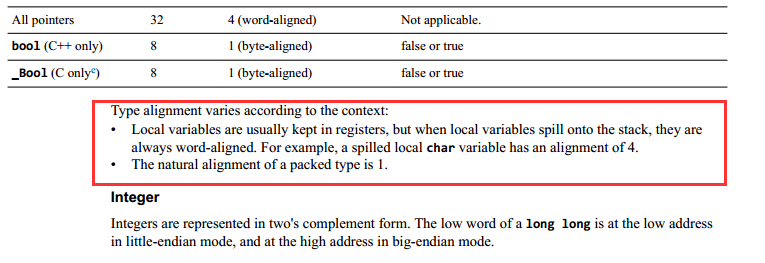
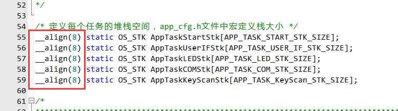
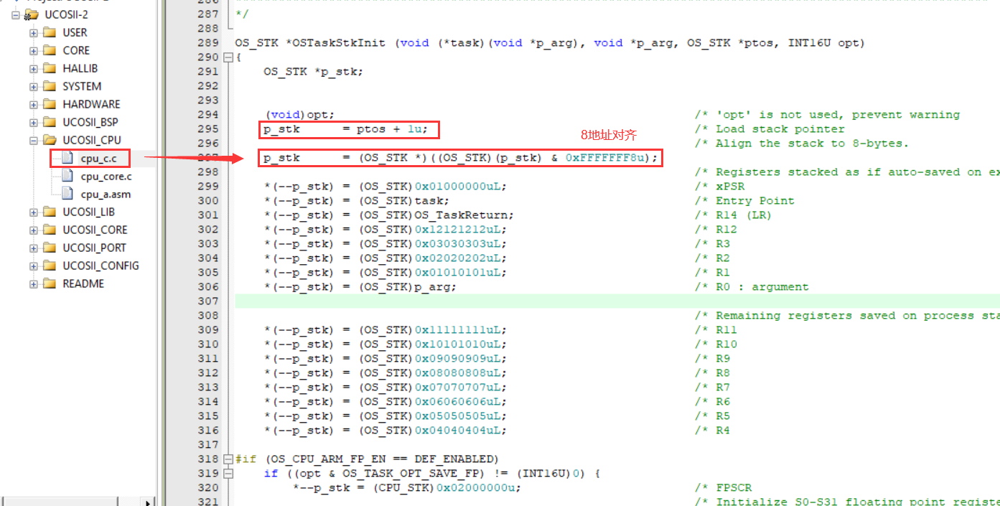

#### 空间8字节对齐

https://www.armbbs.cn/forum.php?mod=viewthread&tid=99001

https://www.armbbs.cn/forum.php?mod=viewthread&tid=13511

##### 为什么

全局变量默认字节对齐方式（MDK的HELP文档）：

如果不作对齐，做浮点运算和64bit数据运算会有问题。

常见的是 printf 打印浮点问题（该问题还和硬件 FPU 移植有关）。

##### 处理方法

① 治标：

② 治本：

8字节对齐就是地址对8求余为0，使用位与的方式屏蔽掉低3位，这样对8求余必定为0。

如原本传入的地址不是8字节对齐，这么处理，会不会用到不该用的地方？不会，因为已将传入的地址往高地址偏移了1。（注：M3/M4的堆栈是从高地址往低地址生长的）

