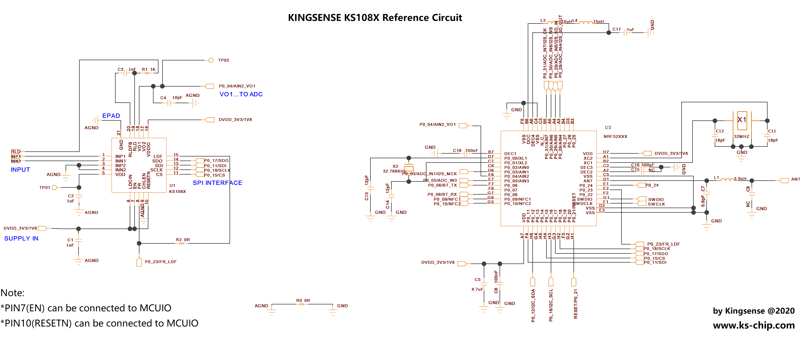
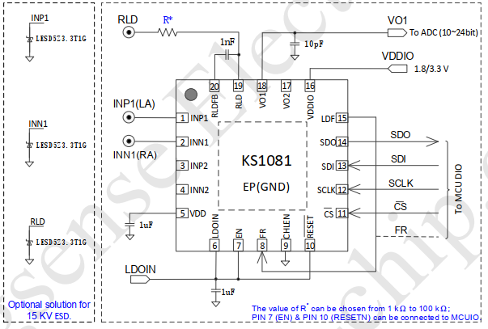
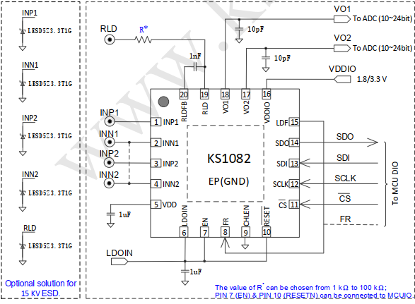
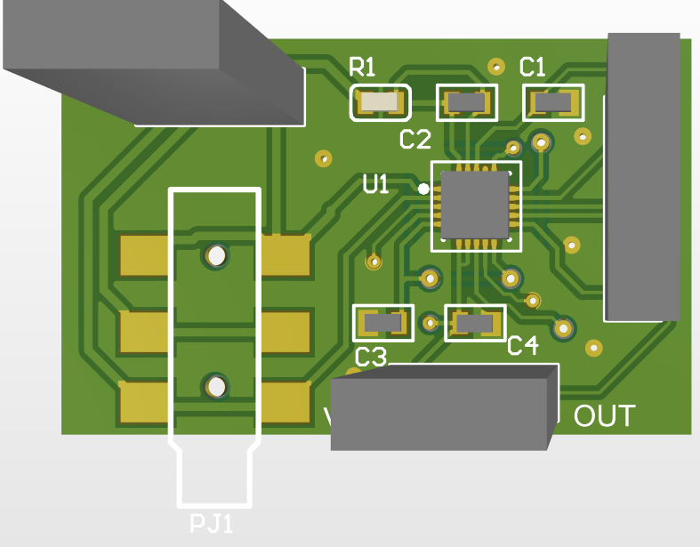
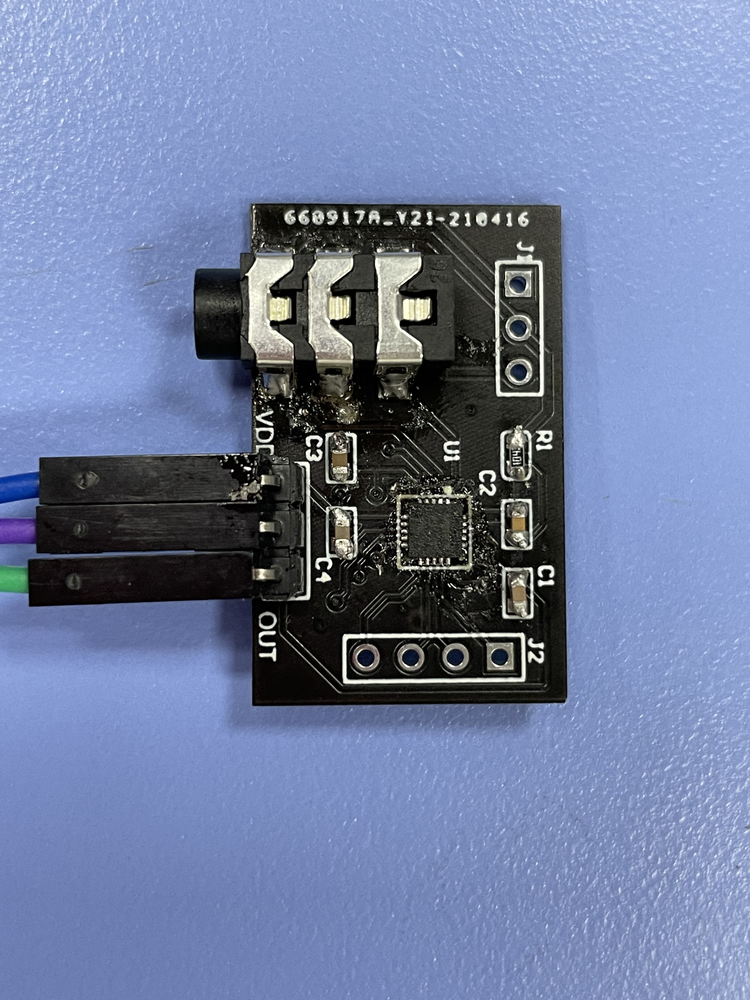
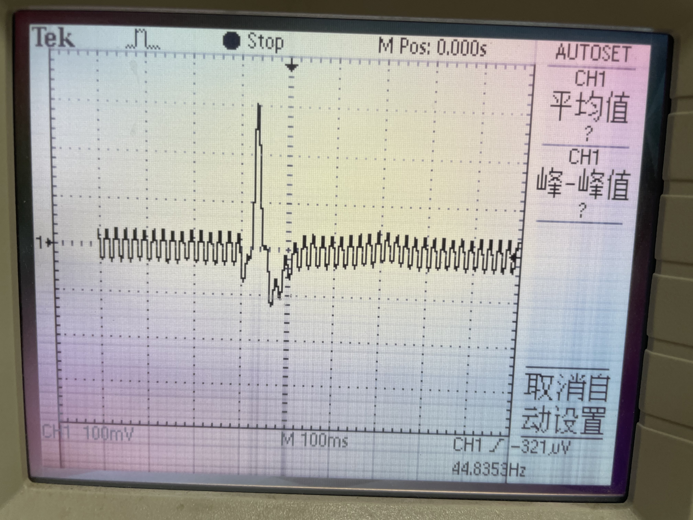
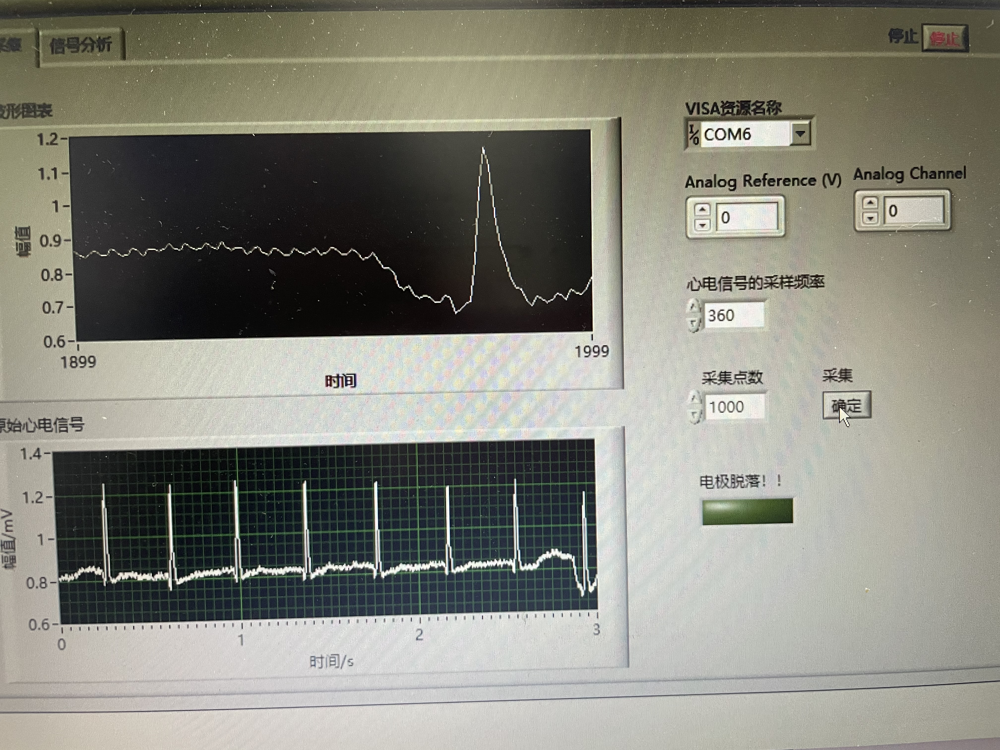
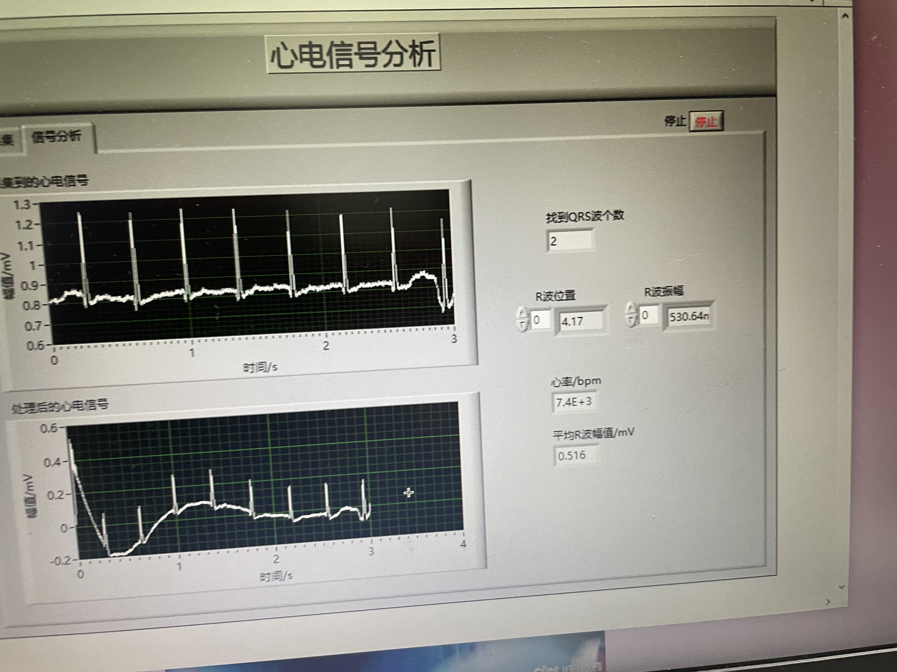

 

 

 

 

 

 

 

 

 

 

 

 

 

 

 

 测试要点：

1@芯片的底部肚皮是否焊接到地！
2@芯片的LDOIN是否正常输入，EN脚和RESETN脚是否正常接线？

3@用万用表测试芯片的第5脚，即VDD输出是不是1.8v？
4@芯片的第19脚是不是输出0.75V左右？

5@上述正常即示意KS1081已经启动工作。此时，用信号发生器在输入端加入一个2 2mV左右的信号，用示波器测试芯片的输出，看看VO1是否有输出放大的波形。
(默认在CHLEN接地下，通道1开启)

6@上述都正常即KS1081的工作没有问题，再接入后续主控进行ADC采集，如果ADC采集输出不正常，那需要检查MCU代码。