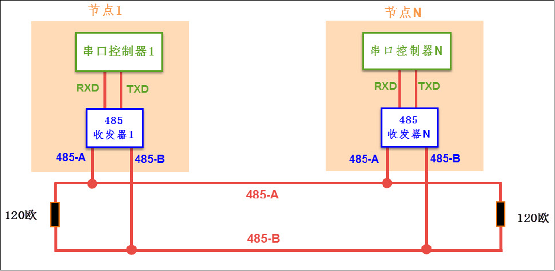

变更传输方向：常态需保持为接收状态，即发送完成后需切回接收状态

```c
#define RS485_Recv()    GPIO_ResetBits(GPIOx,GPIO_Pin_x)
#define RS485_Send()    GPIO_SetBits(GPIOx,GPIO_Pin_x) 
```

---

类似 CAN，RS-485 是种工业控制环境中常用的通讯协议（套了软件层协议，如 Modbus），它具有抗干扰能力强、传输距离远的特点。RS-485 通讯协议由 RS-232协议改进而来，协议层不变，只是改进了物理层。（使用上就是在ST的串口引脚外接个收发器，把串口的TTL电平信号转换成RS485的差分信号）



物理层：

​	差分信号线具有很强的干扰能力，特别适合应用于电磁环境复杂的工业控制环境中，RS-485 协议主要是把 RS-232 的信号改进成差分信号，从而大大提高了抗干扰特性，

​	RS-485通讯网络的最大传输距离可达1200米，总线上可挂载128个通讯节点，而由于 RS-485 网络只有一对差分信号线，它使用差分信号来表达逻辑，当AB两线间的电压差为 +2V\~+6V 时表示逻辑1，当电压差为-6V~-2V 表示逻辑0，在同一时刻只能表达一个信号，所以它的通讯是半双工形式的。

对比：

| **通讯标准** | **信号线**         | **通讯方向** | **电平标准**                      | **通讯距离** | **通讯节点数**                                     |
| ------------ | ------------------ | ------------ | --------------------------------- | ------------ | -------------------------------------------------- |
| **RS232**    | 单端 TXD、RXD、GND | 全双工       | 逻辑1：-15V\~-3V，逻辑0：+3V~+15V | 100米以内    | 只有两个节点                                       |
| **RS485**    | 差分线AB           | 半双工       | 逻辑1：+2V\~+6V，逻辑0：-6V~-2V   | 1200米       | 支持多个节点。支持多个主设备，任意节点间可互相通讯 |

RS-485与RS-232的差异只体现在物理层上，它们的协议层是相同的，也是使用串口数据包的形式传输数据。

