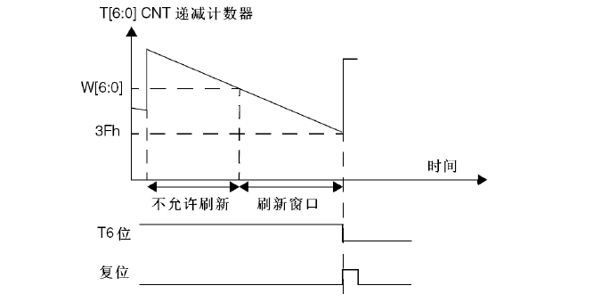
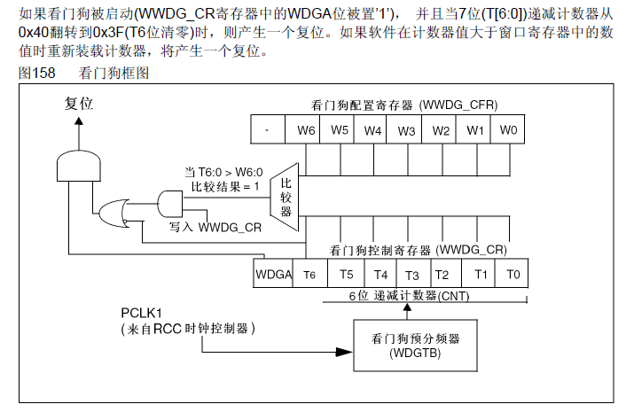
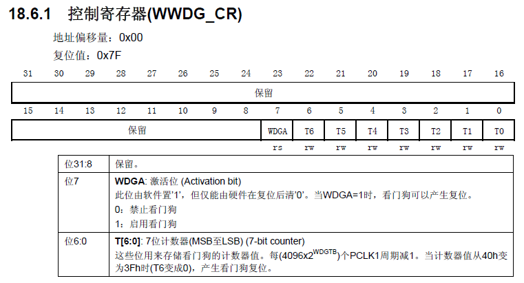
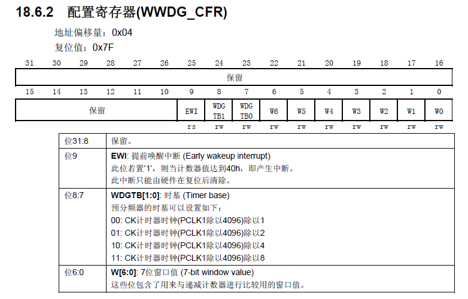
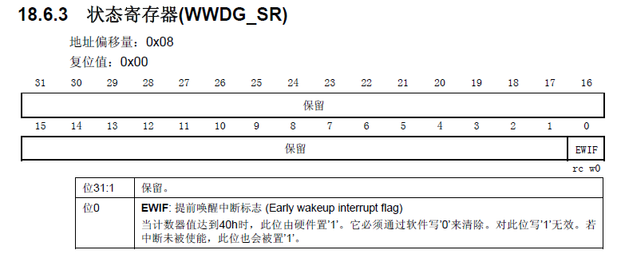

#### 窗口看门狗

窗口指的时喂狗时间有个范围（上限自定，下限固定0x3F）

过早或过晚地喂狗会复位芯片。

##### **框图**

串口看门狗本质上是个递减计数器。

##### 寄存器

① 启动看门狗、存储当前递减计数器的值

② 使能提前唤醒中断、设置预分频系数、设置上窗口值

③ 记录当前是否有提前唤醒的标志

当计数器的值减到40h时（注：3Fh+1=40h，表示将要复位），此位被硬件置1（即使中断未被使能），需通过软件写0来清除（注：对此位写1无效）。

##### 中断频率

f = PCLK1 / ( 4096 * 2^pre )

注：PCLK1 默认情况下是 36MHz，其预分频是在除4096后进行的。

